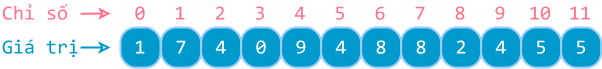

# Mảng một chiều

!!! abstract "Tóm lược nội dung"

    Bài này trình bày những khái niệm về mảng nói chung và mảng một chiều nói riêng.

## Khái quát về mảng

### Đặt vấn đề

Khi xử lý bảng điểm môn Tin học của một lớp gồm 30 học sinh, việc khai báo 30 biến có vẻ không ổn. Thử xem đoạn mã khai báo sau đây bất tiện như thế nào.

*(Phần đặt vấn đề này tương tự như bài [cấu trúc dữ liệu `list`](../../grade-10/topic-F/list.md){target="_blank"}.)*
    
```py
hs1 = 10
hs2 = 9
hs3 = 9.5 
.
.
.
hs29 = 9.1
hs30 = 9.4
```

Nếu số học sinh nhiều hơn, chẳng hạn 500 học sinh cả khối, thì việc khai báo từng biến là hoàn toàn bất khả thi.

May thay, các ngôn ngữ lập trình đều có hỗ trợ những cấu trúc dữ liệu giúp xử lý bảng điểm như trên, trong đó có **cấu trúc mảng**.

### Khái niệm

Trong đa số ngôn ngữ lập trình, **mảng** là cấu trúc dữ liệu dùng để lưu trữ và xử lý **tập hợp các phần tử**, trong đó:

- Các phần tử được **lưu trữ liên tiếp nhau** trên bộ nhớ.
- Các phần tử đều **có cùng kiểu dữ liệu**, chẳng hạn: cùng là số nguyên, cùng là số thực, v.v...
- **Số lượng phần tử** là **hữu hạn** và thường được xác định trước.
- Mỗi phần tử được truy xuất thông qua **một hoặc nhiều chỉ số** tuỳ theo **số chiều** của mảng. Chẳng hạn:

    – Mảng một chiều dùng 1 chỉ số.
    – Mảng hai chiều dùng 2 chỉ số.
    – Mảng ba chiều dùng 3 chỉ số.

Mảng thường được dùng để giải quyết những bài toán có nhiều giá trị liên quan và cùng kiểu dữ liệu. Hầu như mọi bài toán thực tế đều gặp ít nhất một dạng mảng nào đó.

Ví dụ:

- Điểm số môn Tin học của các học sinh trong lớp.
- Dữ liệu thời gian ghi nhận được ở các lần đo trong các thí nghiệm vật lý.

!!! info "Nói rõ thêm về mảng"
    
    1.  Về mặt khái niệm, các phần tử của một mảng được lưu trữ liên tiếp nhau trong bộ nhớ. Tuy nhiên, trên thực tế, trong khi các phần tử của **mảng tĩnh** và **mảng động** vẫn được lưu trữ liên tiếp nhau, các phần tử của những cấu trúc dữ tương đương thì không, mà chúng có thể nằm rải rác trên bộ nhớ.

    2. Trong một số ngôn ngữ *"truyền thống"* như C hay Java, các phần tử của mảng phải có cùng kiểu dữ liệu. Trái lại, một số ngôn ngữ hiện đại như JavaScript, Ruby, Python cho phép mảng hoặc những cấu trúc tương đương chứa các phần tử có kiểu dữ liệu khác nhau. 

### Phân loại

Phân loại theo **chiều**, mảng có các loại sau:

- Mảng một chiều
- Mảng hai chiều
- Mảng đa chiều.

Bài học này chỉ đề cập **mảng một chiều**.

---

## Mảng một chiều

### Khái niệm

**Mảng một chiều** là cấu trúc dữ liệu cơ bản nhất dùng để lưu trữ các các phần tử có cùng kiểu dữ liệu, được sắp xếp theo một hàng duy nhất, hoặc một cột duy nhất.

Mỗi phần tử được định vị bằng một **chỉ số**, thường được đánh thứ tự từ **0**.

Hình sau minh hoạ mảng một chiều A.

{loading=lazy}

Hình ảnh mảng một chiều trong thực tế:

- Dãy các phòng học
- Dãy ghế trong rạp chiếu phim

Mảng một chiều có thể áp dụng khi xử lý:

- Một dãy số
- Một hàng hoặc một cột trong bảng

### Mảng một chiều trong Python

Trong Python, mảng có thể được biểu diễn bằng cấu trúc dữ liệu `list` hoặc module `array`.

Tuy nhiên, do `list` đã được đề cập trong chương trình lớp 10 (1), các bài học về mảng ở lớp 11 sẽ không dùng `list` nữa. Thay vào đó, các bài này sẽ đề cập thư viện mã nguồn mở [numpy](https://numpy.org/){target="_blank"}.
{ .annotate }

1.  và `array` có vẻ còn một số hạn chế

Việc áp dụng `numpy` chỉ chủ yếu diễn ra ở những thao tác cơ bản, hoàn toàn không làm ảnh hưởng tinh thần chung là dạy và học ý tưởng thuật toán.

!!! info "Thư viện numpy"

    Những ưu điểm nổi bật của thư viện `numpy` bao gồm:
    
    - Lưu trữ liên tiếp, đồng nhất kiểu dữ liệu, làm cho tốc độ truy xuất nhanh hơn với độ phức tạp là O(1).
    - Hỗ trợ tính toán vector hoá, tức toàn bộ mảng cùng lúc, cũng giúp tăng tốc xử lý nhanh hơn từ hàng chục đến hàng trăm lần so với vòng lặp `for` trên `list`.
    - Tích hợp sẵn các hàm toán học bao gồm: thống kê, đại số tuyến tính.
    - Phổ biến toàn cầu trong khoa học dữ liệu, AI, vật lý, kỹ thuật.

### Cài đặt thư viện numpy {: #cai-dat-thu-vien-numpy}

Trước khi sử dụng, ta cần cài đặt thư viện `numpy` bằng lệnh `pip`.

**Đối với Visual Studio Code:**

1. Mở cửa sổ **Terminal** (hoặc **PowerShell**, hoặc **Command Prompt**) bằng phím tắt ++ctrl+grave++ (nằm bên trái phím ++1++).

    Hoặc chọn menu **View** > **Terminal**.

2. Trong cửa sổ **Terminal**, gõ lệnh sau:

    ```py linenums="1"
    pip install numpy
    ```

**Đối với Google Colab:**

1. Trong một khối (cell) nào đó, gõ lệnh sau:

    ```py linenums="1"
    !pip install numpy
    ```

2. Chạy khối trên, nếu kết quả tương tự như sau thì nghĩa là cài đặt thành công:

    ```pycon
    Requirement already satisfied: numpy in /usr/local/lib/python3.11/dist-packages (1.26.4)
    ```

    Lúc này, ta có thể bắt đầu viết mã lệnh trong một khối (cell) khác.

### Nạp thư viện

Nạp thư viện `numpy` bằng lệnh `import`. Đồng thời, quy ước tên gọi tắt của `numpy` là `np`.

```py linenums="1"
import numpy as np
```

### Khởi tạo  

Để khởi tạo mảng một chiều, ta sử dụng hàm `array()` của `numpy`.

Các phần tử được liệt kê trong cặp ngoặc vuông `[ ]` và phân cách nhau bằng dấu phẩy `,`.

Ví dụ:  
Dòng lệnh 5 khởi tạo mảng một chiều `A` bằng cách liệt kê phần tử.

```py linenums="1" hl_lines="5"
import numpy as np

if __name__ == '__main__':
    # Khởi tạo mảng A
    A = np.array([1, 7, 4, 0, 9, 4, 8, 8, 2, 4, 5, 5])

    # In mảng
    print(f'Mảng A: {A}') # (1)!
```
{ .annotate }

1.  `f'...'` là cú pháp f-string (formatted string literal) của Python giúp hiển thị giá trị của biến `A`.

    Khi sử dụng f-string, các biến hoặc biểu thức bên trong dấu `{}` sẽ được thay thế bằng giá trị tương ứng.

Chạy đoạn mã trên, kết quả như sau:

```pycon
Mảng A: [1 7 4 0 9 4 8 8 2 4 5 5]
```

Để khởi tạo mảng một chiều gồm các phần tử cùng giá trị, ta dùng hàm `full()` của `numpy`.

Ví dụ:  
Dòng lệnh 11 khởi tạo mảng `zeros` gồm tám phần tử đều là `0`.

```py linenums="10" hl_lines="11"
    # Khởi tạo mảng zeros gồm tám phần tử đều mang giá trị 0
    zeros = np.full(8, 0)

    # In mảng
    print(f'Mảng zeros: {zeros}')
```

Chạy đoạn mã trên, kết quả như sau:

```pycon
Mảng zeros: [0 0 0 0 0 0 0 0]
```

### Truy xuất phần tử  

Mỗi phần tử được truy xuất thông qua chỉ số của nó, đặt trong cặp ngoặc vuông `[ ]`.

Phần tử đầu tiên có chỉ số là `0` và phần tử cuối cùng có chỉ số là `len(mảng) - 1`.

Ví dụ:  
Dòng lệnh 8 và 11 in ra màn hình giá trị của phần tử đầu tiên và cuối cùng của mảng `A`.


```py linenums="1" hl_lines="8 11"
import numpy as np

if __name__ == '__main__':
    # Khởi tạo mảng A
    A = np.array([1, 7, 4, 0, 9, 4, 8, 8, 2, 4, 5, 5])

    # In ra phần tử đầu tiên
    print(f'Phần tử đầu tiên: {A[0]}')

    # In ra phần tử cuối cùng
    print(f'Phần tử cuối cùng: {A[len(A) - 1]}')
```

Chạy đoạn mã trên, kết quả như sau:

```pycon
Phần tử đầu tiên: 1
Phần tử cuối cùng: 5
```

Ví dụ:  
Dòng lệnh 14 bị lỗi vì mảng `A` không có phần tử mang chỉ số `12`.

```py linenums="13" hl_lines="14"
    # Chương trình báo lỗi vì không có chỉ số 12 trong mảng A
    print(f'Phần tử có chỉ số 12: {A[12]}')
```

Chạy đoạn mã trên, kết quả thông báo lỗi tương tự như sau:

```pycon
IndexError                                Traceback (most recent call last)
/tmp/ipython-input-2733226203.py in <cell line: 0>()
     12 
     13     # Chương trình báo lỗi vì không có chỉ số 12 trong mảng A
---> 14     print(f'Phần tử có chỉ số 12: {A[12]}')

IndexError: index 12 is out of bounds for axis 0 with size 12
```

### Duyệt mảng  

Trong nhiều bài toán, các phần tử của mảng thường được xử lý *"một loạt"* tương tự nhau. Do đó, ta thường sử dụng vòng lặp để duyệt mảng.

Ví dụ:  
Dòng lệnh 8 và 9 duyệt mảng để in ra các phần tử từ đầu đến cuối. Mỗi phần tử nằm trên một dòng.

```py linenums="1" hl_lines="8 9"
import numpy as np

if __name__ == '__main__':
    # Khởi tạo mảng A
    A = np.array([1, 7, 4, 0, 9, 4, 8, 8, 2, 4, 5, 5])

    # In ra các phần tử trên từng dòng
    for i in range(len(A)):
        print(f'A[{i}] = {A[i]}')
```

Chạy đoạn mã trên, kết quả như sau:

```pycon
A[0] = 1
A[1] = 7
A[2] = 4
A[3] = 0
A[4] = 9
A[5] = 4
A[6] = 8
A[7] = 8
A[8] = 2
A[10] = 5
A[11] = 5
```

Ví dụ:  
Dòng lệnh 12 và 13 duyệt mảng để in ra các phần tử từ cuối ngược về đầu, trên cùng một dòng.

```py linenums="1" hl_lines="12 13"
import numpy as np

if __name__ == '__main__':
    # Khởi tạo mảng A
    A = np.array([1, 7, 4, 0, 9, 4, 8, 8, 2, 4, 5, 5])

    # In ra các phần tử trên từng dòng
    for i in range(len(A)):
        print(f'A[{i}] = {A[i]}')

    # In ra các phần tử theo thứ tự từ cuối ngược về đầu
    for i in range(len(A) - 1, -1, -1):
        print(A[i], end=' ') # (1)!
```
{ .annotate }

1.  Tham số `end` của hàm `print()` có giá trị mặc định là `'\n'`, nghĩa là xuống dòng sau khi in ra từng phần tử.

    `end=' '` giúp in ra khoảng trắng sau mỗi phần tử.

Chạy đoạn mã trên, kết quả như sau:

```pycon
5 5 4 2 8 8 4 9 0 4 7 1
```

---

## Mã nguồn

Code đầy đủ được đặt tại:

- [Google Colab](https://colab.research.google.com/drive/1pq2-LFJ9I8U52pmCXqe9BMo-aeLyAPAN?usp=sharing){target="_blank"}

---

## Sơ đồ tóm tắt

<div>
    <iframe style="width: 100%; height: 500px" frameBorder=0 src="/grade-11/topic-F3/mindmaps/data-structure-one-dimensional-array.html">Sơ đồ tóm tắt</iframe>
</div>

---

## Some English words

| Vietnamese | Tiếng Anh | 
| --- | --- |
| chỉ số (của phần tử) | index |
| đánh chỉ số từ 0 | zero-based indexing |
| giá trị (của phần tử) | value |
| mảng một chiều | one-dimensional array |
| phần tử | element, item |
| vị trí | position |