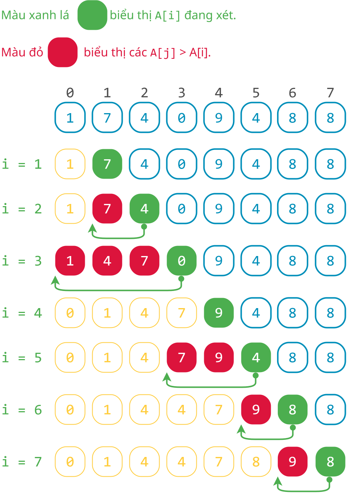

# Sắp xếp chèn

!!! abstract "Tóm lược nội dung"

    Bài này trình bày thuật toán sắp xếp chèn.

## Ý tưởng

Hãy tưởng tượng hình ảnh cả lớp đang xếp một hàng dọc.

Xét một bạn Tèo nào đó. Lần lượt các bạn đứng trước Tèo mà cao hơn Tèo thì lùi về sau một vị trí, cho đến khi gặp một bạn không cao hơn Tèo thì dừng. Lúc này, do các bạn cao đã lùi về sau, một chỗ trống sẽ *"lộ ra"* cho Tèo đứng chèn vào.   

Dựa vào cách thức trên, ý tưởng chính của thuật toán sắp xếp chèn là lặp lại nhiều lần thao tác di chuyển một phần tử lên trước các phần tử lớn hơn nó.

!!! note "Thuật toán sắp xếp chèn"

    Duyệt từng phần tử `A[i]` từ `1` đến cuối mảng, lặp các thao tác sau:

    1. Lưu giá trị của `A[i]` vào biến tạm `t`. (Vì `A[i]` sẽ bị ghi đè bởi các phần tử `A[j]` đứng trước nó)

    2. Duyệt từng phần tử `A[j]` từ `i - 1` ngược về đầu mảng,lặp các theo tác: dịch chuyển `A[j]` sang phải một vị trí.

        Vòng lặp dừng lại khi hết phần tử `A[j]` để xét (`j < 0`) hoặc gặp `A[j]` nào đó không lớn hơn `A[i]` (`A[j] <= t`).

    3. *"Chèn `A[i]` vào chỗ trống"* bằng cách gán `t` cho `A[j + 1]`.

        (Vì sau khi vòng lặp của bước 2 dừng, `j` là vị trí của phần tử bị bắt gặp không còn lớn hơn `A[i]`, và `j + 1` là vị trí mà `A[i]` chèn vào).

Thuật toán có thể được phác họa như hình sau:

{loading=lazy width=300}

---

## Ví dụ minh họa

{loading=lazy width=360px}

---

## Lưu đồ

{loading=lazy width=600}

---

## Trực quan hóa

<div>
    <iframe width="100%" height="690px" frameBorder=0 src="../visualize/insertion-sort.html"></iframe>
</div>   

---

## Viết chương trình

1\. Nạp thư viện `numpy`.

```py linenums="1"
import numpy as np
```

2\. Viết hàm `insertion_sort()` để thực hiện thuật toán sắp xếp chèn.

```py linenums="4"
def insertion_sort(A):
    # Lấy số lượng phần tử của mảng A
    n = len(A)

    # Duyệt từng phần tử A[i] từ 1 đến cuối
    for i in range(1, n):
        # Lưu giá trị của A[i] vào biến tạm t
        t = A[i]

        # Cho j chạy từ i - 1
        j = i - 1

        # Trong khi vẫn còn A[j] và A[j] vẫn lớn hơn t
        while j >= 0 and A[j] > t:
            # Dịch chuyển A[j] sang phải một vị trí
            A[j + 1] = A[j]

            # Giảm j để xét A[j] tiếp theo
            j = j - 1

        # Chèn t vào vị trí j + 1
        A[j + 1] = t # (1)!
```
{ .annotate }

1.  Sau khi vòng lặp while dừng, `j` là vị trí mà `A[j]` nhỏ hơn hoặc bằng `A[i]`, còn `j + 1` là vị trí sẽ được `A[i]` đứng chèn vào.

3\. Viết chương trình chính.

Trong chương trình chính, ta tạm thời bỏ qua việc cho người dùng nhập mảng. Thay vào đó, ta khởi tạo mảng cố định, rồi gọi hàm `insertion_sort()` để sắp xếp mảng `Array`.

```py linenums="29"
if __name__ == '__main__':
    # Khởi tạo mảng Array
    Array = np.array([1, 7, 4, 0, 9, 4, 8, 8])

    # In mảng ban đầu
    print(f'Mảng ban đầu chưa sắp xếp: {Array}')

    # Gọi hàm insertion_sort()
    insertion_sort(Array)

    # In mảng mới
    print(f'Mảng mới sau khi sắp xếp: {Array}')
```

4\. Chạy chương trình trên, kết quả như sau:

```pycon
Mảng ban đầu chưa sắp xếp: [1 7 4 0 9 4 8 8]
Mảng mới sau khi sắp xếp: [0 1 4 4 7 8 8 9]
```

---

## Mã nguồn

Code đầy đủ được đặt tại:

- [Google Colab](https://colab.research.google.com/drive/1zkDywixSi1Le7XikA4njlg72Kpz5E7dY?usp=sharing){target="_blank"}

---

## Some English words

| Vietnamese | Tiếng Anh | 
| --- | --- |
| biến tạm thời | temporatory variable |
| hoán vị (hai phần tử) | swap |
| sắp xếp chèn | insertion sort |
| so sánh | compare |