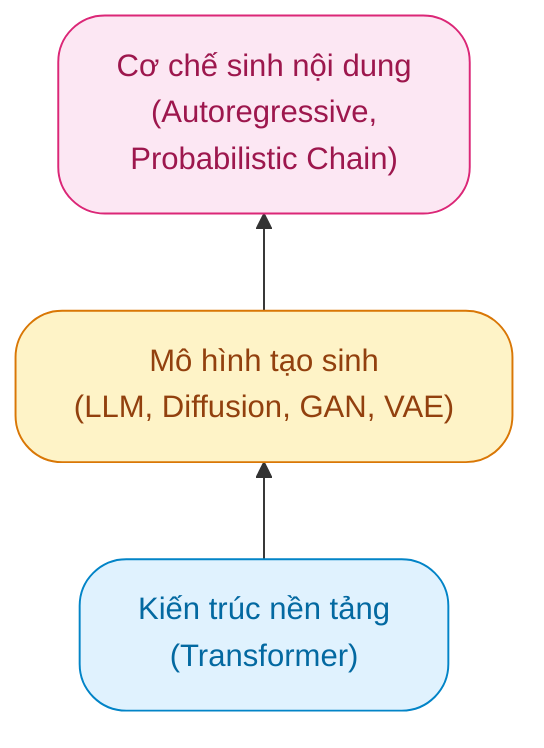

# AI tạo sinh

!!! abstract "Tóm lược nội dung"

    Bài này trình bày đôi nét về AI tạo sinh.

## Khái niệm

!!! note "AI tạo sinh"

    Là một nhánh của Trí tuệ Nhân tạo tập trung vào việc **tạo ra các nội dung mới** từ dữ liệu đầu vào.
    
Thay vì chỉ tìm kiếm, phân tích hoặc phân loại dữ liệu, các mô hình AI tạo sinh có thể tự động **học** cấu trúc hoặc hình mẫu **từ dữ liệu huấn luyện** để sinh ra dữ liệu (1) hoàn toàn mới, mà không phải là bản sao chép đơn thuần.
{ .annotate }

1.  **Dữ liệu** được sinh ra bao gồm văn bản, hình ảnh, âm thanh, video, mã lệnh lập trình, v.v..

??? info "AI phân biệt và AI tạo sinh"

    Một số điểm khác nhau giữa AI phân biệt và AI tạo sinh:

    | Tiêu chí | AI phân biệt | AI tạo sinh |
    | --- | --- | --- |
    | Thuật ngữ | Discriminative AI | Generative AI |
    | Chức năng | Phân loại dựa trên dữ liệu có sẵn | Tạo ra nội dung hoàn toàn mới |
    | Ứng dụng thực tế | Nhận diện khuôn mặt, phát hiện thư rác, phân loại ảnh | Viết bài văn, vẽ tranh theo mô tả, sáng tác nhạc, tạo mã nguồn |
    | Ví dụ câu lệnh (prompt) | "Bức hình này có phải là con mèo không?" | "Hãy vẽ một bức hình con mèo mặc đồ phi hành gia." |

---

## Công nghệ

Hình sau mô tả kiến trúc công nghệ của AI tạo sinh:

??? info "Kiến trúc công nghệ của AI tạo sinh"

    1. **Kiến trúc nền tảng**

        - Mô hình Transformer: là kiến trúc mạng thần kinh dựa trên cơ chế Attention (chú ý tập trung), cho phép xử lý dữ liệu chuỗi song song với quy mô cực lớn. Đây là nền tảng của hầu hết các mô hình ngôn ngữ hiện đại.

    2. **Các mô hình tạo sinh**

        - Mô hình ngôn ngữ lớn (LLM): chuyên xử lý và tạo văn bản tự nhiên.
        - Mô hình khuếch tán (Diffusion Models): tạo hình ảnh, video chất lượng cao.
        - Mô hình GANs (Generative Adversarial Networks): gồm hai mạng cạnh tranh nhau (mạng tạo sinh và mạng phân biệt) để tạo dữ liệu có độ chân thực cao.
        - Mô hình VAEs (Variational Autoencoders): mã hóa dữ liệu vào không gian ẩn (latent space) để tái tạo nội dung mới.

    3. **Cơ chế suy luận**

        - Mô hình tự hồi quy (Autoregressive): dự đoán từ hoặc điểm ảnh tiếp theo dựa trên chuỗi dữ liệu đã xuất hiện trước đó.

??? info "Mô hình ngôn ngữ lớn"

    Các mô hình ngôn ngữ lớn (LLM) là nền tảng quan trọng của AI tạo sinh, chuyên xử lý và tạo ra văn bản tự nhiên.
    
    Một số họ mô hình ngôn ngữ lớn tiêu biểu hiện nay bao gồm:

    * **GPT-4, GPT-4o** của công ty OpenAI: là mô hình đa phương thức (multimodal) hàng đầu, xử lý linh hoạt cả văn bản, hình ảnh, âm thanh và suy luận mã nguồn phức tạp.
    * **Gemini** của công ty Google: là mô hình đa phương thức nguyên bản (native multimodal) được Google tối ưu cho việc xử lý đồng thời văn bản, hình ảnh, âm thanh và video với bộ nhớ ngữ cảnh cực lớn.
    * **Claude 3.5 Sonnet, Claude 3 Opus** của công ty Anthropic: được đánh giá cao về năng lực suy luận, viết mã, xử lý văn bản dài và tuân thủ các chuẩn mực an toàn AI.
    * **Llama 3** của công ty Meta: là họ mô hình mã nguồn mở mạnh mẽ, cho phép cộng đồng lập trình viên và doanh nghiệp tự do tùy chỉnh và triển khai nội bộ.
    * **Grok** của công ty xAI: là mô hình tích hợp khả năng xử lý và truy cập dữ liệu thời gian thực từ mạng xã hội X.

---

## Năng lực

Các năng lực chủ yếu của AI tạo sinh bao gồm:

-   :material-file-document-edit:{ .lg .middle } **Tạo văn bản**
    
    - Viết bài báo, tóm tắt tài liệu, sáng tác kịch bản hoặc thơ ca.
    - Tự động viết, kiểm thử và tìm lỗi (debug) mã lập trình bằng các ngôn ngữ như Python, C++, JavaScript.

-   :material-image-edit:{ .lg .middle } **Tạo hình ảnh**

    - Vẽ tranh, thiết kế logo, phác thảo sản phẩm từ văn bản mô tả.
    - Chỉnh sửa, mở rộng khung hình, phục chế hình ảnh cũ.

-   :material-music-note-plus:{ .lg .middle } **Tạo âm thanh**

    - Sáng tác các bản nhạc hoàn chỉnh theo thể loại hoặc nhạc cụ tùy chọn.
    - Giả lập giọng nói, chuyển đổi văn bản thành giọng nói tự nhiên.

-   :material-movie-open:{ .lg .middle } **Tạo video**

    - Tạo video ngắn từ văn bản mô tả hoặc từ hình ảnh tĩnh.
    - Tạo chuyển động kỹ xảo, làm mịn video, mô phỏng nhân vật ảo.

---

## Ứng dụng

Một số sản phẩm AI tạo sinh phổ biến hiện nay:

- Tạo văn bản: [ChatGPT](https://chatgpt.com/){target="_blank"}, [Claude](https://claude.ai/){target="_blank"}, [Grok](https://grok.com/){target="_blank"}, [Gemini](https://gemini.google.com/app){target="_blank"}, v.v.
- Tạo hình ảnh: [DALL-E](https://openai.com/index/dall-e-3/){target="_blank"}, [MidJourney](https://www.midjourney.com/){target="_blank"}, [Stable Diffusion](https://stability.ai/){target="_blank"}, [Adobe Firefly](https://firefly.adobe.com/){target="_blank"}, v.v.
- Tạo âm thanh: [Suno](https://suno.com/){target="_blank"}, [AIVA](https://www.aiva.ai/){target="_blank"}, [Udio](https://www.udio.com/){target="_blank"}, v.v.
- Tạo video: [Runway](https://runway.com/){target="_blank"}, [Pika](https://pika.art/){target="_blank"}, [Sora](https://openai.com/index/sora/){target="_blank"}, v.v.

---

## Sơ đồ tóm tắt

    <iframe style="width: 100%; height: 360px" frameBorder=0 src="../mindmaps/generative-ai.html">Sơ đồ tóm tắt</iframe>

---

## Some English words

| Vietnamese | Tiếng Anh | 
| --- | --- |
| AI tạo sinh | Generative AI |
| mô hình ngôn ngữ lớn | LLM - Large Language Model |