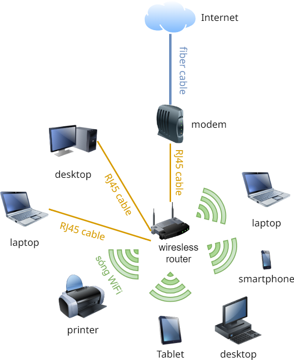

# Thiết bị mạng

!!! abstract "Tóm lược nội dung"

    Bài này trình bày sơ nét về một số thiết bị mạng thông dụng.

## Khái niệm

Thiết bị mạng là những phần cứng được sử dụng để kết nối các máy tính và các thiết bị khác với nhau nhằm tạo ra mạng máy tính.

## Một số thiết bị mạng thông dụng

### Modem

- Chức năng:

    Là viết tắt của Modulator and Demodulator, tạm dịch là bộ **điều chế** và **giải điều chế**. (1)
    { .annotate }

    1. Hình như không có cách dịch hoàn hảo cho cho thuật ngữ *modem*.

    - Điều chế: chuyển đổi dữ liệu kỹ thuật số thành tín hiệu tương tự, tức từ digital sang analog.
    - Giải điều chế: chuyển đổi ngược lại từ tín hiệu tương tự sang dữ liệu kỹ thuật số.

- Vai trò:

    Là thiết bị truyền dẫn tín hiệu Internet **giữa ISP** (1) **và hộ gia đình** thông qua các loại đường truyền khác nhau (2).
    { .annotate }

    1.  Viết tắt của Internet Service Provider, tạm dịch là nhà cung cấp dịch vụ Internet. Một số ISP lớn ở Việt Nam là: VNPT, Viettel, FPT, CMC Telecom, SCTV.

    2.  Một số loại đường truyền:
    
        - Đường dây điện thoại (dial-up)
        - DSL (Digital Subscriber Line)
        - Cáp đồng trục (dùng để đi chung truyền hình cáp và Internet)
        - Phổ biến hiện nay là cáp quang.

???+ note "Nói thêm cho rõ về modem"

    Modem thường được dùng cho các loại đường truyền như DSL hoặc cáp đồng trục, trong khi ONT (Optical Network Terminal) được dùng cho mạng cáp quang. 
    
    ONT là thiết bị chuyển đổi tín hiệu ánh sáng thành tín hiệu điện để máy tính tại nhà có thể sử dụng được.

    Mặc dù về mặt kỹ thuật thì **ONT không phải là modem**, người ta vẫn thường gọi ONT là "modem" do thói quen.

{ loading=lazy width=400 }

*"Modem" dành cho Internet cáp quang*

### Bộ chuyển mạch

- Chức năng: **chuyển tiếp dữ liệu** giữa các thiết bị trong một mạng máy tính bằng cách sử dụng địa chỉ MAC (1).
    { .annotate }

    1.  MAC (Media Access Control) là một địa chỉ duy nhất gán cho mỗi giao diện mạng (network interface) của thiết bị.

- Vai trò: là thiết bị trung tâm trong việc kết nối các thiết bị **trong cùng một mạng**.

{ loading=lazy width=400 }

*Bộ chuyển mạch*

### Bộ định tuyến

- Chức năng: **xác định đường đi tối ưu cho gói tin** từ nguồn đến đích bằng cách sử dụng bảng định tuyến và giao thức định tuyến.

- Vai trò: là thiết bị chuyển tiếp gói tin **giữa các mạng khác nhau**.

{ loading=lazy width=400 }

*Bộ định tuyến kèm chức năng của bộ chuyển mạch*

### Điểm truy cập không dây

- Chức năng: tạo ra một **vùng phủ sóng WiFi**.

- Vai trò: làm **cầu nối giữa mạng không dây và mạng có dây**, giúp mở rộng vùng phủ sóng WiFi.

???+ note "Lưu ý về tên gọi"

    Hiện nay, nhiều thiết bị mạng được tích hợp các chức năng khác nhau. Do đó, việc gọi tên thiết bị chỉ mang tính tương đối. Chẳng hạn, thiết bị tại gia đình có thể gọi là "router WiFi".

??? info "Những thiết bị khác"

    Trong các doanh nghiệp, đặc biệt là những doanh nghiệp có quy mô lớn và nhu cầu sử dụng mạng phức tạp, người ta còn sử dụng những thiết bị mạng như:

    - Bộ chuyển mạch lõi (core switch): dùng để quản lý lưu lượng mạnglớn.
    - Bộ cân bằng tải (load balancer): dùng để cân bằng tải giữa các máy chủ.
    - Tường lửa (firewall): dùng để bảo vệ mạng khỏi các truy cập trái phép.
    - Bộ tập trung VPN (VPN concentrator) dùng để quản lý kết nối VPN an toàn.

!!! question "Câu hỏi 1"

    

        <iframe style="width: 100%; height: 740px" frameBorder=0 src="../network-devices/matching-quiz.html">Câu hỏi so khớp</iframe>
    

## Mạng cục bộ

Còn gọi cách khác là mạng nội bộ, là hệ thống kết nối nhiều thiết bị như máy tính, máy in, máy chủ, v.v... trong một khu vực giới hạn, chẳng hạn như một hộ gia đình, một văn phòng, một trường học.

Mạng gia đình là một ví dụ của mạng cục bộ, kết nối máy tính, điện thoại thông minh, tivi, máy chơi game, v.v... trong một ngôi nhà.

Nhờ mạng gia đình, ta có thể:

- truy cập Internet,
- chia sẻ tài nguyên như file, hình ảnh, video giữa các thiết bị,
- điều khiển các thiết bị thông minh từ xa thông qua app trên điện thoại,
- lắp đặt camera giám sát và các cảm biến.

{ loading=lazy width=400}

*Ví dụ sơ đồ mạng gia đình*

## Some English words

| Vietnamese | Tiếng Anh | 
| --- | --- |
| bộ chuyển mạch | switch |
| bộ định tuyến | router |
| điểm truy cập không dây | wireless access point |
| kỹ thuật số | digital |
| mạng cục bộ | LAN - Local Area Network |
| thiết bị mạng | network device |
| tín hiệu tương tự | analog |

