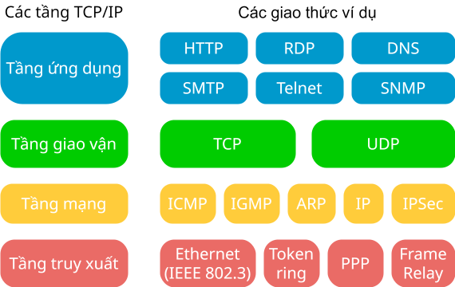

# Giao thức mạng

!!! abstract "Tóm lược nội dung"

    Bài này trình bày:

    - Khái quát về giao thức mạng
    - Giao thức TCP/IP

## Khái niệm

Giao thức là một tập hợp các quy tắc được thiết lập sẵn nhằm kiểm soát việc truyền và nhận dữ liệu giữa các thiết bị trong hệ thống mạng.

Nói cách khác, giao thức giống như một *ngôn ngữ chung* mà các thiết bị sử dụng để trao đổi với nhau.

Ví dụ:

- Giao thức ở tầng ứng dụng:

    - HTTP: dùng để truyền tải các siêu văn bản, chủ yếu là các trang web.

    - FTP: dùng để truyền tải tập tin giữa các máy tính.
    
    - SMTP: dùng để truyền tải email giữa các máy chủ.

    - POP3: dùng để nhận email từ máy chủ về máy tính của người dùng.

    - IMAP: cũng là giao thức để nhận email, nhưng IMAP cho phép người dùng quản lý email trực tiếp trên máy chủ, đồng thời truy cập email từ những thiết bị khác nhau.

- Giao thức ở tầng truyền tải:

    - TCP

    - UDP

- Giao thức ở tầng mạng:
    
    - IP

- Các giao thức khác:

    - DHCP: tự động cấp phát địa chỉ IP cho các thiết bị khi chúng kết nối vào mạng.
    - DNS: dịch các tên miền thành địa chỉ IP để trình duyệt có thể tìm thấy máy chủ.
    - HTTPS: là phiên bản bảo mật của HTTP, sử dụng mã hóa để bảo vệ dữ liệu truyền đi.

## Bộ giao thức TCP/IP

### Khái quát

**TCP/IP** là viết tắt của Transmission Control Protocol/Internet Protocol, tạm dịch là **giao thức điều khiển truyền tải** và **giao thức Internet**.

TCP/IP là bộ giao thức được sử dụng để kết nối các thiết bị trên Internet và trên các mạng máy tính khác.

TCP/IP là nền tảng của Internet, cho phép các máy tính trên toàn thế giới giao tiếp với nhau.

### Mô hình TCP/IP

Bộ giao thức TCP/IP được "mô hình hoá" thành 4 tầng như sau:

{ loading=lazy width=400 }

*Mô hình TCP/IP*

1. Tầng ứng dụng:

    Đóng vai trò cầu nối giữa các ứng dụng trên máy tính và các dịch vụ mạng. Nói cách khác, đây là nơi của các chương trình mà ta sử dụng hằng ngày như: trình duyệt web, phần mềm gửi email, phần mềm truyền file, v.v... giao tiếp với mạng.

    Khi một giao thức tầng ứng dụng cần giao tiếp với một tầng ứng dụng khác, nó sẽ chuyển tiếp thông tin của mình đến tầng vận chuyển.

2. Tầng giao vận:

    Chịu trách nhiệm về độ tin cậy, kiểm soát luồng và hiệu chỉnh dữ liệu gửi qua mạng.

3. Tầng mạng:

    Chịu trách nhiệm gửi các gói tin từ bất kỳ mạng nào đến được đích, bất kể gói tin đi theo đường nào.

4. Tầng truy xuất:

    Tầng này là sự kết hợp của tầng vật lý và tầng liên kết dữ liệu của trong mô hình OSI.
    
    Chịu trách nhiệm truyền thông tin giữa hai thiết bị trên cùng một mạng.

### Hai giao thức chính

TCP và IP là hai giao thức nền tảng và quan trọng nhất trong bộ giao thức TCP/IP.

- **TCP** (Transmission Control Protocol):

    - TCP kiểm soát việc truyền tải, bảo đảm dữ liệu được truyền đi một cách chính xác, đầy đủ và theo đúng thứ tự. Cụ thể, TCP chia dữ liệu thành các gói tin nhỏ, đánh số thứ tự cho từng gói tin và kiểm tra xem tất cả gói tin đã được nhận đầy đủ chưa.
    
    - TCP thường được dùng cho các ứng dụng đòi hỏi độ tin cậy cao như gửi email, truyền file, truy cập web.

- **IP** (Internet Protocol):

    - IP chịu trách nhiệm định tuyến các gói tin trên mạng đến được địa chỉ đích.

    - IP cung cấp địa chỉ duy nhất cho mỗi thiết bị kết nối vào mạng.

## Sơ đồ tóm tắt nội dung

{!grade-12/topic-B/network-protocols.mm.md!}
*Sơ đồ tóm tắt về giao thức mạng*

## Some English words

| Vietnamese | Tiếng Anh | 
| --- | --- |
| bộ giao thức | suite of communication protocols |
| giao thức | protocol |
| tầng giao vận | tranport layer |
| tầng mạng | internet layer, network layer |
| tầng truy xuất | network access layer |
| tầng ứng dụng | application layer |
