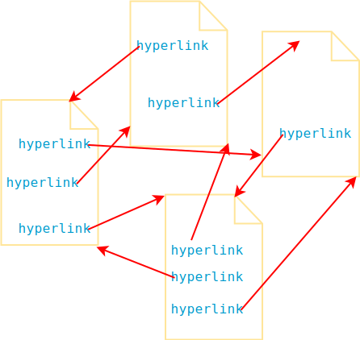
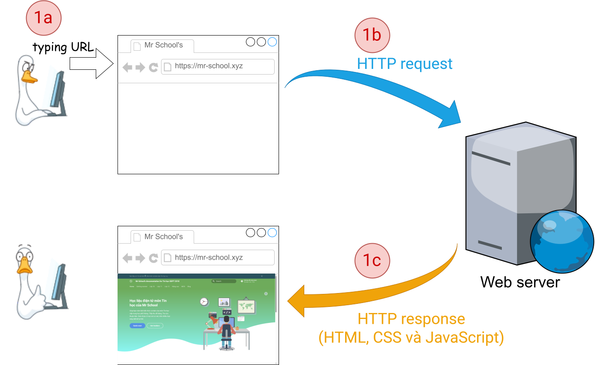

# Ngôn ngữ HTML và trang web

!!! abstract "Tóm lược nội dung"

    Bài này trình bày một vài khái niệm liên quan đến trang web bao gồm:
    
    - Siêu văn bản
    - Siêu liên kết
    - Trang web, website
    - HTML
    - Trình duyệt web

## Khái niệm

!!! note "Siêu văn bản"

    Siêu văn bản là văn bản
    
    - hiển thị trên máy tính và những thiết bị số khác
    - và có chứa các siêu liên kết cho phép người đọc truy xuất ngay đến những thông tin hữu quan khác.

Văn bản có chứa video hoặc ảnh động thì vẫn không phải là siêu văn bản.

!!! note "Siêu liên kết"

    Siêu liên kết, có thể gọi tắt là *liên kết*, là một tham chiếu hoặc một kết nối giữa hai phần thông tin trong cùng một siêu văn bản hoặc giữa các văn bản khác nhau.

Nói cách khác, siêu liên kết có thể dẫn đến phần nội dung khác của cùng siêu văn bản hoặc dẫn đến một văn bản khác.

{ loading=lazy }

!!! note "Trang web"

    Trang web là một ví dụ của siêu văn bản. 

Khi đang truy xuất một trang web, người dùng có thể nhấn vào siêu liên kết nào đó để truy xuất ngay phần nội dung khác của cùng trang web hoặc trang web khác.

!!! note "Website"

    Website là tập hợp các trang web hữu quan và đứng chung dưới một tên miền.

Ví dụ:  
Website của Samsung là tập hợp các trang web liên quan đến các sản phẩm của Samsung và đứng chung dưới tên miền [samsung.com](https://www.samsung.com/){:target="_blank"}.

!!! note "HTML"

    HTML (Hypertext Markup Language) là ngôn ngữ cơ bản dùng để tạo nên một trang web.

Phiên bản mới nhất hiện nay là [HTML5](https://html.spec.whatwg.org/multipage/){:target="_blank"}.

Ngoài HTML, còn có những ngôn ngữ hoặc công nghệ khác góp phần tạo nên một trang web (1).
{ .annotate }

1.  Trong khi HTML giúp định nghĩa cấu trúc và nội dung của trang web, thì những ngôn ngữ khác kết hợp với HTML nhằm tăng thêm tính năng cho trang web. Chẳng hạn như:
    
    - **CSS**: xử lý bố cục và cách thể hiện của trang web, giúp trang web thêm trực quan và đẹp mắt.
    - **JavaScript**: xử lý hành vi của trang web, làm cho trang web tương tác được với người dùng.

## Cách thức hoạt động của HTML

!!! note "Phần tử HTML"

    HTML định nghĩa cấu trúc của trang web bằng cách sử dụng các **phần tử**.

Các phần tử HTML này có tác dụng tổ chức những nội dung sẽ hiển thị trên trang web.

Nói cách khác, mỗi thành phần của trang web như văn bản, hình ảnh, âm thanh, video, v.v... đều được xác định bởi những phần tử HTML tương ứng.

!!! note "Thẻ và thuộc tính"

    Mỗi phần tử HTML gồm có một **thẻ** và có thể nhiều **thuộc tính**. 

Thẻ là thành phần cốt lõi của thuộc tính. Tên thẻ đặt trong cặp ngoặc `< >`.

Có hai loại thẻ: **thẻ mở** và **thẻ đóng**. Thẻ mở đánh dấu chỗ bắt đầu và thẻ đóng đánh dấu chỗ kết thúc của phần tử.

Bên cạnh đó, còn có một số thẻ không cần thẻ đóng, có thể gọi là *thẻ tự đóng*.

!!! example "Ví dụ"

    === "Cặp thẻ đóng mở"

        `<h1> </h1>` `<h2> </h2>` ... `<h6> </h6>`
        
        `
 
`
        
        `
 
`

    === "Thẻ tự đóng"

        ``
        
        ` `
        
        `
`
        
        `<link>`

!!! note "Trình duyệt web và HTML"

    Khi ta truy cập một trang web bằng trình duyệt web (1), có ba công đoạn diễn ra:
    { .annotate }

    1.  Trình duyệt web là phần mềm giúp truy cập và khám phá các website, giống như một hướng dẫn viên du lịch trên Internet.
    
        Những trình duyệt phổ biến hiện nay: Microsoft Edge, Google Chrome, Mozilla Firefox, Opera, Samsung Internet, v.v...

    &nbsp;

    1. Trình duyệt tải xuống mã nguồn HTML của trang web này từ máy chủ chứa website liên quan. (Minh hoạ tại hình ngay bên dưới)
    2. Trình duyệt phân tích mã nguồn HTML để hiểu cấu trúc và nội dung của trang web.
    3. Trình duyệt tiến hành kết xuất trang web, bao gồm việc thông dịch các phần tử HTML, áp dụng mã CSS và thực thi mã javascript.[^1]

[^1]: CSS được đề cập trong những bài sau, còn Javascript không có trong chương trình học.

{ loading=lazy width=800 loading=lazy data-title="Minh hoạ công đoạn 1" data-description="Trình duyệt tải mã nguồn HTML từ web server."}

Về cơ bản, các trình duyệt đều kết xuất trang web một cách tương tự nhau, do chúng đều tuân theo những tiêu chuẩn chung, chẳng hạn HTML5. Tuy nhiên, vẫn còn nhiều yếu tố tạo ra sự khác biệt khi các trình duyệt kết xuất cùng một trang web, dẫn đến việc người dùng sẽ có những trải nghiệm khác nhau trên các trình duyệt.

Vì vậy, các nhà phát triển web phải kiểm thử trang web của mình trên nhiều trình duyệt lẫn thiết bị khác nhau để đảm bảo trang web hoạt động tốt. Các hình dưới đây minh họa kết xuất của một trang web trên những trình duyệt khác nhau.

=== "Chrome trên Windows 11"
    { width=800 loading=lazy}

=== "Firefox trên Windows 11"
    { width=800 loading=lazy}

=== "Safari trên Macbook Air"
    { width=688 loading=lazy}

=== "Galaxy S21 Ultra"
    { width=198 loading=lazy}

=== "iPhone 13 PRO MAX"
    { width=213 loading=lazy}

## Sơ đồ tóm tắt nội dung

{!grade-12/topic-F/html-vs-web-page.mm.md!}
*Sơ đồ tóm tắt những khái niệm về trang web*

## Some English words

| Vietnamese | Tiếng Anh | 
| --- | --- |
| kết xuất | render |
| ngôn ngữ đánh dấu siêu văn bản | HTML (HyperText Markup Language) |
| phần tử HTML | HTML element |
| siêu liên kết | hyperlink |
| siêu văn bản | hypertext |
| thẻ | tag |
| thuộc tính | attribute |
| trang web | web page |
| trình duyệt web | web browser |

