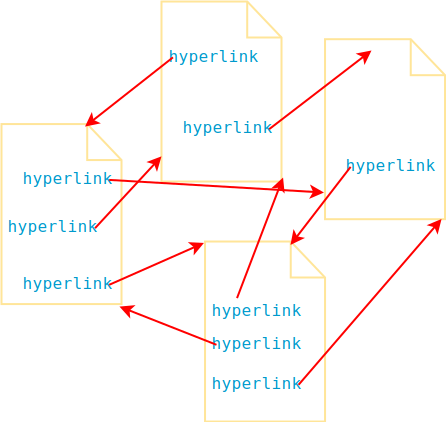
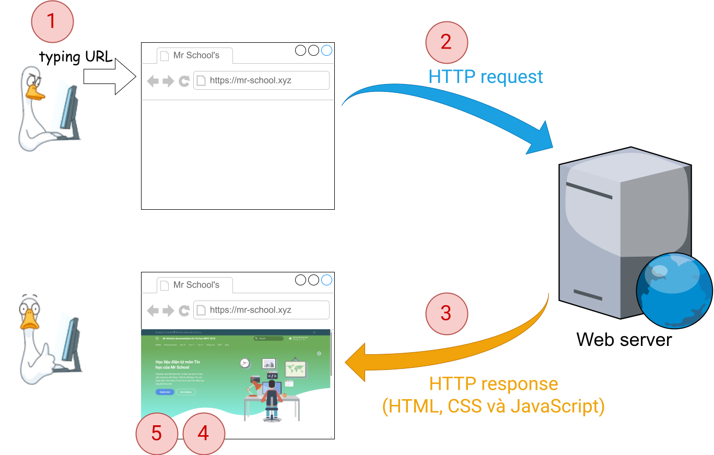

# Khái quát về HTML và web

!!! abstract "Tóm lược nội dung"

    Bài này trình bày một số khái niệm gồm:
    
    - Siêu văn bản
    - Siêu liên kết
    - Trang web, website
    - HTML
    - Trình duyệt web

## Siêu văn bản

**Siêu văn bản** là văn bản

- hiển thị trên máy tính và những thiết bị số khác
- và có chứa các [siêu liên kết](#sieu-lien-ket) (1) cho phép người đọc truy xuất ngay đến những thông tin liên quan khác.
{ .annotate }
    
    1.  Văn bản có chứa video hoặc ảnh động thì vẫn không phải là siêu văn bản.

## Siêu liên kết

**Siêu liên kết**, gọi tắt là **liên kết**, là một kết nối giữa hai phần thông tin trong cùng một siêu văn bản hoặc giữa các siêu văn bản khác nhau.

Nói cách khác, siêu liên kết giúp ta truy cập ngay các nguồn tài nguyên khác trên mạng.

{loading=lazy}

## Trang web

**Trang web** là một tài liệu nằm trên hệ thống World Wide Web (1) và được hiển thị trên trình duyệt web.
{ .annotate }

1.  World Wide Web, viết tắt là www, là hệ thống thông tin mà trong đó mỗi tài liệu hoặc mỗi tài nguyên web được xác định bằng một URL (Uniform Resource Locators) và có thể được truy cập thông qua Internet.

Trang web là một ví dụ của siêu văn bản. 

## Website

**Website** là tập hợp các trang web liên quan và đứng chung dưới một tên miền.

Ví dụ:

Website của Samsung là tập hợp các trang web liên quan đến các sản phẩm của Samsung và đứng chung dưới tên miền [samsung.com](https://www.samsung.com/){:target="_blank"}.

## HTML

**HTML** (Hypertext Markup Language) (1) là ngôn ngữ cơ bản dùng để tạo nên một trang web.
{ .annotate }

1.  Phiên bản mới nhất hiện nay là [HTML5](https://html.spec.whatwg.org/multipage/){:target="_blank"}.

Ngoài HTML, còn có những ngôn ngữ hoặc công nghệ khác góp phần tạo nên một trang web (1).
{ .annotate }

1.  Trong khi HTML giúp định nghĩa cấu trúc và nội dung của trang web, thì những ngôn ngữ khác kết hợp với HTML nhằm tăng thêm tính năng cho trang web. Chẳng hạn như:
    
    - **CSS**: xử lý cách thể hiện của trang web, giúp trang web thêm trực quan và đẹp mắt.
    - **JavaScript**: xử lý hành vi của trang web, giúp trang web tương tác được với người dùng.

### Phần tử HTML

Ngôn ngữ HTML định nghĩa cấu trúc của trang web bằng cách sử dụng các **phần tử**.

Các phần tử HTML này có tác dụng tổ chức những nội dung sẽ hiển thị trên trang web.

Nói cách khác, mỗi thành phần của trang web như văn bản, hình ảnh, âm thanh, video, v.v... đều được xác định bởi những phần tử HTML tương ứng.

### Thẻ và thuộc tính

Mỗi phần tử HTML được đại diện bằng một **thẻ HTML** (1) và có thể có nhiều **thuộc tính**.
{ .annotate }

1.  Trong nhiều tài liệu, thuật ngữ **phần tử** và **thẻ** được sử dụng thay thế cho nhau.

Tên thẻ đặt trong cặp ngoặc `< >`.

Có hai loại thẻ:

- **Thẻ mở**: đánh dấu chỗ bắt đầu phần tử.
- **Thẻ đóng**: đánh dấu chỗ kết thúc phần tử.

Ngoài ra, còn có các phần tử không cần thẻ đóng, có thể gọi là **thẻ tự đóng**.

| Cặp thẻ đóng mở | Thẻ tự đóng | 
| --- | --- |
| `<h1> </h1>` `<h2> </h2>` ... `<h6> </h6>`   `
 
`   `
 
` | ``   ` `   `
`   `<link>` |

## Trình duyệt web

### Khái quát

**Trình duyệt web** là phần mềm giúp truy cập và khám phá các website.

Ví dụ:

Những trình duyệt phổ biến hiện nay:

- [Microsoft Edge](https://www.microsoft.com/en-us/edge){target="_blank"}
- [Google Chrome](https://www.google.com/chrome/){target="_blank"}
- [Mozilla Firefox](https://www.mozilla.org/en-US/firefox/){target="_blank"}
- [Opera](https://www.opera.com/){target="_blank"}
- [Samsung Internet](https://www.samsung.com/us/support/owners/app/samsung-internet){target="_blank"}

### Cơ chế hoạt động

Các công đoạn chính khi duyệt web:

1. Người dùng nhập địa chỉ của trang web.

2. Trình duyệt gửi yêu cầu đến máy chủ web.

3. Máy chủ xử lý và trả về mã HTML của trang web.

4. Trình duyệt phân tích mã HTML để hiểu cấu trúc và nội dung của trang web.

5. Trình duyệt kết xuất trang web, trong đó bao gồm các thao tác như: thông dịch các phần tử HTML, áp dụng mã CSS và thực thi mã JavaScript. (1)
{ .annotate }

    1.  CSS được đề cập trong những bài sau, còn Javascript không có trong chương trình học.

{loading=lazy}

### Kết quả kết xuất

Về cơ bản, các trình duyệt đều tuân thủ những tiêu chuẩn chung (1), nên chúng kết xuất cùng một trang web một cách tương tự nhau. Tuy nhiên, do còn nhiều yếu tố khác, nên với cùng một trang web, người dùng sẽ có những trải nghiệm khác nhau trên các trình duyệt khác nhau.
{ .annotate }

1.  Một số tiêu chuẩn phổ biến hiện nay:
    
    - HTML5: phiên bản mới nhất của ngôn ngữ HTML.
    - CSS3: phiên bản mới nhất của ngôn ngữ CSS.
    - ECMAScript 6: phiên bản mới nhất của ngôn ngữ JavaScript.

Vì vậy, các nhà phát triển web phải kiểm thử trên nhiều trình duyệt lẫn thiết bị khác nhau để bảo đảm trang web hoạt động tốt.

Các hình dưới đây minh họa kết xuất của một trang web trên những trình duyệt khác nhau.

=== "Chrome trên Windows 11"
    {loading=lazy}

=== "Firefox trên Windows 11"
    {loading=lazy}

=== "Safari trên Macbook Air"
    {width=688 loading=lazy}

=== "Galaxy S21 Ultra"
    {width=198 loading=lazy}

=== "iPhone 13 PRO MAX"
    {width=213 loading=lazy}

## Sơ đồ tóm tắt

    <iframe style="width: 100%; height: 360px" frameBorder=0 src="../mindmaps/html-web-a-simplified-overview.html">Sơ đồ tóm tắt</iframe>

## Some English words

| Vietnamese | Tiếng Anh | 
| --- | --- |
| kết xuất | render |
| ngôn ngữ đánh dấu siêu văn bản | HTML (HyperText Markup Language) |
| phần tử HTML | HTML element |
| siêu liên kết | hyperlink |
| siêu văn bản | hypertext |
| thẻ | tag |
| thuộc tính | attribute |
| trang web | web page |
| trình duyệt web | web browser |
