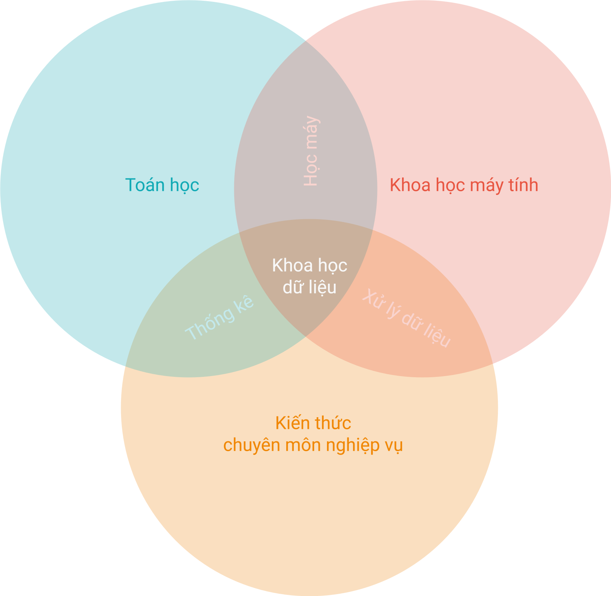

# Khoa học dữ liệu

!!! abstract "Tóm lược nội dung"

    Bài này trình bày một số khía cạnh về khoa học dữ liệu, bao gồm:
    
    - Khái niệm
    - Các lĩnh vực liên quan
    - Quy trình
    - Vai trò của máy tính
    - Tính ưu việt của máy tính và thuật toán
    - Một số thành tựu
   
## Khái quát

Trong thế giới số, mỗi khi ta thực hiện một thao tác, ta đã để lại một **dấu vết kỹ thuật số** (1) và hệ thống sẽ ghi nhận nó thành một thực thể dữ liệu.
{ .annotate }

1.  Dấu vết kỹ thuật số được chia thành hai loại chính:

    1. **Dấu vết chủ động**
    
        Là dữ liệu mà ta chủ ý tạo ra. Ví dụ: email, bài đăng hoặc bình luận trên mạng xã hội.

    2. **Dấu vết thụ động**

        Là dữ liệu được thu thập mà ta có thể không nhận ra hoặc không trực tiếp kiểm soát tại thời điểm đó. Ví dụ: địa chỉ IP của máy tính, vị trí, cookies khi duyệt web.

Khoa học dữ liệu bắt nguồn từ những dấu vết kỹ thuật số này. Chúng còn được gọi là **dữ liệu thô**.

Nếu dữ liệu thô chỉ có một ít, ta không thể hiểu hết về một đối tượng. Song với lượng dữ liệu thô đủ lớn, chẳng hạn như hàng triệu dấu vết kỹ thuật số của đối tượng (1), tạo thành một dòng chảy không ngừng nghỉ, khoa học dữ liệu có thể:
{ .annotate }

1.  Tập hợp những dấu vết kỹ thuật số khổng lồ này được gọi là **dữ liệu lớn**.

&emsp;

- Phân tích dữ liệu trong quá khứ, chẳng hạn như: hành vi, quá trình.
- Nắm bắt dữ liệu hiện tại, chẳng hạn như: trạng thái, ngữ cảnh.
- Kết hợp *"quá khứ"* và *"hiện tại"* tạo ra *"quyền năng"* của khoa học dữ liệu, chẳng hạn như: so sánh, đối chiếu, dự đoán xu hướng tương lai.

Ví dụ:  
Khoa học dữ liệu có thể giúp thực hiện một chuỗi nhận thức liên tục như sau:

- Hệ thống lưu trữ và phân tích việc ta thường xuyên xem các video dạy học tiếng Anh vào tối thứ Bảy. 
- Hệ thống nhận thấy ta vừa nhấn vào một khoá học IELTS và đang dừng lại ở trang thanh toán hai phút mà chưa *"chốt đơn"*.
- Hệ thống dự đoán khả năng cao là ta sẽ mua, nên lập tức gửi mã giảm giá 10% nhằm *"tối ưu hoá"* khả năng *"chốt đơn"*.

Tóm lại, khoa học dữ liệu là tiến trình *"bắt"* dữ liệu phải *"lên tiếng"*. Khoa học dữ liệu không chỉ là *"kính lúp để soi quá khứ"* mà còn là *"radar để quét hiện tại"* và "*la bàn để chỉ hướng cho tương lai"*.

!!! note "Khái niệm khoa học dữ liệu"

    **Khoa học dữ liệu** là tiến trình trích xuất những thông tin và tri thức có giá trị từ các tập dữ liệu khổng lồ, hay gọi tắt là **trích xuất tri thức từ dữ liệu**.

---

## Mục đích

Khoa học dữ liệu hướng đến 3 việc sau, sắp xếp theo mức độ tăng dần:

1. **Mô tả dữ liệu**

    Việc này giúp thấy được điều gì đã xảy ra.

    Mô tả dữ liệu bao gồm phân tích dữ liệu và trực quan hoá dữ liệu.

    - **Phân tích dữ liệu** là nắm được các thuộc tính và ý nghĩa của dữ liệu.

    - **Trực quan hoá dữ liệu** là biểu diễn dữ liệu thông qua biểu đồ hoặc infographic.

    Ví dụ:  
    Hệ thống vận hành xe ôm công nghệ biết được thói quen di chuyển của khách hàng thông qua các biểu đồ nhiệt: vào giờ H của thứ Hai hằng tuần, khu vực R luôn có lượng gọi xe cao gấp N lần so với khung giờ khác; 80% các chuyến đều hướng về các toà nhà văn phòng.

2. **Khám phá tri thức và dự đoán xu hướng**:

    Việc này giúp hiểu rõ hơn về xu hướng cũng như những mối quan hệ ẩn trong dữ liệu. Từ đó, có thể dự đoán được tương lai.

    Ví dụ:  
    Hệ thống biết rằng: thứ Hai tuần tới là ngày đầu tiên sau kỳ nghỉ Tết, cộng với dự báo 70% có mưa. Hệ thống dự đoán lượng cầu sẽ tăng thêm 30%.

3. **Đề xuất và tối ưu hoá quyết định**

    Việc này giúp đưa ra giải pháp tốt nhất cho một vấn đề, thay sự *"cảm tính"* bằng *"định lượng"*.

    Ví dụ:  
    Hệ thống đề xuất: áp dụng chính sách giá linh hoạt để khuyến khích tài xế chạy đến khu vực R; gợi ý tài xế A đang ở gần đó chạy đến đường S.

---

## Các lĩnh vực liên quan

Để thực hiện tiến trình trích xuất tri thức từ dữ liệu, khoa học dữ liệu cần sự giao thoa của ba lĩnh vực lớn.

!!! note "Các lĩnh vực liên quan"

    Về khía cạnh học thuật, **khoa học dữ liệu** là lĩnh vực liên ngành kết hợp giữa:

    - Toán học
    - Khoa học máy tính
    - Kiến thức chuyên môn nghiệp vụ

Hình sau minh hoạ mối quan hệ giữa khoa học dữ liệu và các lĩnh vực liên quan.

{loading=lazy width=480}

Ba lĩnh vực trên đóng vai trò là trụ cột kiến thức cho khoa học dữ liệu, trong đó:

- **Toán học** đóng vai trò nền tảng cốt lõi, là phần *"hồn"*, dùng để tư duy và suy luận.
- **Khoa học máy tính** đóng vai trò công cụ, dùng để điều khiển việc thu thập và xử lý dữ liệu.
- **Kiến thức chuyên môn nghiệp vụ** đóng vai trò ngữ cảnh, dùng để hiểu đúng về dữ liệu.

Ví dụ:  
Đối với việc xây dựng hệ thống phát hiện bệnh qua hình ảnh X-quang:

- Toán học: giúp tính toán xác suất vùng mờ trên ảnh có phải là khối u hay không.
- Khoa học máy tính: giúp xử lý hàng vạn hình ảnh cùng lúc với tốc độ nhanh.
- Kiến thức chuyên môn nghiệp vụ: cụ thể là y khoa, giúp hiểu một chấm đen tại một vị trí nào đó là bình thường hay cần báo động. 

---

## Quy trình khoa học dữ liệu

### CRISP-DM

Theo hướng tiếp cận tư duy hệ thống, vòng đời của một dự án khoa học dữ liệu thường áp dụng quy trình **CRISP-DM**, viết tắt của **Cross-Industry Standard Process for Data Mining**, tạm dịch là **Quy trình tiêu chuẩn liên ngành dành cho khai phá dữ liệu**.

| Bước | Tên gọi | Ý nghĩa khoa học |
| --- | --- | --- |
| 1 | Xác định vấn đề | Xác định mục tiêu và giả thuyết. |
| 2 | Thu thập dữ liệu | Thu thập dữ liệu huấn luyện và dữ liệu kiểm tra. |
| 3 | Chuẩn bị dữ liệu | Làm sạch, loại bỏ dữ liệu sai hoặc lỗi. Chọn lọc, kết hợp và định dạng lại dữ liệu. |
| 4 | Mô hình hoá | Áp dụng các thuật toán phù hợp để tìm ra các mối liên hệ ẩn giấu trong dữ liệu. |
| 5 | Đánh giá | Kiểm tra độ chính xác và độ tin cậy của mô hình. |
| 6 | Triển khai | Đưa mô hình vào sử dụng trong thực tế. |

### OSEMN

Nếu CRISP-DM là chiến lược thì OSEMN là các bước hành động cụ thể của một lập trình viên khi đối mặt với dữ liệu.

Khung quy trình **OSEMN** (The OSEMN Framework), viết tắt của **Obtain, Scrub, Explore, Model, iNterpret** (1), thường được gọi là **đường ống khoa học dữ liệu** (The data science pipeline) để diễn tả dữ liệu đi từ đầu này, qua các công đoạn và ra ở đầu kia.
{ .annotate }

1.  Người ta không lấy chữ **I**, mà lấy chữ **N** là để phát âm tương tự *"awesome"*, nghĩa là *"tuyệt vời"*, thay vì OSEMI khó đọc và không có nghĩa.

| Bước | Tên gọi | Công việc cụ thể |
| --- | --- | --- |
| 1  | Thu thập | Lấy dữ liệu từ các nguồn khác nhau như: tập tin, cảm biến, internet. |
| 2 | Làm sạch | Xử lý các giá trị trống, dữ liệu nhiễu hoặc các lỗi định dạng. |
| 3 | Khám phá | Dùng biểu đồ và thống kê mô tả để "nhìn" vào dữ liệu, tìm ra những điểm bất thường hoặc các xu hướng thú vị ban đầu. |
| 4 | Xây dựng mô hình | Sử dụng thuật toán để tìm ra các quy luật. |
| 5 | Thông dịch kết quả | Chuyển hoá các con số phức tạp thành những báo cáo, câu chuyện dễ hiểu. |

---

## Vai trò của máy tính đối với khoa học dữ liệu

!!! note "Vai trò của máy tính"

    Máy tính đóng vai trò là **công cụ thực thi** và **môi trường vận hành** của khoa học dữ liệu.

Máy tính là **điều kiện cần** để khoa học dữ liệu tồn tại và phát triển trong kỷ nguyên số.

Cụ thể:

- Với vai trò công cụ thực thi, máy tính có thể:

    - Số hoá và lưu trữ các thực thể dữ liệu.
    - Thực hiện các thuật toán phức tạp.

- Với vai trò môi trường vận hành, máy tính giúp kết nối các bước trong quy trình khoa học dữ liệu thành một dòng chảy liên tục.

---

## Tính ưu việt của máy tính và thuật toán trong xử lý dữ liệu lớn

1. **Năng lực lưu trữ lớn và bảo mật dữ liệu**

    Công nghệ điện toán đám mây cho phép lưu trữ hàng tỷ thực thể dữ liệu từ khắp nơi trên thế giới.

2. **Tốc độ xử lý siêu việt**

    Sự ra đời của các bộ vi xử lý chuyên dụng như GPU, NPU và TPU đã giúp cho việc xây dựng mô hình trở nên khả thi. Các phép toán trên ma trận phức tạp giờ đây được giải quyết với tốc độ rất nhanh.

3. **Năng lực tự động hoá**

    Sử dụng thuật toán để tự động hoá toàn bộ *"đường ống dữ liệu"*, tức các nhiệm vụ có tính chất lặp lại trong quy trình.

4. **Năng lực xử lý song song**

    Máy tính có thể chia nhỏ dữ liệu khổng lồ thành hàng triệu phần và xử lý chúng cùng một lúc.

5. **Năng lực xử lý theo thời gian thực**

    Nghĩa là máy tính có năng lực phản hồi kết quả gần như ngay tức thì, độ trễ rất thấp, sau khi nhận dữ liệu đầu vào.
    
    Xử lý song song là điều kiện cần và là nền tảng quan trong để đạt được xử lý theo thời gian thực.

6. **Năng lực mở rộng**

    Mở rộng không chỉ có nghĩa là làm việc nhiều hơn, mà còn có nghĩa là hệ thống vẫn vận hành tốt khi lượng dữ liệu tăng lên hàng triệu lần. Trong đó:

    - Mở rộng theo chiều dọc: nâng cấp cấu hình máy tính mạnh hơn.
    - Mở rộng theo chiều ngang: kết nối hàng nghìn máy tính với nhau.

7. **Tính khách quan**

    Với cùng một dữ liệu đầu vào, thuật toán luôn cho ra kết quả nhất quán.
    
    Điều này giúp hệ thống trở nên công bằng và đáng tin cậy, loại bỏ được những sai sót do cảm tính của con người.

8. **Năng lực phát hiện mối quan hệ phi tuyến tính**

    Thuật toán có năng lực tìm ra các quy luật ẩn giữa hàng nghìn biến số khác nhau.

---

## Một số thành tựu

Khoa học dữ liệu đã trở thành hạt nhân chính của sự phát triển hiện đại. Dưới đây là những thành tựu nổi bật thể hiện sức mạnh của lĩnh vực này:

1. **Khám phá tri thức mới**

    Khoa học dữ liệu có khả năng tìm ra những quy luật và mối liên hệ mà con người chưa từng biết tới, đặc biệt là các lĩnh vực phức tạp như y sinh.

    Ví dụ:  
    Trong dự án giải mã bản đồ gene của người, khoa học dữ liệu giúp phân tích hàng tỷ chuỗi DNA để tìm ra các gene gây bệnh.

2. **Nâng cao năng lực ra quyết định**

    Thay vì dựa vào kinh nghiệm hoặc cảm tính, các cá nhân, tổ chức hiện nay đã dựa trên bằng chứng số liệu để đưa ra quyết định, giúp tăng hiệu quả và giảm rủi ro.

    Ví dụ:  
    Các hãng hàng không sử dụng dữ liệu về thời tiết, giá nhiên liệu và nhu cầu của khách hàng để quyết định giá vé và lịch trình bay theo thời gian thực, giúp tối ưu hoá lợi nhuận trong khi khách hàng vẫn có cơ hội mua được vé giá tốt.

3. **Cá nhân hoá trải nghiệm người dùng**

    Khoa học dữ liệu giúp các hệ thống hiểu rõ sở thích cá nhân của từng người, từ đó phục vụ người dùng một cách chính xác nhất.

    Ví dụ:  
    Các hệ thống đề xuất nội dung của Youtube, Netflix, Spotify hoặc của các mạng xã hội.

4. **Dự báo xu hướng**

    Khoa học dữ liệu có thể *"nhìn thấy tương lai"*, giúp con người chủ động hơn trước các biến cố.

    Ví dụ:  
    Trong lĩnh vực tài chính - ngân hàng, khoa học dữ liệu giúp phát hiện các giao dịch gian lận chỉ trong vài mili-giây.

5. **Thúc đẩy sự phát triển của tự động hoá và AI**

    Khoa học dữ liệu là nền móng tạo ra những cỗ máy thông minh có năng lực tự học và thực hiện các nhiệm vụ thay con người.

    Ví dụ:  
    Xe tự hành là *"đỉnh cao"* của việc kết hợp xử lý song song và thời gian thực để đưa ra các quyết định lái xe an toàn.

---

## Sơ đồ tóm tắt

    <iframe style="width: 100%; height: 360px" frameBorder=0 src="../mindmaps/data-science.html">Sơ đồ tóm tắt</iframe>

---

## Some English words

| Vietnamese | Tiếng Anh | 
| --- | --- |
| dấu vết kỹ thuật số | digital footprint |
| dữ liệu thô | raw data |
| khoa học dữ liệu | data science |