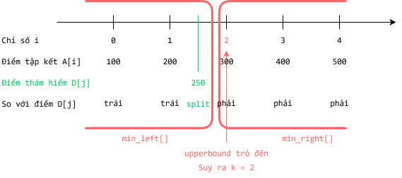

# 2023 - 2024 Vĩnh Phúc 

## Bài 1: Truy vấn đoạn

### Đề bài

Cho dãy gồm N số nguyên dương đôi một phân biệt $a_1, a_2, ..., a_n$. Tèo cần trả lời $Q$ truy vấn, truy vấn thứ $i$ cho ba số nguyên dương $l_i, r_i, d_i$ với yêu cầu xác định xem có bao nhiêu số từ vị trí $l_i$ đến $r_i$ trong dãy là ước số hoặc bội số của $d_i$. Bạn hãy lập trình giúp Tèo trả lời các truy vấn nhé!

**Dữ liệu:**

- Dòng 1: Gồm hai số nguyên $N, Q (1 \le N, Q \le 10^5)$;
- Dòng 2: Gồm $N$ số nguyên dương đôi một phân biệt $a_1, a_2, ..., a_n (1 \le a_i \le 2 \cdot 10^5, 1 \le i \le N)$;
- Tiếp theo là $Q$ dòng, mỗi dòng mô tả một truy vấn gồm ba số nguyên $l_i, r_i, d_i \quad (1 \leq l_i \leq r_i \leq N, \ 1 \leq d_i \leq 2 \cdot 10^5, \ 1 \leq i \leq Q)$.

**Kết quả:**

- Ghi trên một dòng duy nhất gồm $Q$ số nguyên, số thứ $i (1 \le i \le Q)$ là câu trả lời cho truy vấn thứ i.

**Ví dụ:**

| squery.inp | squery.out | Giải thích |
| --- | --- | --- |
| 8 5 <br> 12 10 3 18 6 72 28 42 <br> 1 8 6 <br> 2 7 5 <br> 1 5 3 <br> 3 7 3 <br> 4 4 1 | 6 1 3 1 2 | Trong truy vấn 1: Các số trong đoạn từ vị trí 1 đến 8 là ước hoặc bội của số 6 gồm: 12, 3, 18, 6, 72, 42. |

Ràng buộc:

- 80% số điểm có $Q = 1$;
- 10% số điểm có $N, Q \le 1000$;
- 10% số điểm không có ràng buộc bổ sung.

### Bài giải đề xuất

Để đếm số lượng ước hoặc bội của `d`, ta duyệt mảng `A` từ vị trí `l` đến `r` và xét từng phần tử trong phạm vi này.

=== "C++"

    ```c++ linenums="14"
    int count_dm(int l, int r, int d)
    {
        int cnt = 0;

        // Duyệt mảng A từ vị trí l đến vị trí r
        for (int i = l; i < r +  1; ++i)
        {
            // Xét A[i] là ước hoặc bội của d
            if (A[i] % d == 0 || d % A[i] == 0)
            {
                cnt += 1;
            }
        }

        return cnt;
    }
    ```

=== "Python"

    ```py linenums="12"
    def count_dm(l, r, d):
        cnt = 0
        
        # Duyệt mảng A từ vị trí l đến vị trí r
        for i in range(l, r + 1):
            # Xét A[i] là ước hoặc bội của d
            if A[i] % d == 0 or d % A[i] == 0:
                cnt += 1
        return cnt
    ```

### Mã nguồn

Code đầy đủ được đặt tại [GitHub](https://github.com/vtchitruong/hsg/tree/main/hsg12-tinh/2023-2024-vinhphuc/squery){:target="_blank"}.

---

## Bài 2: Triển lãm tranh

### Đề bài

Tèo có N bức tranh được đánh số từ 1 đến $N$. Bức tranh thứ $i (1 \le i \le N)$ có kích thước $S_i$ và giá trị $V_i$.  

Ngoài ra, Tèo có $M$ khung tranh được đánh số từ 1 đến $M$. Khung tranh thứ $j (1 \le j \le M)$ có kích thước $C_j$ chỉ chứa được một bức tranh có kích thước không vượt quá kích thước của khung tranh.

Tèo cần chọn ra một số bức tranh để trưng bày sao cho thỏa mãn các điều kiện sau:

- Tranh phải được đặt vào trong khung tranh;
- Kích thước của khung tranh bên phải luôn lớn hơn hoặc bằng kích thước bức tranh bên trái;
- Giá trị của bức tranh bên phải luôn lớn hơn hoặc bằng giá trị của bức tranh bên trái;
- Số bức tranh được chọn là nhiều nhất có thể.

Hãy lập trình tính xem Tèo có thể trưng bày nhiều nhất bao nhiêu bức tranh.

**Dữ liệu:**

- Dòng 1: Gồm hai số nguyên $N, M (1 \le N, M \le 10^5)$ tương ứng với số bức tranh và số khung tranh;
- Tiếp theo là $N$ dòng, mỗi dòng gồm hai số nguyên dương $S_i, V_i (1 \le S_i, V_i \le 10^9, 1 \le i \le N)$ là kích thước và giá trị của bức tranh thứ $i$;
- Cuối cùng là $M$ dòng, mỗi dòng gồm một số nguyên $C_j (1 \le C_j \le 10^9, 1 \le j \le M)$ là kích thước của khung tranh thứ $j$.

**Kết quả:**

- In ra một số nguyên là số lượng bức tranh nhiều nhất mà Tèo có thể trưng bày.

**Ví dụ:**

| picture.inp | picture.out | Giải thích |
| --- | --- | --- |
| 3 4 <br> 10 20 <br> 5 1 <br> 3 5 <br> 4 <br> 6 <br> 10 <br> 4 | 2 | Tèo có thể trưng bày nhiều nhất 2 bức tranh, trong đó có một cách trưng bày theo thứ tự như sau: <br> \[Tranh 2 đặt trong Khung 2\] và \[Tranh 1 đặt trong Khung 3\] |

Ràng buộc:

- 50% số điểm có $N, M \le 10$;
- 30% số điểm có $N, M \le 1000$;
- 20% số điểm không có ràng buộc bổ sung.

### Bài giải đề xuất

**Bước 1:** Sắp xếp các bức tranh và khung tranh theo thứ tự nhằm chuẩn bị thực hiện tham lam (greedy).

=== "C++"

    ```c++ linenums="44"
        // Sắp xếp các bức tranh theo kích thước tăng dần
        // Nếu cùng kích thước thì sắp xếp theo giá trị tăng dần
        sort(pictures.begin(), pictures.end());

        // Sắp xếp các khung tranh theo kích thước tăng dần
        sort(frames.begin(), frames.end());
    ```

=== "Python"

    ```py linenums="30"
        # Sắp xếp các bức tranh theo kích thước tăng dần
        # Nếu cùng kích thước thì sắp xếp theo giá trị tăng dần
        pictures.sort(key=lambda x: (x[0], x[1])) # (1)!
        
        # Sắp xếp các khung tranh theo kích thước tăng dần
        frames.sort()
    ```
    { .annotate }

    1.  Có thể được viết gọn lại thành `pictures.sort()`.

**Bước 2:** Thực hiện tham lam như sau:

Duyệt các khung tranh `frames[j]`, lặp thao tác:

&emsp;Dùng while để duyệt các bức tranh `pictures[i]` có kích thước nhỏ hơn hoặc bằng khung tranh `frames[j]`.

&emsp;&emsp;Nếu bức tranh `pictures[i]` có giá trị lớn hơn hoặc bằng bức tranh vừa đặt vào khung trước đó (được lưu lại trong biến `previous_value`) thì:

&emsp;&emsp;&emsp;Đặt tranh vào khung, đồng nghĩa tăng biến đếm.  
&emsp;&emsp;&emsp;Ghi nhận giá trị `previous_value` mới.  
&emsp;&emsp;&emsp;Tăng `i` để chuẩn bị xét tiếp bức tranh tiếp theo.  
&emsp;&emsp;&emsp;Ngắt vòng lặp while để duyệt tiếp khung tranh tiếp theo.

&emsp;&emsp;Ngược lại, giá trị không lớn hơn, thì chỉ tăng `i` để xét bức tranh tiếp theo.

=== "C++"

    ```c++ linenums="51"
        // Biến i dùng để duyệt các bức tranh
        int i = 0;

        // Giá trị của bức tranh đặt vào khung trước đó
        int previous_value = 0;

        // Duyệt các khung tranh
        for (int j = 0; j < m; ++j)
        {
            // Duyệt các bức tranh có kích thước phù hợp với khung
            while (i < n && pictures[i].first <= frames[j])
            {
                // Nếu tìm thấy bức tranh thoả về kích thước lẫn giá trị
                if (pictures[i].second >= previous_value)
                {
                    // Đặt tranh vào khung
                    cnt += 1;

                    // Lưu giá trị của bức tranh vừa đặt vào khung
                    previous_value = pictures[i].second;

                    // Xét bức tranh tiếp theo
                    i += 1;

                    // Ngắt vòng lặp while để xét khung tranh tiếp theo
                    break;
                }

                // Xét bức tranh tiếp theo
                i += 1;
            }
        }
    ```

=== "Python"

    ```py linenums="37"
        # Biến i dùng để duyệt các bức tranh
        i = 0
        
        # Giá trị của bức tranh đặt vào khung trước đó
        previous_value = 0

        # Duyệt các khung tranh
        for f in frames:
            # uyệt các bức tranh có kích thước phù hợp với khung
            while i < n and pictures[i][0] <= f:
                # Nếu tìm thấy bức tranh thoả về kích thước lẫn giá trị
                if pictures[i][1] >= previous_value:
                    # Đặt tranh vào khung
                    cnt += 1

                    # Lưu giá trị của bức tranh vừa đặt vào khung
                    previous_value = pictures[i][1]

                    # Xét bức tranh tiếp theo
                    i += 1

                    # Ngắt vòng lặp while để xét khung tranh tiếp theo
                    break

                # Xét bức tranh tiếp theo
                i += 1
    ```

### Mã nguồn

Code đầy đủ được đặt tại [GitHub](https://github.com/vtchitruong/hsg/tree/main/hsg12-tinh/2023-2024-vinhphuc/picture){:target="_blank"}.

---

## Bài 3: Thám hiểm

### Đề bài

Khu rừng nguyên sinh X nằm trên một trục đường thẳng dài mà ta có thể coi như trục tọa độ. Chỉ có thể di chuyển vào cảnh rừng bằng cách sử dụng trực thăng để bay tới một trong $n$ điểm tập kết đã được xây dựng sẵn trong khu rừng. Điểm tập kết thứ $i$ nằm ở tọa độ $a_i$, chuyến bay tới đó tốn $b_i$ đơn vị nhiên liệu. Mỗi đội thám hiểm sau khi hạ cánh ở một điểm tập kết sẽ tiếp tục sử dụng phương tiện đường bộ để di chuyển đến điểm thám hiểm. Chi phí di chuyển bằng phương tiện đường bộ là $c$ đơn vị nhiên liệu cho mỗi đơn vị khoảng cách.

Có $m$ đội thám hiểm, đội thứ $j (1 \le j \le m)$ muốn đến thám hiểm ở vị trí tọa độ $d_j$, họ có thể chọn bay tới một điểm tập kết bất kỳ, sau đó di chuyển tiến hoặc lùi trên bộ để đến đích.

Với mỗi đội thám hiểm, hãy tính xem họ tốn ít nhất bao nhiêu đơn vị nhiên liệu để tới được điểm thám hiểm của mình.

**Dữ liệu:**

- Dòng 1: chứa ba số nguyên $n, m, c (1 \le n, m \le 10^5; 1 \le c \le 10^9)$;
- Tiếp theo là $n$ dòng, mỗi dòng mô tả một điểm tập kết gồm hai số nguyên $a_i, b_i (0 \le a_i, b_i \le 10^9)$, không có hai điểm tập kết nào cùng tọa độ;
- Cuối cùng là $m$ dòng, mỗi dòng gồm một số nguyên $d_j (0 \le d_j \le 10^9)$ mô tả tọa độ cần đến của các đội thám hiểm.

**Kết quả:**

- Ghi trên $m$ dòng, dòng thứ $j (1 \le j \le m)$ ghi tổng chi phí nhỏ nhất để đội thám hiểm thứ $i$ đến được tọa độ $d_j$.

**Ví dụ:**

| expfuel.inp | expfuel.out | Giải thích |
| --- | --- | --- |
| 3 2 1 <br> 200 300 <br> 300 100 <br> 100 250 <br> 150 <br> 110 | 250 <br> 260 | - Đội 1: bay đến điểm tập kết tọa độ 300, tiêu tốn 100 đơn vị nhiên liệu, sau đó di chuyển tới 150, tốn thêm 150 đơn vị nhiên liệu. <br> - Đội 2: bay đến điểm tập kết tọa độ 100, tiêu tốn 250 đơn vị nhiên liệu, sau đó di chuyển tới 110, tốn thêm 10 đơn vị nhiên liệu. |

Ràng buộc:

- 40% số điểm có $n, m \le 20$;
- 20% số điểm có $n, m \le 1000$;
- 40% số điểm không có ràng buộc bổ sung.

### Bài giải đề xuất

Ta có tổng nhiên liệu tiêu tốn là:

$fuel = b_i + c \times | a_i - d_j |$

Trong đó:

- $b_i$ là nhiên liệu để bay đến điểm tập kết $a_i$.
- $c$ là nhiên liệu cho mỗi đơn vị khoảng cách và là hằng số.
- $c \times | a_i - d_j |$ là nhiên liệu để đi bộ từ điểm tập kết $a_i$ đến điểm thám hiểm (điểm đích) $d_j$.

Xét vị trí của điểm tập kết $a_i$ so với điểm đích $d_j$, có hai trường hợp:

**Trường hợp 1: điểm tập kết nằm bên trái điểm đích**

Tổng nhiên liệu là:

$fuel = b_i + c \times (d_j - a_i) = (b_i - c \times a_i) + c \times d_j$

Như vậy, với các $a_i \lt d_j$, ta cần tính $min(b_i - c \times a_i)$

**Trường hợp 2: điểm tập kết nằm bên phải điểm đích**

Tổng nhiên liệu là:

$fuel = b_i + c \times (a_i - d_j) = (b_i + c \times a_i) - c \times d_j$

Như vậy, với các $a_i \gt d_j$, ta cần tính $min(b_i + c \times a_i)$

Với phân tích trên, ý tưởng giải quyết bài toán như sau:

1. Sắp xếp điểm tập kết `A[]` theo toạ độ tăng dần.
2. Thực hiện tiền xử lý:

    - Trường hợp 1: tính prefix min từ `0` đến `n - 1`, lưu vào mảng `min_left[]`.

        Nói cách khác, trong `min_left[]`, càng tiến sang phải giá trị phần tử càng nhỏ dần.

    - Trường hợp 2: tính suffix min từ `n - 1` về `0`, lưu vào mảng `min_right[]`.

        Nói cách khác, trong `min_right[]`, càng tiến sang trái giá trị phần tử càng nhỏ dần.

3. Ứng với mỗi điểm đích `D[j]`, thực hiện nhị phân bằng cách dùng hàm `upperbound()` để tính vị trí `k`:

    - Các điểm từ `0` đến `k - 1` đều nằm bên trái của `D[j]`.
    - Các điểm từ `k` đến `n - 1` đều nằm bên phải của `D[j]`.

    Hình sau minh hoạ các đại lượng liên quan. *Lưu ý: số liệu trong hình không phải là dữ liệu đầu vào của đề bài.*

    Giả sử ta cần tìm điểm tập kết tốt nhất (tổng nhiên liệu tốn ít nhất) từ năm điểm tập kết `A[i]`.

    Điểm đích là `D[j] = 250`.

    Hàm `upperbound()` sẽ tìm vị trí đầu tiên mà lớn hơn `250`, đó là `300`. Vị trí này ứng với `k = 2`.

    - Với các điểm tập kết `A[i]` có `i < k`, ta dùng mảng `min_left[]`.
    - Với các điểm tập kết `A[i]` có `i >= k`, ta dùng mảng `min_right[]`.

    {loading=lazy}

4. Với `k` tìm được, tổng nhiên liệu tiêu tốn ít nhất sẽ được tính dựa trên mảng `min_left[k - 1]` và `min_right[k]`.

Theo đó, ta viết chương trình như sau:

**Bước 0:**

Khai báo các hằng và biến liên quan.

=== "C++"

    ```c++ linenums="10"
    typedef long long int lli;

    const lli INF = 4e18;

    int n, m;

    // nhiên liệu cho mỗi đơn vị khoảng cách
    lli c;

    // mảng điểm tập kết: first là toạ độ, second là chi phí bay
    vector<pair<lli, lli>> A;

    // mảng điểm thám hiểm (điểm đích)
    vector<lli> D;

    // Mảng dùng để tính prefix min, dành cho các điểm nằm bên trái điểm đích
    // Lưu min(b - c * a) từ trái sang
    vector<lli> min_left;

    // MMảng dùng để tính suffix min, dành cho các điểm nằm bên phải điểm đích
    // Lưu min(b + c * a) từ phải sang
    vector<lli> min_right;
    ```

=== "Python"

    ```py linenums="8"
    INF = 4 * 10**18

    n, m = 0, 0

    # nhiên liệu cho mỗi đơn vị khoảng cách
    c = 0

    # mảng điểm tập kết, gồm các tuple (toạ độ, nhiên liệu)
    A = []

    # mảng điểm thám hiểm (điểm đích)
    D = []

    # mảng toạ độ, tách ra từ mảng A
    positions = []

    # Mảng dùng để tính prefix min, dành cho các điểm nằm bên trái điểm đích
    # Lưu min(b - c * a) từ trái sang
    min_left = []

    # Mảng dùng để tính suffix min, dành cho các điểm nằm bên phải điểm đích
    # Lưu min(b + c * a) từ phải sang
    min_right = []
    ```

**Bước 1:**

Viết hàm tiền xử lý.

=== "C++"

    ```c++ linenums="60"
    void precompute()
    {
        // Sắp xếp điểm tập kết theo toạ độ tăng dần
        sort(A.begin(), A.end());

        // Tính prefix min, càng tiến sang phải càng nhỏ dần
        min_left.resize(n);
        lli current_min = INF;

        for (int i = 0; i < n; ++i)
        {
            lli value = A[i].second  - c * A[i].first;
            current_min = min(current_min, value);
            min_left[i] = current_min;
        }

        // Tính suffix min, càng tiến sang trái càng nhỏ dần
        min_right.resize(n);
        current_min = INF;

        for (int i = n - 1; i > -1; --i)
        {
            lli value = A[i].second + c * A[i].first;
            current_min = min(current_min, value);
            min_right[i] = current_min;
        }
    }
    ```

=== "Python"

    ```py linenums="49"
    def precompute():
        global A, c, min_left, min_right, positions

        # Sắp xếp điểm tập kết theo toạ độ tăng dần
        A.sort()

        # Tính prefix min, càng tiến sang phải càng nhỏ dần
        min_left = [INF] * n
        current_min = INF

        for i in range(n):
            value = A[i][1]  - c * A[i][0]
            current_min = min(current_min, value)
            min_left[i] = current_min
        

        # Tính suffix min, càng tiến sang trái càng nhỏ dần
        min_right = [INF] * n
        current_min = INF

        for i in range(n - 1, -1, -1):
            value = A[i][1] + c * A[i][0]
            current_min = min(current_min, value)
            min_right[i] = current_min
    
        # Vì hàm bisect không so sánh số nguyên (dj) với tuple (pos, fuel) được
        # nên ta tách riêng thành phần tọa độ ra
        positions = [item[0] for item in A]
    ```

**Bước 2:**

Viết hàm vừa xử lý vừa ghi kết quả vào tập tin.

=== "C++"

    ```c++ linenums="90"
    void process_output()
    {
        freopen(output_file, "w", stdout);

        // Duyệt điểm thám hiểm D[j] của từng đội
        for (int j = 0; j < m; ++j)
        {
            // Khởi tạo output của một đội
            lli answer = INF;

            // Tìm vị trí điểm tập kết đầu tiên nằm bên phải điểm đích D[j]
            auto it = upper_bound(A.begin(), A.end(), D[j],
                    [](lli dj, const pair<lli, lli>& a) {
                        return dj < a.first;
                    }); // (1)!
            
            // Chuyển đổi iterator sang chỉ số của mảng
            // Chỉ số k là ranh giới
            // - Các điểm từ 0 đến k-1: nằm bên trái hoặc trùng điểm đích (A[i] <= D[j])
            // - Các điểm từ k đến n-1: nằm bên phải đích (A[i] > D[j])
            int k = distance(A.begin(), it);

            // Trường hợp 1: chọn điểm tập kết ở bên trái
            if (k > 0)
            {
                answer = min(answer, min_left[k - 1] + c * D[j]);
            }

            // Trường hợp 2: chọn điểm tập kết ở bên phải
            if (k < n)
            {
                answer = min(answer, min_right[k] - c * D[j]);
            }

            cout << answer << '\n';
        }
    }
    ```
    { .annotate }

    1.  `[]`: báo hiệu bắt đầu một hàm lambda.

        `(lli dj, const pair<lli, lli>& a)`: tham số đầu vào của hàm lambda:
        
        - `dj` là toạ độ điểm đích
        -  `a` là một phần tử của mảng điểm tập kết `A[]`

        `return dj < a.first;`: dùng để kiểm tra xem toạ độ của điểm tập kết `a` có lớn hơn điểm đích `dj` hay không.

=== "Python"

    ```py linenums="79"
    def process_output():
        global A, c, D, min_left, min_right

        with open(output_file, 'w') as f:
            results = []

            # Duyệt điểm thám hiểm D[j] của từng đội
            for dj in D:
                # Khởi tạo output của một đội
                answer = INF

                # Tìm vị trí k bằng danh sách 'positions' đã tách ra ở trên
                k = bisect_right(positions, dj) # (1)!

                # Trường hợp 1: chọn điểm tập kết ở bên trái
                if k > 0:
                    answer = min(answer, min_left[k - 1] + c * dj)
                
                # Trường hợp 2: chọn điểm tập kết ở bên phải
                if k < n: 
                    answer = min(answer, min_right[k] - c * dj)
                
                results.append(answer)
            
            f.write('\n'.join(map(str, results)))
    ```
    { .annotate}

    1.  Hàm `bisect_right(positions, dj)` trả về vị trí `k` để có thể chèn `dj` vào `positions` mà vẫn bảo đảm thứ tự tăng dần của `positions`.
    
        Hàm này không thực sự chèn, mà chỉ tìm vị trí có thể chèn.  

### Mã nguồn

Code đầy đủ được đặt tại [GitHub](https://github.com/vtchitruong/hsg/tree/main/hsg12-tinh/2023-2024-vinhphuc/expfuel){:target="_blank"}.