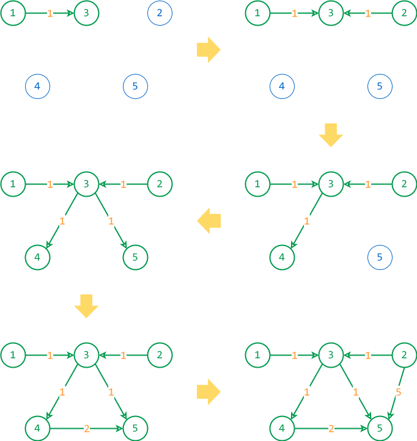

# 2015 lớp 10

## Bài 1: Đặt trạm phủ sóng (10 điểm)

### Đề bài

Nhà cung cấp dịch vụ viễn thông Mobi đã khảo sát số lượng người sẽ dùng dịch vụ trên một con đường thẳng mới được xây dựng và đánh dấu lại những vị trí trên con đường này. Đầu đường được đánh toạ độ bắt đầu từ 0. Tại vị trí có toạ độ X (đơn vị chiều dài), số lượng người sẽ sử dụng dịch vụ là Y. Trước mắt, nhà cung cấp dịch vụ cần đặt một trạm phát sóng có bán kính phủ sóng là K đơn vị chiều dài để phủ sóng cho một số người sử dụng dịch vụ trên con đường này.

**Yêu cầu:** hãy xác định vị trí đặt trạm phát sóng sao cho trạm có thể phụ vụ được số lượng người sử dụng nhiều nhất.

**Dữ liệu:** cho file văn bản MOBI.INP có cấu trúc như sau:

- Dòng đầu tiên ghi hai số nguyên $N$ và $K$ $(0 \le N ≤ 10^6, 0 \le K \le $2.10^6)$, trong đó $N$ là số điểm dân cư đã được đánh dấu, $K$ là bán kính phủ sóng của trạm.
- Trong $N$ dòng tiếp theo, dòng thứ $i (i = 1..N)$ ghi hai số nguyên $X[i]$ và $Y[i]$ cho biết tại vị trí $X[i]$ có số lượng người dùng là $Y[i]$ (0 \le X[i] \le 10^6, 0 \le Y[i] \le 10^4)$. Các số trên cùng một dòng viết cách nhau ít nhất một dấu cách.

**Kết quả:** file văn bản MOBI.OUT gồm một số nguyên cho biết số người dùng nhiều nhất sẽ được phụ vụ.

**Ví dụ:**

| MOBI.INP | MOBI.OUT | Giải thích |
| --- | --- | --- |
| 4 3 <br> 7 4 <br> 15 10 <br> 2 2 <br> 1 5 | 11 | Chọn vị trí trạm tại $X = 4$. Như vậy có thể phủ sóng đến các vị trí có toạ độ 1, 2, 7. Số lượng người sử dụng lớn nhất là 11. |

### Bài giải đề xuất

#### Ý tưởng chính

Sử dụng hai biến `left` và `right` đóng vai trò con trỏ để làm cửa sổ trượt.

- Mỗi lần dịch chuyển `right` sang phải, ta thêm số người dùng tại vị trí `right` vào cửa sổ.
- Mỗi lần dịch chuyển `left` sang phải, ta bỏ bớt số người dùng tại vị trí `left` ra khỏi cửa sổ. 

Để cửa số trượt phù hợp với vùng phủ sóng, ta cần kiểm tra xem khoảng cách giữa `left` và `right` có lớn hơn bán kính phủ sóng hay không. Nếu lớn hơn, ta cần dịch chuyển `left` sang phải.

Giả sử $p$ là vị trí đặt trạm phát sóng. Khi đó, phạm vi phủ của trạm phát sóng là $[p - K, p + K]$. Suy ra, điều kiện cần kiểm tra là $X[right] - X[left] > 2 * K$.

Hình dưới đây minh họa cửa sổ trượt:

{loading="lazy"}

*Trường hợp lấy được số người dùng nhiều nhất*

<br>

{loading="lazy"}

*Trường hợp cửa sổ vượt quá bán kính cho phép*

#### Viết chương trình

**Bước 1:** Sắp xếp các điểm dân cư theo toạ độ $X$ tăng dần.

=== "C++"

    ```c++ linenums="38"
        sort(locations.begin(), locations.end(), [](const pair<int, int> &a, const pair<int, int> &b) {
            return a.first < b.first;
        });
    ```

=== "Python"

    ```py linenums="26"
        locations.sort(key=lambda loc: loc[0])
    ```

**Bước 2:** Dùng cửa sổ trượt để tìm số người dùng nhiều nhất. Cụ thể:

Duyệt từng khu dân cư bằng biến `right`, ứng với mỗi `right`:

- Thêm số người dùng tại vị trí `right` vào cửa sổ.
- Nếu khoảng cách giữa `left` và `right` lớn hơn `2 * k` thì bỏ bớt số lượng người dùng tại `left` và dịch chuyển `left` sang phải. 
- Cập nhật số lượng người dùng lớn nhất `max_user_number`.

=== "C++"

    ```c++ linenums="42"
        // Biến lưu số lượng người dùng của cửa sổ đang xét
        ll user_number = 0;

        // Biến lưu vị trí bắt đầu cửa sổ
        int left = 0;

        // Duyệt từng khu dân cư bằng mốc phải của cửa sổ
        for (int right = 0; right < n; ++right)
        {
            // Cập nhật số lượng người dùng của cửa sổ
            user_number += locations[right].second;

            // Nếu khoảng cách giữa hai điểm lớn hơn 2k
            while (locations[right].first - locations[left].first > 2 * k)
            {
                // thì giảm số lượng người dùng của cửa sổ
                user_number -= locations[left].second;

                // và tăng vị trí bắt đầu cửa sổ
                ++left;
            }

            // Cập nhật số lượng người dùng lớn nhất
            max_user_number = max(max_user_number, user_number);
        }
    ```

=== "Python"

    ```py linenums="28"
        # Biến lưu số lượng người dùng của cửa sổ đang xét
        user_number = 0

        # Biến lưu vị trí bắt đầu cửa sổ
        left = 0

        # Duyệt từng khu dân cư bằng mốc phải của cửa sổ
        for right in range(n):
            # Cập nhật số lượng người dùng của cửa sổ
            user_number += locations[right][1]

            # Nếu khoảng cách giữa hai điểm lớn hơn 2k
            while locations[right][0] - locations[left][0] > 2 * k:
                # thì giảm số lượng người dùng của cửa sổ
                user_number -= locations[left][1]

                # và tăng vị trí bắt đầu cửa sổ
                left += 1

            # Cập nhật số lượng người dùng lớn nhất
            max_user_number = max(max_user_number, user_number)
    ```

### Mã nguồn

Code đầy đủ được đặt tại [GitHub](https://github.com/vtchitruong/hsg/tree/main/olympic-april-30/2015-grade-10/mobi){:target="_blank"}.

## Bài 2: Tam giác cân (10 điểm)

Tam giác cân là tam giác có ít nhất 2 cạnh có độ dài bằng nhau. Cho dãy gồm $N$ số nguyên $a_1, a_2, ..., a_N$.

Hãy tính số bộ 3 chỉ số $(i, j, k)$, với $1 \le i \le j < k \le N$ sao cho ba số $a_i, a_j, a_k$ là độ dài ba cạnh của một tam giác cân.

**Dữ liệu:** cho file văn bản TGCAN.INP.

- Dòng đầu ghi số nguyên $N (3 \le N \le 500000)$.
- Dòng tiếp theo ghi $N$ số hạng của dãy, mỗi số đều không vượt quá $10^5$. Các số hạng được ghi cách nhau bởi ít nhất một dấu cách.

**Kết quả:** file văn bản TGCAN.OUT một số nguyên, là số tam giác cân tìm được.

**Ví dụ:**

| TGCAN.INP | TGCAN.OUT |
| --- | --- |
| 8 <br> 5 3 2 9 5 4 9 5 | 22 |

### Bài giải đề xuất

#### Ý tưởng chính

Gọi `u` là độ dài của một cạnh trong input. Ta có các trường hợp sau:

- Nếu chỉ có một cạnh `u` thì không thể tạo thành tam giác cân.
- Nếu có thể chọn hai cạnh `u` thì tam giác cân `(u, u, v)`:
    - Tính tổ hợp số cách chọn hai cạnh `u`.
    - Rồi nhân với số cách chọn các cạnh thứ ba có độ dài `v`.
        
        Trong đó, cần chú ý điều kiện hình thành tam giác `u + u > v`. Nói cách khác, `v <= 2u - 1`.

- Nếu có thể chọn ba cạnh `u` thì tính tổ hợp số cách chọn để đạt được tam giác đều `(u, u, u)`.

#### Viết chương trình

**Bước 0:** Khởi tạo và viết các hàm phụ trợ

Vì cần phải tính số cách chọn các cạnh nên ta sử dụng mảng tần suất `f`. 

Do độ dài `u` của mỗi cạnh không vượt quá $10^5$ nên ta khai báo luôn mảng `f` có `MAX = 100001` phần tử.

Mảng `f` được khởi tạo đồng thời khi đọc input như sau:

=== "C++"

    ```c++ linenums="29"
        cin >> n;

        // Vừa đọc input vừa gán giá trị cho mảng tần số f
        int x;
        for (int i = 1; i <= n; i++)
        {
            cin >> x;
            f[x]++;
        }
    ```

=== "Python"

    ```py linenums="22"
        n = int(file.readline())

        # Mảng input a
        a = list(map(int, file.readline().split()))
        
        # Gán giá trị cho mảng tần số f
        for x in a:
            f[x] += 1
    ```

Viết hàm tính tổ hợp chập 3 và hàm tính tổ hợp chập 2.

=== "C++"

    ```c++ linenums="41"
    // Hàm dùng để tính tổ hợp C(x, 3) dành cho tam giác đều
    ll combination_3(ll x) // (1)!
    {
        if (x < 3) return 0;

        return x * (x - 1) * (x - 2) / 6;
    }


    // Hàm dùng để tính tổ hợp C(x, 2) dành cho tam giác cân
    ll combination_2(ll x)
    {
        if (x < 2) return 0;

        return x * (x - 1) / 2;
    }
    ```
    { .annotate }

    1.  `typedef long long ll;`

=== "Python"

    ```py linenums="32"
    # Hàm dùng để tính tổ hợp C(x, 3) dành cho tam giác đều
    def combination_3(x):
        if x < 3:
            return 0

        return x * (x - 1) * (x - 2) // 6


    # Hàm dùng để tính tổ hợp C(x, 2) dành cho tam giác cân
    def combination_2(x):
        if x < 2:
            return 0

        return x * (x - 1) // 2
    ```

Ngoài ra, đối với trường hợp tam giác cân `(u, u, v)`, để tính số cách chọn các cạnh thứ ba có độ dài `v` nào đó một cách hiệu quả, ta cần áp dụng kỹ thuật tổng tích luỹ (prefix sum) để tính trước tổng của các phần tử `f` trong phạm vi `1..i`.

=== "C++"

    ```c++ linenums="61"
        // Tổng tích luỹ dùng để tính nhanh tổng của f[1]..f[i]
        // prefix[i] = f[1] + f[2] + ... + f[i]
        vector<int> prefix(MAX + 1, 0);

        for (int i = 1; i < MAX + 1; ++i)
        {
            prefix[i] += prefix[i - 1] + f[i];
        }
    ```

=== "Python"

    ```py linenums="51"
        # Tổng tích luỹ dùng để tính nhanh tổng của f[1]..f[i]
        # prefix[i] = f[1] + f[2] + ... + f[i]
        prefix = [0] * (MAX + 1)

        for i in range(MAX + 1):
            prefix[i] += prefix[i - 1] + f[i]
    ```

**Bước 1:** Tính số lượng tam giác đều `(u, u, u)`

Ta chỉ cần duyệt mảng tần số f và tính tổ hợp chập 3.

=== "C++"

    ```c++ linenums="70"
        // Duyệt mảng tần số f
        for (int u = 1; u < MAX + 1; ++u)
        {
            // Tính số tam giác đều
            result += combination_3(f[u]);
        }
    ```

=== "Python"

    ```py linenums="58"
        # Duyệt mảng tần số f
        for u in range(1, MAX + 1):
            # Tính số tam giác đều
            result += combination_3(f[u])
    ```

**Bước 2:** Tính số lượng tam giác cân `(u, u, v)`

Đầu tiên, ta tính tổ hợp chập 2 đối với cạnh `u`.

Sau đó, ta tính giá trị cận trên của `v`, tức độ dài của cạnh thứ ba: `upper_bound = 2 * u - 1`. Nói cách khác, không thể chọn những cạnh `v` mà vượt quá `upper_bound`.

Quan sát tổng tích luỹ: `prefix[upper_bound] = f[1] + f[2] + ... + f[upper_bound]`

`prefix[upper_bound]` là tổng tần số của các cạnh `v` hợp lệ: `1, 2, ..., upper_bound`, trong đó bao gồm cả cạnh `u`.

Như vậy, số cách chọn cạnh thứ ba `v` là: `count_v = prefix[upper_bound] - f[u]`.

Xem hình minh hoạ mảng tần số `f` dưới đây:

{loading=lazy}

=== "C++"

    ```c++ linenums="77"
        // Duyệt mảng tần số f
        for (int u = 1; u < MAX + 1; ++u)
        {
            // Nếu không đủ hai cạnh để tạo thành tam giác cân thì bỏ qua
            if (f[u] < 2) continue;

            // Tính cận trên của độ dài cạnh thứ ba (cạnh v)
            ll upper_bound = 2LL * u - 1; // (1)!
            if (upper_bound > MAX) upper_bound = MAX;

            // Tính số cách chọn cạnh thứ ba
            ll count_v = prefix[upper_bound] - f[u];

            // Tính số tam giác cân (u, u, v)
            result += (combination_2(f[u]) * count_v);
        }
    ```
    { .annotate }

    1.  `2LL` hoặc `2ll` là cách để biểu thị tường minh hằng số 2 theo kiểu `long long`.

=== "Python"

    ```py linenums="63"
        # Duyệt mảng tần số f
        for u in range(1, MAX + 1):
            # Nếu không đủ hai cạnh để tạo thành tam giác cân thì bỏ qua
            if f[u] < 2:
                continue

            # Tính cận trên của độ dài cạnh thứ ba (cạnh v)
            upper_bound = 2 * u - 1
            if upper_bound > MAX:
                upper_bound = MAX

            # Tính số cách chọn cạnh thứ ba
            count_v = prefix[upper_bound] - f[u]

            # Tính số tam giác cân (u, u, v)
            result += (combination_2(f[u]) * count_v)
    ```

### Mã nguồn

Code đầy đủ được đặt tại [GitHub](https://github.com/vtchitruong/hsg/tree/main/olympic-april-30/2015-grade-10/tgcan){:target="_blank"}.

## Bài 3: Mạng điện (10 điểm)

### Đề bài

Để bảo đảm việc cung cấp điện chocaác công ty trong một khu công nghiệp, ban quản lý lên kế hoạch xây dựng thêm một nhà máy nhiệt điện X. Chỉ có một công ty (bất kỳ trong khu công nghiệp) được truyền tải từ nhà máy X. Chi phí cho kết nối từ nhà máy X đến công ty này là không đáng kể.

Một công ty được xem là có nguồn điện ổn định nếu nó có kết nối đến nhà máy X hay có kết nối đến một công ty khác có nguồn điện ổn định. Dựa trên chi phí kết nối giữa các công ty do nhóm khảo sát thực hiện, ban quản lý cân nhắc giữa hai giải pháp kết nối ít chi phí nhất để tất cả các công ty đều có nguồn điện ổn định.

**Yêu cầu:** cho trước chi phí kết nối giữa các công ty, hãy xác định tổng chi phí kết nối nhỏ nhất $S1$ và nhỏ thứ nhì $S2$ sao cho tất cả công ty đều có nguồn điện ổn định (có thể $S1 = S2$). Giả sử luôn tìm được hai cách kết nối khác nhau để các công ty có nguồn điện ổn định.

**Dữ liệu:** cho file văn bản MANGDIEN.INP.

- Dòng đầu là hai số nguyên $N, M (3 \le N \le 100)$ lần lượt là số công ty và số kết nối đã được khảo sát.
- M dòng tiếp theo, mỗi dòng chứa 3 số nguyên: $A_i, B_i, C_i$ cho biết để kết nối hai công ty $A_i$ và $B_i$ thì cần chi phí $C_i (1 \le C_i \le 1000)$. Các công ty được đánh số từ 1 đến $N$.

**Kết quả:** ghi ra file văn bản MANGDIEN.OUT hai số nguyên $S1$ và $S2$ trên một dòng. Hai số cách nhau một khoảng trắng.

**Ví dụ:**

| MANGDIEN.INP | MANGDIEN.OUT |
| --- | --- |
| 5 6 <br> 1 3 1 <br> 2 3 1 <br> 3 4 1 <br> 3 5 1 <br> 2 5 5 <br> 4 5 2 <br> | 4 5 |

### Bài giải đề xuất

#### Ý tưởng chính

Để tính `s1` là tổng chi phí kết nối nhỏ nhất, ta áp dụng thuật toán Kruscal, với mỗi công ty là một đỉnh và mỗi kết nối giữa hai công ty là một cạnh.

Để tỉnh `s2` là tổng chi phí nhỏ thứ nhì, ta thử lần lượt:

- Bỏ bớt một cạnh trong cây khung nhỏ nhất có được khi tính `s1`

- Thực hiện lại Kruscal với những cạnh còn lại để tìm ra `s2` nào vừa đủ lớn hơn hoặc bằng `s1`.

Hinh sau minh hoạ công đoạn thực hiện Kruscal:

{loading=lazy}

#### Viết chương trình

**Bước 0:** Khai báo các cấu trúc và hàm cần thiết

Khai báo cấu trúc `edge` gồm `a` và `b` là hai công ty, `cost` là chi phí kết nối hai công ty này.

=== "C++"

    ```c++ linenums="11"
    struct edge
    {
        int a, b, cost;
    }
    ```

=== "Python"

    ```py linenums="8"
    class edge:
        def __init__(self, a, b, cost):
            self.a = a
            self.b = b
            self.cost = cost
    ```

Khai báo mảng `rep` và `ranking` để áp dụng cấu trúc disjoint-set trong thuật toán Kruscal.

=== "C++"

    ```c++ linenums="31"
    // rep[a] là đại diện của tập hợp chứa công ty a
    // ranking[a] là độ sâu của cây tập hợp chứa công ty a
    vector<int> rep, ranking;
    ```

=== "Python"

    ```py linenums="29"
    # rep[a] là đại diện của tập hợp chứa công ty a
    # ranking[a] là độ sâu của cây tập hợp chứa công ty a
    rep = []
    ranking = []
    ```

Viết hàm `find()` để tìm đại diện của tập hợp chứa công ty `a`.

=== "C++"

    ```c++ linenums="56"
    int find(int a)
    {
        if (a != rep[a])
            rep[a] = find(rep[a]);

        return rep[a];
    }
    ```

=== "Python"

    ```py linenums="47"
    def find(a):
        global rep

        if a != rep[a]:
            rep[a] = find(rep[a])

        return rep[a]
    ```

Viết hàm `unite()` (1) để hợp nhất hai tập hợp chứa công ty `a` và công ty `b`.
{ .annotate }

1.  Sở dĩ đặt tên hàm là `unite()` vì để tránh từ khoá `union` có sẵn của C++.  

=== "C++"

    ```c++ linenums="66"
    bool unite(int a, int b)
    {
        // Lấy đại diện của hai tập hợp chứa a và b
        int rep_a = find(a);
        int rep_b = find(b);

        // Nếu a và b cùng một tập hợp thì không làm gì cả
        if (rep_a == rep_b) return false;

        // Ngược lại, nếu không cùng tập hợp thì hợp nhất hai tập hợp
        if (ranking[rep_a] > ranking[rep_b])
            rep[rep_b] = rep_a;
        else if (ranking[rep_a] < ranking[rep_b])
            rep[rep_a] = rep_b;
        else
        {
            rep[rep_b] = rep_a;
            ranking[rep_a]++;
        }

        return true;
    }
    ```

=== "Python"

    ```py linenums="57"
    def unite(a, b):
        global rep, ranking

        # Lấy đại diện của hai tập hợp chứa a và b
        rep_a = find(a)
        rep_b = find(b)

        # Nếu a và b cùng một tập hợp thì không làm gì cả
        if rep_a == rep_b:
            return False
        
        # Ngược lại, nếu không cùng tập hợp thì hợp nhất hai tập hợp
        if ranking[rep_a] > ranking[rep_b]:
            rep[rep_b] = rep_a
        elif ranking[rep_a] < ranking[rep_b]:
            rep[rep_a] = rep_b
        else:
            rep[rep_b] = rep_a
            ranking[rep_a] += 1

        return True
    ```

**Bước 1:** Viết hàm thực thi Kruscal

Hàm `kruscal()` gồm hai tham số:

- Mảng `excluded_edges` dùng để lưu các kết nối bị loại trừ. Tham số này không dùng đến khi tính `s1`, mà dùng đến khi tính `s2`.
- Mảng `included_edges` dùng để lưu các kết nối của cây khung nhỏ nhất.

Giá trị trả về là chi phí nhỏ nhất kết nối tất cả công ty, tức tổng trọng số của cây khung nhỏ nhất tìm được.

Giả sử các kết nối đã được sắp xếp theo chi phí tăng dần. Hàm `kruscal()` thực hiện như sau:

- Khởi tạo mảng `rep` và `ranking` gồm `n` phần tử, ứng với `n` công ty.
- Khởi tạo `total_cost = 0` là tổng chi phí kết nối.
- Duyệt từng kết nối trong input:
    - Nếu kết nối đang xét nằm trong mảng loại trừ `excluded_edges` thì bỏ qua. Để kiểm tra điều này, ta sử dụng hàm `std::find()` của thư viện `<algorithm>` (không phải hàm find() đã viết ở trên) và bổ sung toán tử `==` cho cấu trúc `edge`:

        === "C++"

            ```c++ linenums="11" hl_lines="10-13"
            struct edge
            {
                int a, b, cost;

                bool operator<(const edge& other) const
                {
                    return cost < other.cost;
                }

                bool operator==(const edge& other) const
                {
                    return a == other.a && b == other.b && cost == other.cost;
                }
            };
            ```

        === "Python"

            ```py linenums="8" hl_lines="12 13"
            class edge:
                def __init__(self, a, b, cost):
                    self.a = a
                    self.b = b
                    self.cost = cost


                def __lt__(self, other):
                    return self.cost < other.cost
                

                def __eq__(self, other):
                    return self.a == other.a and self.b == other.b and self.cost == other.cost
            ```

    - Ngược lại, nếu kết nối đang xét không nằm trong mảng loại trừ thì thực hiện kết nối hai công ty `a` và `b` bằng hàm `unite()`. Nếu kết nối thành công, ta cộng dồn tổng chi phí và thêm kết nối vào cây khung nhỏ nhất, là mảng `included_edges`.

=== "C++"

    ```c++ linenums="91"
    int kruskal(vector<edge> &excluded_edges, vector<edge> &included_edges)
    {
        // Khởi tạo mảng rep và ranking
        rep.resize(n + 1);
        ranking.resize(n + 1);

        for (int i = 1; i < n + 1; ++i)
        {
            rep[i] = i;
            ranking[i] = 0;
        }

        int total_cost = 0;

        // Duyệt từng kết nối trong input
        for (int i = 0; i < m; ++i)
        {
            // Nếu kết nối đang xét nằm trong mảng loại trừ thì bỏ qua
            if (std::find(excluded_edges.begin(), excluded_edges.end(), edges[i]) != excluded_edges.end())
                continue;

            // Ngược lại, nếu kết nối đang xét không nằm trong mảng loại trừ
            if (unite(edges[i].a, edges[i].b))
            {
                // thì cộng dồn tổng chi phí
                total_cost += edges[i].cost;

                // và thêm vào mảng cây khung nhỏ nhất
                included_edges.push_back(edges[i]);
            }
        }

        // Nếu không đủ n - 1 cạnh thì trả về -1
        if (included_edges.size() != n - 1) return -1;

        return total_cost;
    }
    ```

=== "Python"

    ```py linenums="81"
    def kruskal(excluded_edges, included_edges):
        global n, edges, rep, ranking

        # Khởi tạo mảng rep và ranking
        rep = list(range(n + 1))
        ranking = [0] * (n + 1)

        total_cost = 0

        # Duyệt từng kết nối trong input
        for e in edges:
            # Nếu kết nối đang xét nằm trong mảng loại trừ thì bỏ qua
            if e in excluded_edges:
                continue
            
            # Ngược lại, nếu kết nối đang xét không nằm trong mảng loại trừ
            if unite(e.a, e.b) == True:
                # thì cộng dồn tổng chi phí
                total_cost += e.cost

                # và thêm vào mảng cây khung nhỏ nhất
                included_edges.append(e)

        # Nếu không đủ n - 1 cạnh thì trả về -1
        if len(included_edges) != n - 1:
            return -1
        
        return total_cost
    ```

**Bước 2:** Viết hàm `process()` để xử lý bài toán

Hàm `process()` gọi `kruscal()` lần thứ nhất để tính chi phí kết nối nhỏ nhất `s1`, đồng thời cũng trả về các kết nối được chọn cho cây khung nhỏ nhất, thông qua mảng `included_edges`.

Trước khi gọi `kruscal()`, các kết nối cần được sắp xếp theo chi phí tăng dần.

Để sắp xếp, ta sử dụng hàm `sort()` và bổ sung toán tử `<` cho cấu trúc `edge`:

=== "C++"

    ```c++ linenums="11" hl_lines="5-8"
    struct edge
    {
        int a, b, cost;

        bool operator<(const edge& other) const
        {
            return cost < other.cost;
        }
    };
    ```
    
=== "Python"

    ```py linenums="8" hl_lines="8 9"
    class edge:
        def __init__(self, a, b, cost):
            self.a = a
            self.b = b
            self.cost = cost


        def __lt__(self, other):
            return self.cost < other.cost # (1)!
    ```
    { .annotate }

    1.  Mặc định, hàm sort() của Python sử dụng toán tử `<` (viết cách khác là `__lt__`) để so sánh hai đối tượng.

Để tìm chi phí kết nối nhỏ thứ nhì `s2`, ta thực hiện như sau:

Duyệt từng kết nối của cây khung nhỏ nhất (mảng `included_edges`):

- Thử loại bỏ kết nối đang xét bằng cách đẩy kết nối này vào mảng `excluded_edges`.
- Gọi hàm `kruscal()` để tính chi phí của cây khung nhỏ nhất mới, đặt là `cost`.
- Xét xem `cost` có phải là chi phí nhỏ thứ nhì hay không.
- Đưa kết nối đang xét trở lại bằng cách xoá khỏi mảng `excluded_edges`. Lúc này mảng `excluded_edges` trở về trạng thái rỗng nhằm chuẩn bị cho việc xét kết nối tiếp theo.

=== "C++"

    ```c++ linenums="131"
    void process()
    {
        // Sắp xếp các kết nối theo chi phí tăng dần
        sort(edges.begin(), edges.end());
    
        vector<edge> excluded_edges;
        vector<edge> included_edges;
        
        // Tìm s1
        s1 = kruskal(excluded_edges, included_edges);

        // Tìm s2
        s2 = INT_MAX;
        for (int i = 0; i < included_edges.size(); ++i)
        {
            // Thử loại bỏ kết nối thứ i
            excluded_edges.push_back(included_edges[i]);

            // Mảng lưu cây khung nhỏ nhất mới
            vector<edge> tmp_included_edges;

            // Tính chi phí của cây khung nhỏ nhất mới
            int cost = kruskal(excluded_edges, tmp_included_edges);

            // Xét xem chi phí mới có phải là nhỏ thứ nhì hay không
            if (cost != -1 && cost >= s1)
                s2 = min(s2, cost);

            // Đưa kết nối thứ i trở lại
            excluded_edges.pop_back();
        }

        if (s2 == INT_MAX) s2 = s1;
    }
    ```

=== "Python"

    ```py linenums="112"
    def process():
        global edges, s1, s2

        # Sắp xếp các kết nối theo chi phí tăng dần
        edges.sort()

        excluded_edges = []
        included_edges = []

        # Tìm s1
        s1 = kruscal(excluded_edges, included_edges)

        # Tìm s2
        s2 = float('inf')

        for e in included_edges:
            # Thử loại bỏ kết nối e
            excluded_edges.append(e)

            # Mảng lưu cây khung nhỏ nhất mới
            tmp_included_edges = []

            # Tính chi phí của cây khung nhỏ nhất mới
            cost = kruscal(excluded_edges, tmp_included_edges)

            # Xét xem chi phí mới có phải là nhỏ thứ nhì hay không
            if cost != -1 and cost >= s1:
                s2 = min(s2, cost)

            # Đưa kết nối e trở lại
            excluded_edges.pop()

        if s2 == float('inf'):
            s2 = s1
    ```

### Mã nguồn

Code đầy đủ được đặt tại [GitHub](https://github.com/vtchitruong/hsg/tree/main/olympic-april-30/2015-grade-10/mangdien){:target="_blank"}.