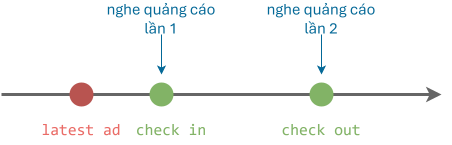
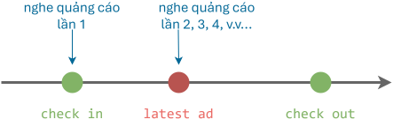

# 2021 Olympic 10

## Câu 1: Quảng cáo (10 điểm)

### Đề bài

Siêu thị thường có quảng cáo giới thiệu những mặt hàng mới. Để phân bố thời gian quảng cáo sao cho có hiệu quả, họ ghi nhận thời điểm đi vào và thời điểm đi ra khỏi siêu thị của từng khách hàng và cho rằng phân bố này sẽ không thay đổi trong các ngày tiếp theo.

Thời điểm bắt đầu của mỗi đoạn quảng cáo là một số nguyên. Mỗi đoạn quảng cáo sẽ kết thúc ngay trước khi đoạn quảng cáo tiếp theo bắt đầu. Nếu đoạn quảng cáo xuất hiện vào đúng thời điểm khách hàng bước ra khỏi siêu thị thì xem như khách hàng vẫn nghe được quảng cáo này. Thời điểm đi vào siêu thị của khách hàng luôn nhỏ hơn thời điểm đi ra và là các số nguyên.

Họ muốn phân bố thời gian các đoạn âm thanh quảng cáo sao cho hai quảng cáo khác nhau không diễn ra đồng thời (tức là vào một thời điểm chỉ có một quảng cáo) và mỗi khách hàng đều được nghe ít nhất hai quảng cáo khác nhau. Mặt khác, họ cũng muốn các nhân viên bị ít ảnh hưởng bởi những âm thanh này nên đề xuất số lượng các đoạn quảng cáo là ít nhất có thể.

**Yêu cầu:** Bạn hãy viết chương trình phân bố thời gian các đoạn quảng cáo sao cho đạt được các yêu cầu nói trên.

**Dữ liệu:**

Vào từ tập tin văn bản DOANQC.INP, gồm:

- Dòng đầu tiên ghi một số nguyên $N$ cho biết số lượng khách hàng đến siêu thị trong một ngày $(1 \le N \le 3000)$.
- $N$ dòng tiếp theo, mỗi dòng ghi hai số nguyên dương $A_i$ và $B_i$ cho biết thời điểm đi vào siêu thị và thời điểm đi ra của mỗi khách hàng $(0 \lt A_i \lt B_i \lt 10^6)$.

**Kết quả:** Ra tập tin văn bản DOANQC.OUT, gồm:

- Dòng đầu tiên ghi một số nguyên $K$ cho biết số lượng các đoạn quảng cáo trong một ngày.
- Dòng tiếp theo ghi $K$ số nguyên cho biết thời điểm xuất hiện của các đoạn quảng cáo theo thứ tự tăng dần.

**Lưu ý:**

- Các số trên cùng một dòng ghi cách nhau bởi ít nhất một khoảng trắng.
- Nếu có nhiều kết quả thì đưa ra một kết quả bất kỳ trong số chúng.

**Ví dụ:**

| DOANQC.INP | DOANQC.OUT |
| --- | --- |
| 5 <br> 1 8 <br> 8 12 <br> 1 8 <br> 1 8 <br> 20 21 <br> | 4 <br> 4 8 12 20 21 |

### Bài giải đề xuất

#### Ý tưởng chính

Khi một khách hàng đi vào siêu thị, họ sẽ nghe được quảng cáo đang phát sẵn trước đó. Đây là lần nghe quảng cáo thứ nhất của khách hàng này.

Mà yêu cầu đề bài là mỗi khách hàng phải nghe ít nhất hai quảng cáo.

Cho nên, ta cần xét thời điểm đi ra (`check_out`) của mỗi khách hàng: có nên phát quảng cáo vào thời điểm đi ra này hay không.

Có hai trường hợp:

**Trường hợp 1:** thời điểm vào và ra đều xảy ra sau thời điểm phát quảng cáo mới nhất (`latest_ad`).

{loading=lazy}

Để bảo đảm khách hàng nghe được ít nhất hai quảng cáo, ta phải phát quảng cáo vào thời điểm họ đi ra.

**Trường hợp 2:** thời điểm phát quảng cáo mới nhất nằm ở giữa thời điểm vào và thời điểm ra.

{loading=lazy}

Ở trường hợp này, khách hàng đã nghe được ít nhất hai quảng cáo, nên ta không cần phát thêm quảng cáo ở thời điểm họ đi ra.

#### Viết chương trình

**1\. Khởi tạo**

Ta phải phát quảng cáo vào thời điểm vào của khách hàng đầu tiên, tức thời điểm vào nhỏ nhất trong số toàn bộ khách hàng.

=== "C++"

    ```c++ linenums="53"
        // Tìm khách hàng đầu tiên, tức có thời điểm đi vào siêu thị nhỏ nhất
        vector<pair<int, int>>::iterator first_customer = min_element(customers.begin(), customers.end(), compare_check_in); // (1)!

        // Lấy thời điểm vào của khách hàng đầu tiên
        int first_check_in = (*first_customer).first;

        // Lưu thời điểm vào nhỏ nhất vào lịch phân bố
        ad_schedule.push_back(first_check_in);
    ```
    { .annotate }

    1.  Biến customers là mảng lưu trữ các cặp số biểu thị thời điểm vào và thời điểm ra: `vector<pair<int, int>> customers;`

    Trong đó, hàm `compare_check_out()` như sau:

    ```c++ linenums="37"
    // Hàm so sánh dùng để tìm thời điểm vào siêu thị nhỏ nhất
    bool compare_check_in(const pair<int, int>& a, const pair<int, int>& b)
    {
        return a.first < b.first;
    }
    ```

=== "Python"

    ```py linenums="30"
        # Lấy thời điểm vào của khách hàng đầu tiên
        first_check_in = min(customers, key=lambda t: t[0])[0] # (1)!

        # Lưu thời điểm vào nhỏ nhất vào lịch phân bố
        ad_schedule.append(first_check_in)
    ```
    { .annotate }

    1.  Biến customers là mảng lưu trữ các cặp số biểu thị thời điểm vào và thời điểm ra: `customers = [[check_in, check_out], [..., ...]]`

**2\. Sắp xếp**

Sắp xếp mảng `customers` theo thứ tự tăng dần của thời điểm ra.

=== "C++"

    ```c++ linenums="63"
        sort(customers.begin(), customers.end(), compare_check_out);
    ```

    Trong đó, hàm `compare_check_out()` như sau:

    ```c++ linenums="44"
    // Hàm so sánh dùng để sắp xếp mảng customers theo thời điểm ra khỏi siêu thị
    bool compare_check_out(const pair<int, int>& a, const pair<int, int>& b)
    {
        return a.second < b.second;
    }
    ```

=== "Python"

    ```py linenums="37"
        customers.sort(key=lambda t: t[1])
    ```

**3\. Phân bố lịch phát quảng cáo**

Duyệt mảng `customers` đã sắp xếp thời điểm ra tăng dần, ứng với mỗi khách hàng, lặp thao tác:

- Dựa vào ý tưởng đã phân tích trên, xét thời điểm vào, nếu thời điểm vào xảy ra sau thời điểm phát quảng cáo mới nhất (lưu trong biến `latest_ad`) thì ta nạp thời điểm ra vào lịch phát (lưu trong biến `ad_schedule`).

=== "C++"

    ```c++ linenums="65"
        // Biến latest_ad lưu thời điểm mới nhất phát quảng cáo
        int latest_ad = -1;

        int check_in, check_out;

        // Duyệt từng khách hàng trong mảng customers đã sắp xếp
        for (pair<int, int> customer : customers)
        {
            // Lấy thời điểm vào và thời điểm ra
            check_in = customer.first;
            check_out = customer.second;
            
            // Nếu thời điểm vào xảy ra sau thời điểm phát quảng cáo mới nhất
            if (latest_ad <= check_in)
            {
                // thì phát quảng cáo tại thời điểm ra
                ad_schedule.push_back(check_out);

                // Ghi nhận thời điểm phát quảng cáo mới nhất
                latest_ad = check_out;
            }
        }
    ```

=== "Python"

    ```py linenums="39"
        # Biến latest_ad lưu thời điểm mới nhất phát quảng cáo
        latest_ad = -1

        # Duyệt từng khách hàng trong mảng customers đã sắp xếp
        for customer in customers:    
            # Lấy thời điểm vào và thời điểm ra
            check_in = customer[0]
            check_out = customer[1]

            # Nếu thời điểm vào xảy ra sau thời điểm phát quảng cáo mới nhất
            if latest_ad <= check_in:
                # thì phát quảng cáo tại thời điểm ra
                ad_schedule.append(check_out)

                # Ghi nhận thời điểm phát quảng cáo mới nhất
                latest_ad = check_out
    ```

#### Output

Output của chương trình này khác với output của đề bài. Cụ thể, output là:

```pycon
4
1 8 12 21
```

Giải thích:

Có ba khách hàng cùng là `(1, 8)`:

- Đi vào tại thời điểm `1`: ta phát quảng cáo tại thời điểm `1` để họ nghe lần thứ nhất.

- Đi ra tại thời điểm `8`: ta phát quảng cáo tại thời điểm `8` để họ nghe lần thứ hai.

Khách hàng `(8, 12)`:

- Đi vào tại thời điểm `8`: họ nghe quảng cáo lần thứ nhất tại thời điểm `8`.

- Đi ra tại thời điểm `12`: ta phát quảng cáo tại thời điểm `12` để họ nghe lần thứ hai.

Khách hàng `(20, 21)`:

- Đi vào tại thời điểm `20`: họ nghe được đoạn quảng cáo phát từ thời điểm `12`, đây là lần nghe thứ nhất.

- Đi ra tại thời điểm `21`: ta phát quảng cáo tại thời điểm `21` để họ nghe lần thứ hai.

Output này có số lần phát quảng cáo ít hơn so với output của đề bài, đáp ứng được yêu cầu của bài toán.

### Mã nguồn

Code đầy đủ được đặt tại <a href="https://github.com/vtchitruong/hsg/tree/main/olympic-hcm/2021-olympic10/doanqc" target="_blank">GitHub</a>.

## Câu 2: Chia phô mai (10 điểm)

### Đề bài

Hai chú gấu con đã tìm được trong rừng hai miếng phô mai có khối lượng tương ứng là a và b gam (g), với a và b là số nguyên. Hai chú gấu tham lam đến nỗi muốn chuẩn bị đánh nhau để tranh phần miếng phô mai nhiều hơn.

Một con cáo đi đến và nói: "Các chú hãy đợi đấy, tôi sẽ giúp các chú chia các miếng phô mai bằng nhau!". "Đồng ý, nhưng làm sao chia được?" - một chú gấu hào hứng nói.

"Rất đơn giản, nếu khối lượng miếng phô mai nào đó được chia đều thành hai phần thì tôi sẽ ăn một phần. Nếu khối lượng miếng phô mai được chia đều làm ba thì tôi sẽ ăn hai phần ba, còn nếu chia đều làm năm thì tôi sẽ ăn bốn phần năm. Như vậy tôi sẽ ăn một ít và hai miếng phô mai sẽ bằng nhau" - con cáo nói.

Hai chú gấu nghi ngờ con cáo chơi khăm mình nhưng lúc này chúng không thể tự chia hai miếng phô mai bằng nhau được nên đành phải đồng ý với lời đề nghị của cáo nhưng với một điều kiện: Cáo phải chia sao cho hai miếng phô mai bằng nhau nhanh nhất và khối lượng của chúng phải luôn là số nguyên.

**Yêu cầu:** Bạn hãy tìm số ít nhất các thao tác đã mô tả ở trên sao cho cáo có thể chia thành hai miếng phô mai bằng nhau.

**Dữ liệu:** Vào từ tập tin văn bản PHOMAI.INP, gồm một dòng duy nhất ghi hai số nguyên $a$ và $b$ cách nhau một khoảng trắng $(1 \le a, b \le 10^9)$.

**Kết quả:** Ra tập tin văn bản PHOMAI.OUT, gồm một dòng duy nhất ghi một số cho biết:

- Trường hợp con cáo nói dối và không thể chia đều được, ghi số -1.

- Ngược lại, ghi số thao tác ít nhất. Trong trường hợp hai miếng phô mai ban đầu bằng nhau thì ghi số 0.

**Ví dụ:**

| PHOMAI.INP | PHOMAI.OUT |
| --- | --- |
| 15 20 | 3|

Giải thích:

- Lần 1: Cáo chia miếng 15g thành 3 phần, mỗi phần bằng 5g. Cáo ăn 2 phần, miếng còn lại bằng 5g.

- Lần 2: Cáo chia miếng 20g thành 2 phần, mỗi phần bằng 10g. Cáo ăn 1 phần, miếng còn lại bằng 10g.

- Lần 3: Cáo chia tiếp miếng 10g thành 2 phần, mỗi phần bằng 5g. Cáo ăn 1 phần, miếng còn lại bằng 5g.

Kết quả sau 3 lần chia Cáo có 2 miếng bằng nhau và bằng 5g. Vậy có 3 lần chia. Không có cách chia nào khác nhanh hơn 3 lần chia nên kết quả là 3.

| PHOMAI.INP | PHOMAI.OUT |
| --- | --- |
| 14 8 | -1|
| 4 4 | 0 |

### Bài giải đề xuất

#### Ý tưởng chính

Vì mỗi miếng phô mai có thể được chia 2, 3 và 5 nhiều lần, ta có:

$$
\begin{aligned}
a = 2^{x1} . 3^{y1} . 5^{z1} . remaining\_a \\
b = 2^{x2} . 3^{y2} . 5^{z2} . remaining\_b
\end{aligned}
$$

**Trường hợp 1:** phần dư của a và phần dư của b không bằng nhau, nghĩa là không có cách chia nào.

**Trường hợp 2:** phần dư bằng nhau.

Lúc này, để đạt được số thao tác chia ít nhất, ta tính chênh lệch giữa các số mũ.

Bởi vì:

Gọi $c$ là chênh lệch của các số mũ của cơ số 2: $c = | x1 - x2 |$.

Cáo chỉ cần chia một trong hai miếng phô mai $c$ lần thì số mũ (của cơ số 2) của hai miếng phô mai $a$ và $b$ sẽ bằng nhau.

Thực hiện tương tự như vậy cho số mũ của 3 và số mũ của 5. 

#### Viết chương trình

1\. Tạo cấu trúc `factors` để lưu trữ các số mũ và phần dư khi phân tích `a` và `b`.

=== "C++"

    ```c++ linenums="11"
    struct factors
    {
        int x = 0; // số mũ của 2
        int y = 0; // số mũ của 3
        int z = 0; // số mũ của 5
        int remaining = 0; // phần dư sau khi phân tích luỹ thừa
    };
    ```
    
=== "Python"

    ```py linenums="10"
    class factors:
        def __init__(self, x=0, y=0, z=0, remaining=0):
            self.x = x # số mũ của 2
            self.y = y # số mũ của 3
            self.z = z # số mũ của 5
            self.remaining = remaining # phần dư sau khi phân tích luỹ thừa   
    ```

2\. Viết hàm phân tích một số `n` thành tích của các thừa số nguyên tố 2, 3 và 5.

=== "C++"

    ```c++ linenums="32"
    factors factorize(int n)
    {
        factors f;

        // Chia 2 nhiều lần để lấy số mũ của 2
        while (n % 2 == 0)
        {
            n /= 2;
            f.x += 1;
        }

        // Chia 3 nhiều lần để lấy số mũ của 3
        while (n % 3 == 0)
        {
            n /= 3;
            f.y += 1;
        }

        // Chia 5 nhiều lần để lấy số mũ của 5
        while (n % 5 == 0)
        {
            n /= 5;
            f.z += 1;
        }

        // Phần dư còn lại của n
        f.remaining = n;

        return f;
    }
    ```

=== "Python"

    ```py linenums="25"
    def factorize(n):
        f = factors()

        # Chia 2 nhiều lần để lấy số mũ của 2
        while n % 2 == 0:
            n /= 2
            f.x += 1


        # Chia 3 nhiều lần để lấy số mũ của 3
        while n % 3 == 0:
            n /= 3
            f.y += 1

        # Chia 5 nhiều lần để lấy số mũ của 5
        while n % 5 == 0:
            n /= 5
            f.z += 1

        # Phần dư còn lại của n
        f.remaining = n

        return f
    ```

3\. Gọi hàm `factorize()` để thực hiện phân tích `a` và `b`.

Sau khi phân tích, nếu phần dư không bằng nhau thì trả về `-1`, không có cách chia để hai miếng phô mai bằng nhau.

Ngược lại, nếu phần dư bằng nhau thì tính tổng các chênh lệch giữa các số mũ. Đây chính là số cách chia ít nhất cần tìm.

=== "C++"

    ```c++ linenums="64"
    void process()
    {
        // Phân tích a và b
        factors fa = factorize(a);
        factors fb = factorize(b);

        // Nếu phần dư không bằng nhau thì có nghĩa là không có cách chia
        if (fa.remaining != fb.remaining)
        {
            result = -1;
            return; 
        }

        // Ngược lại, nếu phần dư bằng nhau thì tính tổng các chênh lệch giữa các số mũ
        result = abs(fa.x - fb.x) + abs(fa.y - fb.y) + abs(fa.z - fb.z);
    }        
    ```

=== "Python"

    ```py linenums="50"
    def process():
        global a, b, result
        
        # Phân tích a và b
        fa = factorize(a)
        fb = factorize(b)

        # Nếu phần dư không bằng nhau thì có nghĩa là không có cách chia
        if fa.remaining != fb.remaining:
            result = -1
            return
        
        # Ngược lại, nếu phần dư bằng nhau thì tính tổng các chênh lệch giữa các số mũ
        result = abs(fa.x - fb.x) + abs(fa.y - fb.y) + abs(fa.z - fb.z)
    ```

### Mã nguồn

Code đầy đủ được đặt tại <a href="https://github.com/vtchitruong/hsg/tree/main/olympic-hcm/2021-olympic10/phomai" target="_blank">GitHub</a>.
