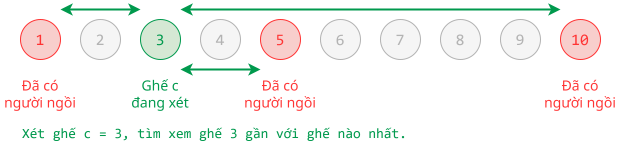
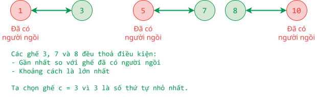

# 2021 Olympic 11

## Câu 1: Tam giác vuông (10 điểm)

### Đề bài

Nam vẫn thường hướng dẫn em trai mình, bé An, học bài mỗi ngày. Hôm nay Nam muốn giới thiệu cho An biết về các hình tam giác. Nam đặt trên một mặt phẳng $N$ điểm phân biệt. Tiếp đến Nam chọn ra 3 điểm không thẳng hàng, nối chúng lại và giới thiệu với An rằng 3 đoạn thẳng nối 3 điểm phân biệt không thẳng hàng thì tạo thành một tam giác.

Theo hướng dẫn của Nam, An đã vẽ được rất nhiều hình tam giác trên mặt phẳng đó. Trong những hình tam giác có thể vẽ trên mặt phẳng, An chỉ thích vẽ những tam giác vuông có các cạnh góc vuông (cạnh kề với góc vuông) song song với trục hoành và trục tung. An hỏi Nam rằng mình có thể vẽ được bao nhiêu hình tam giác vuông như thế với $N$ điểm cho trước trên mặt phẳng. An không muốn làm em mình thất vọng nhưng việc trả lời chính xác câu hỏi trên quả là một thử thách dành cho Nam. Bạn hãy giúp Nam trả lời câu hỏi trên nhé.

**Yêu cầu:** Cho trước $N$ điểm phân biệt trên mặt phẳng tọa độ Oxy. Hãy viết một chương trình cho biết từ $N$ điểm trên có thể vẽ bao nhiêu tam giác vuông có các cạnh góc vuông song song với trục hoành và trục tung.

**Dữ liệu:** Vào từ tệp văn bản TGV.INP, gồm:

- Dòng đầu ghi một số nguyên $N$ cho biết số điểm phân biệt trên mặt phẳng $(3 \lt N \lt 100000)$.

- $N$ dòng tiếp theo, mỗi dòng ghi hai số nguyên $X$, $Y$ cách nhau một khoảng trắng cho biết tọa độ các điểm $(1 \lt X, Y \lt 100000)$.

**Kết quả:** Ra tập tin văn bản TGV.OUT một số nguyên là số lượng tam giác vuông theo yêu cầu trên.

**Ví dụ:**

| TGV.INP | TGV.OUT |
| --- | --- |
| 5 <br> 1 1 <br> 1 2 <br> 1 3 <br> 2 1 <br> 2 3 | 6 |	

### Bài giải đề xuất

#### Ý tưởng chính

Để tính số lượng tam giác vuông, ta cần tính số cạnh góc vuông, tức các cạnh song song với hai trục của hệ toạ độ:

- Để tính số cạnh song song với trục tung, ta tính số tung độ y có cùng hoành độ x.
- Để tính số cạnh song song với trục hoành, ta tính số hoành độ x có cùng tung độ y.

Với cùng một bộ (x, y), ta lấy tích của số cạnh song song trục tung và số cạnh song song trục hoành là đạt được số tam giác vuông tạo thành.

#### Viết chương trình

**1\. Nhập liệu**

Khi đọc các dòng từ tập tin input, ta nạp vào danh sách kề `x_axis` các tung độ có cùng hoành độ `x`, và nạp vào danh sách kề `y_axis` các hoành độ có cùng tung độ `y`.

=== "C++"

    ```c++ linenums="30"
        int x, y;
        for (int i = 0; i < n; ++i)
        {
            cin >> x >> y;

            if (x >= x_axis.size())
                x_axis.resize(x + 1);

            x_axis[x].push_back(y);

            if (y >= y_axis.size())
                y_axis.resize(y + 1);

            y_axis[y].push_back(x);
        }
    ```

=== "Python"

    ```py linenums="30"
        for _ in range(n):
            x, y = map(int, f.readline().split())

            if x >= len(x_axis):
                x_axis.extend([] for _ in range(x - len(x_axis) + 1))
            
            x_axis[x].append(y)

            if y >= len(y_axis):
                y_axis.extend([] for _ in range(y - len(y_axis) + 1))

            y_axis[y].append(x)
    ```

**2\. Xử lý**

Duyệt từng hoành độ `x` trong phạm vi `[1..hoành độ cuối cùng]`, lặp thao tác:

- Tính số cạnh song song trục tung ứng với `x` đang xét.
- Duyệt từng tung độ `y` trong danh sách kề `x_axis[x]`, lặp thao tác:
    - Tính số cạnh song song trục hoành ứng với `y` đang xét.
    - Nhân số cạnh song song với nhau để ra được số tam giác vuông ứng với `x` và `y` đang xét.

=== "C++"

    ```c++ linenums="48"
    void process()
    {
        // Duyệt từng hoành độ x
        for (int x = 1; x < x_axis.size(); ++x)
        {
            // Nếu tồn tại điểm có hoành độ x đang xét 
            if (x_axis[x].size() != 0)
            {
                // Tính số cạnh song song trục tung, tức có cùng hoàng độ x
                int vertical_edge_number = x_axis[x].size() - 1;

                // Duyệt từng tung độ y có cùng hoành độ x đang xét
                for (int y : x_axis[x])
                {
                    // Nếu tồn tại điểm có tung độ y đang xét
                    if (y_axis[y].size() != 0)
                    {
                        //  Tính số cạnh song song trục hoành, tức có cùng tung độ y
                        int horizontal_edge_number = y_axis[y].size() - 1;

                        // Tính số tam giác vuông tạo thành
                        result += vertical_edge_number * horizontal_edge_number;
                    }
                }
            }
        }
    }
    ```

=== "Python"

    ```py linenums="39"
    def process():
        global x_axis, y_axis, result

        # Duyệt từng hoành độ x
        for x in range(1, len(x_axis)):
            # Nếu tồn tại điểm có hoành độ x đang xét 
            if x_axis[x]:
                # Tính số cạnh song song trục tung, tức có cùng hoàng độ x
                vertical_edge_number = len(x_axis[x]) - 1

                # Duyệt từng tung độ y có cùng hoành độ x đang xét
                for y in x_axis[x]:
                    # Nếu tồn tại điểm có tung độ y đang xét
                    if  y_axis[y]:
                        # Tính số cạnh song song trục hoành, tức có cùng tung độ y
                        horizontal_edge_number = len(y_axis[y]) - 1

                        # Tính số tam giác vuông tạo thành
                        result += vertical_edge_number * horizontal_edge_number
    ```

### Mã nguồn

Code đầy đủ được đặt tại <a href="https://github.com/vtchitruong/hsg/tree/main/olympic-hcm/2021-olympic11/tgv" target="_blank">GitHub</a>.

## Câu 2: Khoảng cách (10 điểm)

### Đề bài

Ngành công an đang tích cực thực hiện việc cấp thẻ căn cước công dân (CCCD). Việc cấp thẻ CCCD cho hàng triệu người nhưng vẫn đảm bảo an toàn phòng chống dịch theo khuyến cáo 5K của bộ Y tế đòi hỏi ngành công an phải có những giải pháp phù hợp.

Ban tổ chức (BTC) việc cấp thẻ CCCD đã cho dựng trong khu vực chờ một dãy có $N$ ghế được đánh số liên tiếp từ $1$ đến $N$. Khoảng cách giữa hai ghế, ghế $A$ có số $D_A$, ghế số $B$ có số $D_B$, được tính bằng trị tuyệt đối của hiệu ($D_A - D_B)$.

Để giữ khoảng cách tối ưu cho người dân trong khu vực chờ, BTC khuyến cáo người dân khi vào khu vực chờ cần chọn ghế ngồi có khoảng cách với ghế gần nhất có người đang ngồi trong khu vực chờ là lớn nhất. Nếu có nhiều ghế thỏa điều kiện trên, người dân sẽ chọn ghế ngồi có số bé nhất. Người đầu tiên vào khu vực chờ sẽ luôn chọn ghế số 1. Khi đã chọn được một ghế ngồi, người dân sẽ không đổi chỗ cho đến khi rời khỏi khu vực chờ. BTC muốn nhờ bạn viết một chương trình tự động xác định vị trí ghế ngồi theo yêu cầu trên mỗi khi có một người vào khu vực chờ.

**Yêu cầu:** Cho trước dãy các sự kiện vào hoặc ra khu vực chờ, bạn hãy viết một chương trình xác định vị trí ghế ngồi (thông qua số của ghế) cho từng người mỗi khi vào khu vực chờ, biết rằng ban đầu khu vực chờ trống.

Có $M$ sự kiện được đánh số thứ tự từ $1$ đến $M$ theo thời gian xảy ra. Mỗi sự kiện thuộc một trong hai loại: sự kiện 'V' để biết một người vào khu vực chờ, sự kiện 'R' cho biết một người rời khu vực chờ. Với mỗi sự kiện 'R', bạn được cho biết thêm một số nguyên $X$ với ý nghĩa người rời khu vực chờ trong sự kiện này là người đã vào khu vực chờ ở sự kiện thứ $X$. Bạn có thể giả sử dữ liệu cho luôn hợp lý (không có người chưa vào đã rời khu vực chờ, khu vực chờ luôn còn chỗ cho người mới vào).

**Dữ liệu:** Vào từ tập tin văn bản YTE5K.INP, gồm:

- Dòng đầu là hai số nguyên $N$ và $M$ cách nhau một khoảng trắng $(1 \lt N \lt 150000, 1 \lt M \lt 30000)$ lần lượt là số ghế trong khu vực chờ và số sự kiện.

- Trên $M$ dòng tiếp theo, dòng thứ $K$ mô tả sự kiện thứ $K$, có thể là một ký tự 'V' hoặc một ký tự 'R' theo sau là một khoảng trắng và một số nguyên $X (1 \lt X \lt K)$.

**Kết quả:** Ra tập tin văn bản YTE5K.OUT, với mỗi sự kiện 'V' theo thứ tự xuất hiện trong file dữ liệu hãy xuất trên một dòng cho biết vị trí ghế ngồi thỏa điều kiện đề bài.

**Ghi chú:** Có 70% số lượng test chỉ có sự kiện 'V'.

**Ví dụ:**  

| YTE5K.INP | YTE5K.INP |
| --- | --- |
| 10 5 <br> V <br> V <br> V <br> R <br> 1 <br> V | 1 <br> 10 <br> 5 <br> 3 <br> 7 |  

| YTE5K.INP | YTE5K.OUT |
| --- | --- |
| 10 8 <br> V <br> V <br> V <br> V <br> R <br> 2 <br> R <br> 1 <br> V <br> V | 1 <br> 10 <br> 5 <br> 3 <br> 10 <br> 1 |

### Bài giải đề xuất

#### Ý tưởng chính

Ứng với mỗi sự kiện, ta lần lượt xét hai trường hợp là sự kiện loại `'V'` hay `'R'`.

**Trường hợp 1:** Sự kiện `'V'`

Ứng với mỗi ghế còn trống `c`, ta tìm khoảng cách gần nhất trong số các khoảng cách tính từ ghế `c` này đến các ghế đã có người ngồi.

{ loading=lazy }

Trong số các khoảng cách gần nhất, ta tìm khoảng cách lớn nhất và ghi nhận ghế `c` tương ứng. Nếu có nhiều ghế `c` thoả khoảng cách lớn nhất, ta chọn ghế có số `c` nhỏ nhất.

{ loading=lazy }

**Trường hợp 2:** Sự kiện `'R'`

Ta chỉ cần đặt lại giá trị mới cho các biến liên quan.

#### Viết chương trình

1\. Khai báo các biến cần dùng:

=== "C++"

    ```c++ linenums="10"
    // Số lượng ghế, số lượng sự kiện
    int n, m;

    // Mảng lưu các sự kiện V hoặc R
    vector<char> events;

    // Mảng lưu giá trị x đi kèm với loại sự kiện R
    // event_index[i] = x nghĩa là sự kiện x được đính kèm với sự kiện i
    vector<int> event_index;

    // Tập hợp lưu số thứ tự của ghế, dùng để đánh dấu đã có người ngồi
    set<int> occupied_chairs;

    // Mảng lưu ánh xạ sự kiện và ghế được chọn
    // event_chair[i] = c nghĩa là tại sự kiện i, ghế c được chọn ngồi
    vector<int> event_chair;

    // Mảng lưu số thứ tự ghế, dùng để output
    vector<int> result;
    ```
    
=== "Python"

    ```py linenums="7"
    # Số lượng ghế, số lượng sự kiện
    n = m = 0

    # Mảng lưu các sự kiện V hoặc R
    events = []

    # Mảng lưu giá trị x đi kèm với loại sự kiện R
    # event_index[i] = x nghĩa là sự kiện x được đính kèm với sự kiện i
    event_index = []

    # Tập hợp lưu số thứ tự của ghế, dùng để đánh dấu đã có người ngồi
    occupied_chairs = set()

    # Mảng lưu ánh xạ sự kiện và ghế được chọn
    # event_chair[i] = c nghĩa là tại sự kiện i, ghế c được chọn ngồi
    event_chair = []

    # Mảng lưu số thứ tự ghế, dùng để output
    result = []
    ```

2\. Khởi tạo giá trị `0` cho toàn bộ mảng ánh xạ sự kiện - ghế `event_chair`.

Khởi tạo các biến khác ứng với yêu cầu đề bài "người đầu tiên vào khu vực chờ sẽ luôn chọn ghế số 1".

=== "C++"

    ```c++ linenums="59"
        // Khởi tạo giá trị 0 cho toàn bộ mảng ánh xạ sự kiện - ghế
        event_chair.resize(m + 1, 0);

        // Người đầu tiên vào khu vực chờ sẽ luôn chọn ghế số 1
        // Ghế 1 được chọn cho sự kiện 1
        event_chair[1] = 1;

        // Đánh dấu ghế 1 đã có người ngồi
        occupied_chairs.insert(1);

        // Nạp vào mảng result để output
        result.push_back(1);
    ```
    
=== "Python"

    ```py linenums="50"
        # Khởi tạo giá trị 0 cho toàn bộ mảng ánh xạ sự kiện - ghế
        event_chair = [0] * (m + 1)

        # Người đầu tiên vào khu vực chờ sẽ luôn chọn ghế số 1
        # Ghế 1 được chọn cho sự kiện 1
        event_chair[1] = 1

        # Đánh dấu ghế 1 đã có người ngồi
        occupied_chairs.add(1)

        # Nạp vào mảng result để output
        result.append(1)  
    ```

2\. Duyệt từng sự kiện `i` trong phạm vi `[2..m]`, lặp thao tác xét sự kiện thuộc loại `'V'` hay `'R'`.

**Trường hợp 1:** Sự kiện `'V'`

Duyệt từng ghế thứ `c` (đã có lẫn chưa có người ngồi), lặp các thao tác:

- Chỉ xét các ghế `c` chưa có người ngồi, tức chưa được đánh dấu trong `occupied_chairs`.

- Duyệt các ghế `oc` đã có người ngồi, lặp thao tác tìm khoảng cách gần nhất trong số các khoảng cách từ ghế `c` đang xét đến các ghế `oc` đã có người ngồi, lưu vào biến `nearest`.

- Nếu `nearest` lớn hơn khoảng cách lớn nhất `max_distance` thì tạm ghi nhận giá trị `max_distance` mới và ghế `c` là ghế được chọn.

- Nếu `nearest` bằng khoảng cách lớn nhất `max_distance` thì chỉ ghi nhận ghế có `c` nhỏ hơn nhằm thoả yêu cầu đề bài "Nếu có nhiều ghế thoả điều kiện trên, người dân sẽ chọn ghế ngồi có số bé nhất."

Lưu ghế được chọn `selected_chair` vào các mảng liên quan.

=== "C++"

    ```c++ linenums="75"
            // Nếu sự kiện i thuộc loại V
            if (events[i] == 'V')
            {
                // Biến tạm lưu ghế được chọn
                int selected_chair = -1;

                // Khoảng cách lớn nhất trong số các khoảng cách gần nhất
                int max_distance = -1;

                // Duyệt từng ghế (đã có lẫn chưa có người ngồi)
                for (int c = 1; c < n + 1; ++c)
                {
                    // Nếu ghế c đã có người ngồi thì bỏ qua, xét ghế c tiếp theo
                    if (occupied_chairs.count(c) == 1) continue;

                    // nearest là khoảng cách gần nhất từ ghế c đến các ghế đã có người ngồi 
                    int nearest = INT_MAX;
                    
                    // Duyệt từng ghế oc đã có người ngồi
                    for (int oc : occupied_chairs)
                    {
                        // Tính khoảng cách gần nhất từ ghế c đến các ghế oc
                        nearest = min(nearest, abs(c - oc));
                    }

                    // Nếu khoảng cách đến ghế gần nhất là lớn nhất
                    if (nearest > max_distance)
                    {
                        // thì lưu giá trị lớn nhất mới
                        max_distance = nearest;

                        // và chọn ghế c
                        selected_chair = c;
                    }
                    // Nếu các khoảng cách gần nhất đều là lớn nhất
                    else if (nearest == max_distance && c < selected_chair)
                    {
                        // thì chọn ghế có số nhỏ nhất
                        selected_chair = c;
                    }
                }

                // Đánh dấu đã có người ngồi cho ghế selected_chair
                occupied_chairs.insert(selected_chair);

                // Lưu ghế đã chọn ứng với sự kiện i
                event_chair[i] = selected_chair;

                // Nạp vào mảng result để output
                result.push_back(selected_chair);
            }
    ```

=== "Python"

    ```py linenums="66"
            if events[i] == 'V':
                # Biến tạm lưu ghế được chọn
                selected_chair = -1

                # Khoảng cách lớn nhất trong số các khoảng cách gần nhất
                max_distance = -1

                # Duyệt từng ghế (đã có lẫn chưa có người ngồi)
                for c in range(1, n + 1):
                    # Nếu ghế c đã có người ngồi thì bỏ qua, xét ghế c tiếp theo
                    if c in occupied_chairs:
                        continue

                    # nearest là khoảng cách gần nhất từ ghế c đến các ghế đã có người ngồi 
                    nearest = float('inf')
                    
                    # Duyệt từng ghế oc đã có người ngồi
                    for oc in occupied_chairs:                
                        # Tính khoảng cách gần nhất từ ghế c đến các ghế oc
                        nearest = min(nearest, abs(c - oc))                

                    # Nếu khoảng cách đến ghế gần nhất là lớn nhất
                    if nearest > max_distance:                
                        # thì lưu giá trị lớn nhất mới
                        max_distance = nearest

                        # và chọn ghế c
                        selected_chair = c
                    
                    # Nếu các khoảng cách gần nhất đều là lớn nhất
                    elif nearest == max_distance and c < selected_chair:                
                        # thì chọn ghế có số nhỏ nhất
                        selected_chair = c               

                # Đánh dấu đã có người ngồi cho ghế selected_chair
                occupied_chairs.add(selected_chair)

                # Lưu ghế đã chọn ứng với sự kiện i
                event_chair[i] = selected_chair

                # Nạp vào mảng result để output
                result.append(selected_chair)    
    ```

**Trường hợp 2:** Sự kiện `'R'`

Ta đặt lại giá trị mới cho các biến liên quan.

=== "C++"

    ```c++ linenums="126"
            // Nếu sự kiện i thuộc loại R
            else if (events[i] == 'R')
            {
                // Lấy sự kiện x
                int x = event_index[i];

                // Lấy số ghế của sự kiện x
                int chair_to_free = event_chair[x];
                
                // Bỏ đánh dấu đã có nguòi ngồi
                occupied_chairs.erase(chair_to_free);

                // Đặt lại trạng thái ghế của sự kiện
                event_chair[x] = 0; // (1)!
            }
    ```
    { .annotate }

    1.  Dòng lệnh này chỉ mang tính tường minh và bảo đảm đúng trạng thái của mảng `event_chair`, chứ không ảnh hưởng kết quả xuất ra, vốn được lưu trong mảng `result`.

=== "Python"

    ```py linenums="109"
        # Nếu sự kiện i thuộc loại R
        elif events[i] == 'R':
            # Lấy sự kiện x
            x = event_index[i]

            # Lấy số ghế của sự kiện x
            chair_to_free = event_chair[x]
            
            # Bỏ đánh dấu đã có nguòi ngồi
            occupied_chairs.remove(chair_to_free)

            # Đặt lại trạng thái ghế của sự kiện
            event_chair[x] = 0 # (1)!
    ```
    { .annotate }

    1.  Dòng lệnh này chỉ mang tính tường minh và bảo đảm đúng trạng thái của mảng `event_chair`, chứ không ảnh hưởng kết quả xuất ra, vốn được lưu trong mảng `result`.

### Mã nguồn

Code đầy đủ được đặt tại <a href="https://github.com/vtchitruong/hsg/tree/main/olympic-hcm/2021-olympic11/yte5k" target="_blank">GitHub</a>.
