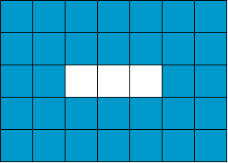

# 2024-2025 Olympic 10

## Bài 1: Năng lượng

### Đề bài

An có quỹ thời gian $N$ ngày để luyện tập cho kỳ thi. Do đó, An phải lập thời khoá biểu cho $N$ buổi tối mà trong mỗi buổi An sẽ luyện tập hoặc ngủ sớm.

Mỗi tối, nếu An ngủ sớm thì năng lượng sẽ tăng lên $A$ đơn vị, nếu $A$ luyện tập thì năng lượng sẽ giảm $B$ đơn vị.

An muốn luyện tập nhiều nhất có thể và cũng muốn duy trì mức năng lượng như trước khi bắt đầu luyện tập, nghĩa là mức năng lượng sẽ không giảm và cũng không tăng. An nhận định rằng muốn duy trì năng lượng thì tổng độ giảm phải bằng tổng độ tăng.

**Yêu cầu:** Hãy viết chương trình giúp An lập thời khoá biểu thoả điều kiện trên.

**Dữ liệu:** NANGLUONG.INP

- Dòng đầu tiên ghi số nguyên dương $N (1 \le N \le 10^6)$.
- Dòng thứ hai ghi số nguyên dương $A (1 \le A \le 10^3)$.
- Dòng thứ ba ghi số nguyên dương $B (1 \le B \le 10^3)$.

**Kết quả:** NANGLUONG.OUT

Một số nguyên là số buổi ngày An sẽ luyện tập. Nếu An không thể lập thời khoá biểu theo yêu cầu trên thì ghi $-1$.

**Ví dụ:**

| NANGLUONG.INP	| NANGLUONG.OUT	| Giải thích |
| --- | --- | --- |
| 4 <br> 6 <br> 2 | 3 | Với quỹ thời gian 4 buổi tối, An sẽ luyện tập 3 buổi (giảm 3 * 2 = 6 đơn vị) và ngủ sớm 1 buổi (tăng 1 * 6 = 6 đơn vị). <br> Thời khoá biểu này bảo đảm sau 4 buổi tối mức năng lượng không tăng và cũng không giảm. |
| 2 <br> 1 <br> 2 | -1 |

### Bài giải đề xuất

#### Ý tưởng chính

Gọi $p$ (practice) là số ngày luyện tập, $s$ (sleep) là số ngày ngủ sớm.

Ta có:

Tổng số ngày là: $p + s = n$

Tổng năng lượng không đổi: $a . s = b . p$

Từ hai đẳng thức trên, suy ra:

$$
\begin{align}
&a . (n - p) = b . p \\
\Rightarrow &a . n = (a + b) . p \\
\Rightarrow &p = \frac{a . n}{a + b}
\end{align}
$$

Như vậy, bài toán ban đầu có thể được phát biểu thành bài toán tìm $p$ sao cho $p$ là số nguyên dương, tức $a . n$ chia hết cho $a + b$.

#### Viết chương trình

=== "C++"

    ```c++ linenums="25"
        int numerator = n * a; 
        int denominator = a + b;

        if (numerator % denominator == 0)
        {
            result = numerator / denominator;
        }
        else
        {
            result = -1;
        }
    ```

=== "Python"

    ```py linenums="23"
        numerator = n * a
        denominator = a + b

        if numerator % denominator == 0:
            p = int(numerator / denominator)
        else:
            p = -1
    ```

### Mã nguồn

Code đầy đủ được đặt tại [GitHub](https://github.com/vtchitruong/hsg/tree/main/olympic-hcm/2025-olympic10/nangluong){:target="_blank"}.

## Bài 2: Bội ba

### Đề bài

Em Na học toán và rất thích các số bội ba (là các số chia hết cho 3). Để rèn luyện thêm, bạn An cho một dãy n các số nguyên dương và yêu cầu Na biến đổi n số đó thành các số bội ba nhưng phải theo nguyên tắc của An.

Na chỉ được biến đổi các số theo thứ tự từ trái qua phải. Đồng thời, tại mỗi vị trí, Na chỉ được cộng một giá trị nào đó vào số đang xét để biến nó thành số bội ba. Khi đó, tất cả các số phía sau đó cũng được cộng một giá trị tương ứng.

**Yêu cầu:** Hãy viết chương trình tính tổng giá trị được cộng thêm ít nhất để biến tất cả các số trong dãy thành số bội ba.

**Dữ liệu:** BOIBA.INP

- Dòng đầu tiên chứa số nguyên dương $n (1 \le n \le 2.10^5)$.
- Dòng tiếp theo chứa n số nguyên dương $a_i (1 \le a_i \le 10^9)$.

**Kết quả:** BOIBA.OUT

Một số nguyên là tổng giá trị cần tìm.

**Ràng buộc:**

- 60% số điểm của bài: $n \le 10^3$
- 40% số điểm của bài: $n \le 2.10^5$

**Ví dụ:**

| BOIBA.INP	| BOIBA.OUT	| Giải thích |
| --- | --- | --- |
| 4	<br> 1 4 3 2 | 1 | Thực hiện theo thứ tự từ trái qua phải, dãy ban đầu 1 4 3 2 <br> - Số 1 cần cộng 2 và phải cộng cho 3 số còn lại, giá trị phải dùng 2 x 4 số = 8, dãy mới: 3 6 5 4 <br> - Số 6 là bội 3, bỏ qua không cần cộng, dãy vẫn là 3 6 5 4 <br> - Số 5 cần cộng 1, giá trị phải dùng 1 x 2 số = 2, dãy mới: 3 6 6 5 <br> - Số 5 cần cộng 1, giá trị phải dùng 1 x 1 số = 1, dãy mới: 3 6 6 6 <br> Tổng giá trị đã cộng ở các vị trí: 8 + 2 + 1 = 11. |

### Bài giải đề xuất

#### Ý tưởng chính

Tại phần tử `a[i]` đang xét, nhằm tránh dùng thêm một vòng lặp để thực hiện cộng thêm vào các phần tử sau `a[i]`, ta xử lý như sau:

- Đặt biến `x` là giá trị cần bù vào để một phần tử `a[i]` chia hết cho 3.

- Đặt biến phụ `cumulative` dùng để lưu trữ giá trị tích luỹ mà sẽ cộng thêm cho phần tử liền sau `a[i]`: `cumulative += x` và `new_ai = ai + cumulative`.

- Kết quả output (tức tổng giá trị cộng thêm cho tất cả phần tử) được tính dựa trên số lượng phần tử từ vị trí `i` đến cuối mảng: `result += x * (n - i)`.

#### Viết chương trình

=== "C++"

    ```c++ linenums="25"
        // phần tử a[i] của input
        lli ai; // (1)!

        // phần tử a[i] sau khi cộng thêm để chia hết cho 3
        lli new_ai;

        // Giá trị tích luỹ từ các phần tử trước đó dùng để cộng thêm cho phần tử tiếp theo
        lli cumulative = 0;

        // Duyệt các phần tử từ đầu đến cuối
        for (int i = 0; i < n; ++i)
        {
            // Đọc từng phần tử từ tập tin input
            cin >> ai;

            // Tính a[i] sau khi cộng thêm giá trị tích luỹ để chia hết cho 3 
            new_ai = ai + cumulative;

            // Tính số dư khi chia cho 3
            lli remain = new_ai % 3;

            // Tính giá trị x cần cộng thêm để chia hết cho 3
            lli x = 0;
            if (remain != 0) x = 3 - remain;

            // x > 0 nghĩa là cần phải cộng thêm x cho phần tử tiếp theo
            if (x > 0)
            {
                // Cập nhật tổng giá trị cần cộng cho phần tử, bao gồm a[i] và tất cả phần tử sau a[i]
                result += x * (n - i);

                // Cập nhật giá trị tích luỹ nhằm cộng cho phần tử tiếp theo ở vòng lặp kế tiếp
                cumulative += x;
            }
        }
    ```
    { .annotate }

    1.  
        ```c++ linenums="8"
        typedef long long int lli;
        ```

=== "Python"

    ```py linenums="25"
        # phần tử A[i] sau khi cộng thêm để chia hết cho 3
        new_ai = 0

        # Giá trị tích luỹ từ các phần tử trước đó dùng để cộng thêm cho phần tử tiếp theo
        cumulative = 0

        # Duyệt các phần tử từ đầu đến cuối
        for i in range(n):
            # Tính a[i] sau khi cộng thêm giá trị tích luỹ để chia hết cho 3 
            new_ai = A[i] + cumulative

            # Tính số dư khi chia cho 3
            remain = new_ai % 3

            # Tính giá trị x cần cộng thêm để chia hết cho 3
            x = 0
            if remain != 0:
                x = 3 - remain

            # x > 0 nghĩa là cần phải cộng thêm x cho phần tử tiếp theo
            if x > 0:
                # Cập nhật tổng giá trị cần cộng cho phần tử, bao gồm a[i] và tất cả phần tử sau a[i]
                result += x * (n - i)

                # Cập nhật giá trị tích luỹ nhằm cộng cho phần tử tiếp theo ở vòng lặp kế tiếp
                cumulative += x
    ```

### Mã nguồn

Code đầy đủ được đặt tại [GitHub](https://github.com/vtchitruong/hsg/tree/main/olympic-hcm/2025-olympic10/boiba){:target="_blank"}.

## Bài 3: Lát gạch

### Đề bài

Quảng trường hình chữ nhật của thành phố ByteCity có kích thước $m \times n$. Quảng trường được lát bằng $m \times n$ viên gạch vuông kích thước $1 \times 1$.

Sau một thời gian, những viên gạch cần được thay mới để đẹp hơn. Ban quản lý có $T$ viên gạch mới. Do không đủ số lượng gạch cần thiết nên họ quyết định chỉ thay mới những viên gạch nằm dọc theo đường biên của quảng trường, phần gạch còn lại ở trung tâm vẫn giữ nguyên như cũ. Lưu ý độ rộng của đường biên luôn bằng nhau ở các cạnh.

**Yêu cầu:** Hãy viết chương trình cho biết độ rộng tối đa của đường biên có thể thay mới được khi sử dụng không quá $T$ viên gạch.

**Dữ liệu:** LATGACH.INP

Gồm một dòng ghi 3 số nguyên dương $m, n, T (3 \le m, n \le 10^9, 1 \le T < m \times n)$.

**Kết quả:** LATGACH.OUT

Một số nguyên là độ rộng tối đa cần tìm.

**Ràng buộc:**

- 70% số điểm của bài: $3 \le m, n \le 10^6$.
- 30% số điểm của bài: không ràng buộc gì thêm.

**Ví dụ:**

{loading=lazy}

{loading=lazy}

| LATGACH.INP | LATGACH.OUT	| Giải thích |
| --- | --- | --- |
| 5 7 33 | 2 | Với quảng trường 5 x 7, dùng 32 viên gạch lát được đường biên có độ rộng bằng 2. |
| 6 6 32 | 2 | Với quảng trường 6 x 6, dùng 32 viên gạch lát được đường biên có độ rộng bằng 2. |

### Bài giải đề xuất

#### Ý tưởng chính

Gọi $w$ (weight) là độ rộng của đường biên (tức phần lát gạch).

Ta có:

- Diện tích (hoặc số viên gạch cần lát) của toàn bộ quảng trường là: $m \times n$

- Diện tích phần không lát gạch nằm ở giữa quảng trường là: $(m - 2w) \times (n - 2w)$

- Diện tích lát gạch (hoặc số viên gạch cần lát) là: $m \times n - (m - 2w) \times (n - 2w)$ 

    Rút gọn thành: $2w(m + n - 2w)$

Như vậy, bài toán ban đầu có thể được phát biểu thành bài toán tìm $w$ lớn nhất sao cho $2w(m + n - 2w) \le t$.

#### Viết chương trình

**Bước 0:**

Vì phép nhân trong phần trình bày trên có thể tạo ra giá trị rất lớn, ta cần sử dụng kiểu `unsigned long long` trong C++.

=== "C++"

    ```c++ linenums="6"
    typedef unsigned long long ull;
    ```

**Bước 1:**

Viết hàm kiểm tra điều kiện $2w(m + n - 2w) \le t$.

=== "C++"

    ```c++ linenums="27"
    bool check(ull weight)
    {
        if (weight == 0) return true;

        // Trường hợp phần không lát gạch không tồn tại
        if (2ULL * weight >= m || 2ULL * weight >= n) return false;

        // Tính số gạch cần lát
        ull tiles = (2ULL * weight) * (m + n - 2ULL * weight);

        return tiles <= t;
    }
    ```

=== "Python"

    ```py linenums="20"
    def check(weight):
        if weight == 0:
            return True

        global m, n, t

        # Trường hợp phần không lát gạch không tồn tại
        if 2 * weight >= m or 2 * weight >= n:
            return False

        # Tính số gạch cần lát
        tiles = (2 * weight) * (m + n - 2 * weight)

        return tiles <= t
    ```

**Bước 2:**

Áp dụng tìm kiếm nhị phân (binary search) để tìm $w$ (weight) lớn nhất.

=== "C++"

    ```c++ linenums="43"
        ull low = 0;
        ull high = min(m, n) / 2 + 1;

        ull mid;
        while (low <= high)
        {
            mid = low + (high - low) / 2;

            if (check(mid))
            {
                result = mid;

                // Tiếp tục tìm kiếm phạm vi bên phải nhằm tìm ra giá trị mid (weight) lớn nhất
                low = mid + 1;
            }
            else
            {
                high = mid - 1;
            }
        }
    ```

=== "Python"

    ```py linenums="39"
        low = 0
        high = min(m, n) // 2 + 1

        while low <= high:    
            mid = low + (high - low) // 2

            if check(mid):
                result = mid

                # Tiếp tục tìm kiếm phạm vi bên phải nhằm tìm ra giá trị mid (weight) lớn nhất
                low = mid + 1
            else:
                high = mid - 1
    ```

### Mã nguồn

Code đầy đủ được đặt tại [GitHub](https://github.com/vtchitruong/hsg/tree/main/olympic-hcm/2025-olympic10/latgach){:target="_blank"}.
