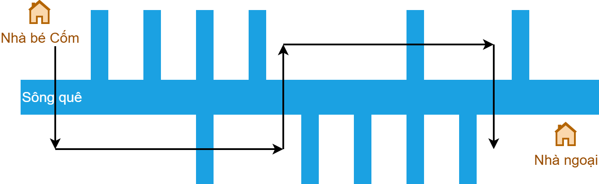

---
tags:
    - BFS
    - vùng liên thông
    - quy hoạch động
    - đường đi ngắn nhất
---

# Olympic 10 Thành phố 2014 - 2015

## Bài 1: Số vùng dương

### Đề bài

Trên một lưới $R \times C$, mỗi ô vuông mang một giá trị nguyên.

**Yêu cầu:** xác định số vùng dương (mang số khác 0). Một vùng dương khi có các cạnh liền kề bất kể hướng.

**Đầu vào:** POSITIVE.INP

- Dòng đầu: hai số $R$ và $C$ cách nhau ít nhất một khoảng trắng.
- $R$ dòng kế tiếp: mỗi dòng cho biết $C$ ký số của dòng.

**Đầu ra:** POSITIVE.OUT

Một số duy nhất là số vùng dương tìm được.

**Ví dụ:**

| POSITIVE.INP | POSITIVE.OUT | Giải thích |
| --- | --- | --- |
| 8 7 <br> **4 3 2 2 1** 0 *1* <br> **3 3 3 2 1** 0 *1* <br> **2 2 2 2 1** 0 0 <br> **2 1 1 1 1** 0 0 <br> **1 1** 0 0 0 **1** 0 <br> 0 0 0 **1 1 1** 0 <br> 0 **1 2 2 1 1** 0 <br> 0 **1 1 1 2 1** 0 <br> | 2 | Hai vùng là vùng in đậm và in nghiên. |

### Cách giải đề xuất

??? tip "Ý tưởng chính"

    Áp dụng thuật toán BFS nhiều lần.
    
    Mỗi lần BFS hoàn thành đồng nghĩa với việc đã duyệt xong một vùng dương trong lưới.

    Nói cách khác, khi gặp một ô có giá trị dương và chưa duyệt, ta tính đây là ô bắt đầu của một vùng mới, ta có thể tăng biến đếm số vùng thêm `1`. 

??? tip "Viết chương trình"

    0\. Khởi tạo các biến và cấu trúc liên quan:

    - Cấu trúc `cell` dùng để lưu trữ tọa độ hàng và cột.
    - Mảng `directions` dùng để lưu trữ tám hướng di chuyển khi áp dụng BFS.
    - Mảng `grid` dùng để lưu lưới input của đề bài.
    - Mảng `visisted` dùng để đánh dấu những ô đã ghé thăm.

    === "C++"

        ```c++ linenums="10"
        struct cell
        {
            int r;
            int c;
        };

        int R, C;
        vector<vector<int>> grid;
        vector<vector<bool>> visited;

        // 8 hướng di chuyển
        vector<cell> directions = {
            {-1, 0}, // lên
            {0, 1},  // phải
            {1, 0},  // xuống
            {0, -1}, // trái
            {-1, 1}, // phải trên
            {1, 1},  // phải dưới
            {1, -1}, // trái dưới
            {-1, -1} // trái trên
        };

        int region_count = 0;
        ```

    === "Python"

        ```py linenums="8"
        R, C = 0, 0
        grid = []
        visited = []

        # 8 hướng di chuyển
        directions = [
            (-1, 0),  # lên
            (0, 1),   # phải
            (1, 0),   # xuống
            (0, -1),  # trái
            (-1, 1),  # phải trên
            (1, 1),   # phải dưới 
            (1, -1),  # trái dưới   
            (-1, -1)  # trái trên
        ]

        region_count = 0
        ```

    1\. Viết hàm `bfs()` dùng để duyệt lưới `grid` theo thuật toán BFS.

    === "C++"

        ```c++ linenums="54"
        void bfs(cell start)
        {
            // Khởi tạo hàng đợi q
            queue<cell> q;
            q.push(start);
            visited[start.r][start.c] = true;

            // Duyệt lưới grid theo BFS và đánh dấu các ô đã duyệt qua
            while (!q.empty())
            {
                // Lấy ô nằm ở đầu ra khỏi hàng đợi
                cell current = q.front();
                q.pop();

                for (const cell &d : directions)
                {
                    // Lấy giá trị của ô tiếp theo
                    cell next = {current.r + d.r, current.c + d.c};

                    // Kiểm tra xem ô next có thỏa các điều kiện sau không:
                    // 1. nằm trong lưới
                    // 2. có giá trị dương
                    // 3. chưa đánh dấu
                    if (next.r >= 0 && next.r < R && next.c >= 0 && next.c < C && grid[next.r][next.c] > 0 && !visited[next.r][next.c])
                    {
                        // Đánh dấu ô next
                        visited[next.r][next.c] = true;

                        // Đẩy ô next vào hàng đợi
                        q.push(next);
                    }
                }
            }
        }
        ```

    === "Python"

        ```py linenums="48"
        def bfs(start_r, start_c):
            global R, C, grid, visited

            # Khởi tạo hàng đợi q
            q = deque([(start_r, start_c)])
            visited[start_r][start_c] = True

            # Duyệt lưới grid theo BFS và đánh dấu đã duyệt cho tất cả ô trong cùng một vùng
            while q:
                current_r, current_c = q.popleft()        

                for dr, dc in directions:
                    # Lấy giá trị của ô tiếp theo
                    next_r = current_r + dr
                    next_c = current_c + dc

                    # Kiểm tra xem ô next có thỏa các điều kiện sau không:
                    # 1. nằm trong lưới
                    # 2. có giá trị dương
                    # 3. chưa đánh dấu
                    if 0 <= next_r < R and 0 <= next_c < C and grid[next_r][next_c] > 0 and not visited[next_r][next_c]:
                        # Đánh dấu ô next
                        visited[next_r][next_c] = True

                        # Đẩy ô next vào hàng đợi
                        q.append((next_r, next_c))
        ```

    2\. Duyệt từng ô trong lưới, nếu ô có giá trị dương và chưa đánh dấu thì bắt đầu tính là một vùng mới.

    === "C++"

        ```c++ linenums="89"
        void process()
        {
            // Khởi tạo mảng visited
            visited.assign(R, vector<bool>(C, false));

            // Duyệt từng ô trong lưới grid
            for (int r = 0; r < R; ++r)
            {
                for (int c = 0; c < C; ++c)
                {
                    if (grid[r][c] > 0 && !visited[r][c])
                    {
                        // Nếu ô có giá trị dương và chưa đánh dấu thì bắt đầu tính là một vùng mới
                        region_count += 1;

                        // Thực hiện bfs từ ô này
                        bfs({r, c});
                    }
                }
            }
        }
        ```

    === "Python"

        ```py linenums="76"
        def process():
            global grid, region_count, visited
            
            # Khởi tạo mảng visited
            visited = [[False] * C for _ in range(R)]

            # Duyệt từng ô trong lưới grid
            for r in range(R):
                for c in range(C):
                    if grid[r][c] > 0 and not visited[r][c]:
                        # Nếu ô có giá trị dương và chưa đánh dấu thì bắt đầu tính là một vùng mới
                        region_count += 1

                        # thực hiện bfs từ ô này
                        bfs(r, c)
        ```

### Mã nguồn

Code đầy đủ được đặt tại:

- [GitHub](https://github.com/vtchitruong/hsg/tree/main/olympic10-hcm/2014-2015/positive){target="_blank"}

---

## Bài 2: Vượt sông

### Đề bài

Nhà của bé Cốm nằm ở bên bờ trái của con sông quê, còn nhà ngoại của bé nằm ở bên bờ phải của sông. Con đường dòng bờ sông còn có rất nhiều nhánh sông bên trái và bên phải, cóo nhánh chảy về bên trái, có nhánh chảy về bên phải, có nhánh chảy cả về bên trái và bên phải.

**Yêu cầu:** bạn có được sơ đồ đoạn sông từ nhà bé Cốm đến nhà ngoại của bé. Hãy chỉ giúp bé phương án đi đến nhà ngoại sao cho số lần "vượt sông" là ít nhất.

**Đầu vào:** RIVER.INP

Gồm một xâu ký tự độ dài $N (N \le 10^6)$ mô tả bản đồ con sông từ nhà bé đến nhà ngoại. Ký tự 'L' ký hiệu nhánh sông bên trái, ký tự 'R' ý hiệu có nhánh sông bên phải, ký tự 'B' ký hiệu có nhánh sông cả bên trái và bên phải.

**Đầu ra:** RIVER.OUT

Một số duy nhất là số lần ít nhất mà bé phải vượt sông để đến nhà ngoại của bé.

**Ví dụ:**

| RIVER.INP | RIVER.OUT |
| --- | --- |
| LLBLRRBRL | 5 |

{loading=lazy width=420}

**Ràng buộc:** có 50% số text tương ứng 50% số điểm của bài có $N \le 20$.

### Cách giải đề xuất

??? tip "Ý tưởng chính"

    Đặt vị trí của xuất phát của Cốm là `0`. Duyệt từng nhánh sông (biểu thị bằng các ký tự trong chuỗi input), mỗi lần duyệt xong một ký tự thì Cốm đến một vị trí mới.

    Vì có hai bờ sông nằm ở bên trái và bên phải nên ứng với một vị trí mới của Cốm, ta xét và lưu số lần vượt sông ít nhất tính từ vị trí `0` đến vị trí mới nhất đối với cả hai bên bờ sông.

    Sau khi duyệt hết chuỗi input, ta so sánh giá trị vượt sông giữa hai bờ thì ra được số lần vượt sông ít nhất tính trên tổng thể để đến được nhà ngoại.

??? tip "Viết chương trình"

    0\. Nhập dữ liệu.

    Gọi `river` là chuỗi input. Ta thêm ký tự `'0'` vào đầu chuỗi `river` nhằm *"hợp lý hoá"* tiến trình suy luận: để đến được vị trí `i`, Cốm phải xét nhánh sông `river[i]`, với `i` sẽ được tính bắt đầu từ `1`.

    === "C++"

        ```c++ linenums="20"
            cin >> river;
            river = '0' + river;
        ```

    === "Python"

        ```py linenums="23"
            river = '0' + next(iterator)
        ```

    1\. Khởi tạo vị trí xuất phát của Cốm.

    Do nhà Cốm nằm ở bờ trái và đây là vị trí `i == 0`, nên để đến được vị trí `0` của bờ trái, Cốm không cần vượt sông. Còn để đến được vị trí `0` của bờ phải, Cốm phải băng ngang sông, nghĩa là số lần vượt là `1`.

    === "C++"

        ```c++ linenums="26"
            int n = river.size();

            // Khởi tạo vị trí xuất phát
            int current_left = 0;
            int current_right = 1;
        ```

    === "Python"

        ```py linenums="29"
            n = len(river)
            
            # Khởi tạo vị trí xuất phát
            current_left = 0
            current_right = 1
        ```

    2\. Duyệt từng nhánh sông bằng biến `i` (lưu tại `river[i]`), với `i` chạy từ `1` đến `n - 1`, cũng chính là từng vị trí `i` mà Cốm sẽ đến, lặp thao tác: 

    Xét ba trường hợp `'L'`, `'R'` và `'B'` của nhánh sông `river[i]`. Với mỗi trường hợp, ta cần tính số lần vượt sông ít nhất để Cốm đến được vị trí `i` ở bờ trái và vị trí `i` ở bờ phải.
    
    Giá trị này được xác định dựa trên số lần vượt sông ít hơn giữa hai lựa chọn: từ vị trí `i - 1` ở cùng bờ hoặc từ vị trí `i - 1` ở khác bờ.

    Vì tính toán tại vị trí `i` chỉ phụ thuộc vào vị trí liền trước đó, là `i - 1`, nên việc lưu trữ bằng mảng là không cần thiết. Thay vào đó, ta chỉ dùng bốn biến:
    
    - Biến `current_left` và `current_right`: số lần vượt sông ít nhất để đến được bờ trái và bờ phải tại vị trí `i - 1`.
    - Biến `next_left` và `next_right`: dùng để tính và lưu số lần vượt sông ít nhất tại vị trí `i`.

    === "C++"

        ```c++ linenums="32"
            // Duyệt từng nhánh sông từ 1 đến n - 1
            for (int i = 1; i < n; ++i)
            {
                // Khởi tạo biến tạm
                int next_left = 0;
                int next_right = 0;

                if (river[i] == 'L')
                {
                    next_left = min(current_left + 1, current_right + 1);
                    next_right = min(current_left + 1, current_right);
                }
                else if (river[i] == 'R')
                {
                    next_left = min(current_left, current_right + 1);
                    next_right = min(current_left + 1, current_right + 1);
                }
                else if (river[i] == 'B')
                {
                    next_left = min(current_left + 1, current_right + 2);
                    next_right = min(current_left + 2, current_right + 1);
                }

                // Cập nhật current để chuẩn bị cho lần lặp tiếp theo
                current_left = next_left;
                current_right = next_right;
            }

            // Bước cuối cùng để đến nhà ngoại
            result = min(current_left + 1, current_right);
        ```

    === "Python"

        ```py linenums="35"
            # Duyệt từng nhánh sông từ 1 đến n - 1
            for i in range(1, n):
                # Khởi tạo biến tạm
                next_left = 0
                next_right = 0

                if river[i] == 'L': 
                    next_left = min(current_left + 1, current_right + 1)
                    next_right = min(current_left + 1, current_right)
                elif river[i] == 'R':        
                    next_left = min(current_left, current_right + 1)
                    next_right = min(current_left + 1, current_right + 1)
                elif river[i] == 'B':        
                    next_left = min(current_left + 1, current_right + 2)
                    next_right = min(current_left + 2, current_right + 1)        

                # Cập nhật current để chuẩn bị cho lần lặp tiếp theo
                current_left = next_left
                current_right = next_right    

            # Bước cuối cùng để đến nhà ngoại
            result = min(current_left + 1, current_right)
        ```

    3\. Sau khi đã vượt qua nhánh sông cuối cùng, Cốm có hai tình huống đến nhà ngoại:

    - Tình huống 1: nếu đang đứng ở bờ trái, Cốm cần vượt sông từ bờ trái sang bờ phải, nghĩa là thêm một lần vượt.
    - Tình huống 2: nếu đang đứng ở bờ phải, Cốm không cần vượt sông lần nào nữa.

    === "C++"

        ```c++ linenums="61"
            result = min(current_left + 1, current_right);
        ```

    === "Python"

        ```py linenums="56"
            result = min(current_left + 1, current_right)
        ```

### Mã nguồn

Code đầy đủ được đặt tại:

- [GitHub](https://github.com/vtchitruong/hsg/tree/main/olympic10-hcm/2014-2015/river){target="_blank"}