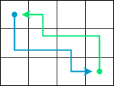

# Olympic 11 Thành phố 2024 - 2025 

## Bài 1: Nghe nhạc

### Đề bài

Bạn An rất thích nghe nhạc nhưng chỉ có $k$ phút thời gian rảnh.

An có danh sách $n$ bài hát, mỗi bài có độ dài là $m_i$ phút. An phải nghe hết một bài hát trước khi nghe bài tiếp theo.

**Yêu cầu:** Hãy viết chương trình tìm ra một dãy liên tiếp các bài hát sao cho số lượng bài hát là nhiều nhất có thể và An phải đủ thời gian để nghe toàn bộ các bài hát này.

**Dữ liệu:** NGHENHAC.INP

- Dòng đầu tiên chứa hai số nguyên dương $n$ và $k$ $(1 \le n \le 10^5, 1 \le k \le 10^9)$.
- Dòng tiếp theo chứa $n$ số nguyên dương $m_i (1 \le m_i \le 10^4)$.

**Kết quả:** NGHENHAC.OUT

Một số nguyên là số lượng bài hát tối đa mà An có thể nghe.

**Ràng buộc:**

- 60% số điểm của bài: $n \le 10^3$.
- 40% số điểm của bài: $n \le 10^5$.

**Ví dụ:**

| NGHENHAC.INP	| NGHENHAC.OUT	| Giải thích |
| --- | --- | --- |
| 5 20 <br> 9 3 5 4 7 | 4 | An có thể nghe các bài hát ở các vị trí 2, 3, 4, 5 với tổng thời gian là 19 phút. |

### Bài giải đề xuất

#### Ý tưởng chính

Do yêu cầu tìm một đoạn liên tiếp thoả mãn thời gian không vượt quá $k$, ta sử dụng cửa sổ trượt với hai con trỏ là `left` và `right`.

#### Viết chương trình

=== "C++"

    ```c++ linenums="36"
        // con trỏ bên trái (con trỏ bắt đầu)
        int left = 0;

        // tổng thời gian của các bài hát trong cửa sổ trượt đang xét
        int current_sum = 0;

        // số lượng bài hát trong cửa sổ trượt đang xét
        int current_count;

        // Duyệt con trỏ bên phải (con trỏ kết thúc)
        for (int right = 0; right < n; ++right)
        {
            // Tính tổng thời gian đang xét
            current_sum += songs[right];

            // Nếu tổng thời gian đang xét vượt quá thời gian cho phép
            while (current_sum > k && left <= right)
            {
                // thì loại bỏ bài hát bên trái
                current_sum -= songs[left];

                // Thu hẹp cửa sổ nhằm làm tổng thời gian hợp lệ trở lại
                left++;
            }

            // Tính số lượng bài hát đang xét
            current_count = right - left + 1;

            // Cập nhật số lượng bài hát tối đa
            max_count = max(max_count, current_count);
        }
    ```

=== "Python"

    ```py linenums="25"
        # con trỏ bên trái (con trỏ bắt đầu)
        left = 0

        # tổng thời gian của các bài hát trong cửa sổ trượt đang xét
        current_sum = 0

        # số lượng bài hát trong cửa sổ trượt đang xét
        current_count = 0

        # Duyệt con trỏ bên phải (con trỏ kết thúc)
        for right in range(n):
            # Tính tổng thời gian đang xét
            current_sum += songs[right]

            # Nếu tổng thời gian đang xét vượt quá thời gian cho phép
            while current_sum > k and left <= right:        
                # thì loại bỏ bài hát bên trái
                current_sum -= songs[left]

                # Thu hẹp cửa sổ nhằm làm tổng thời gian hợp lệ trở lại
                left += 1
            
            # Tính số lượng bài hát đang xét
            current_count = right - left + 1

            # Cập nhật số lượng bài hát tối đa
            max_count = max(max_count, current_count)
    ```

### Mã nguồn

Code đầy đủ được đặt tại [GitHub](https://github.com/vtchitruong/hsg/tree/main/olympic-hcm/2025-olympic11/nghenhac){:target="_blank"}.

## Bài 2: Học toán

### Đề bài

Để ôn tập kiến thức về ước số chung lớn nhất và bội số chung nhỏ nhất cho em Na, bạn An đã chọn hai số nguyên dương $a, b$ và yêu cầu em Na tìm hai số nguyên dương $x, y$ sao cho thỏa mãn đồng thời ba điều kiện sau:

(1) $a$ là ước số chung lớn nhất của $x$ và $y$.

(2) $b$ là bội số chung nhỏ nhất của $x$ và $y$.

(3) Tổng của $x$ và $y$ là nhỏ nhất.

**Yêu cầu:** Hãy viết chương trình tìm hai số nguyên dương $x$ và $y$ thỏa mãn các điều kiện trên.

**Dữ liệu:** HOCTOAN.INP

2 số nguyên dương $a$ và $b$ $(1 \le a<b \le 10^4)$.

**Kết quả:** HOCTOAN.OUT

Gồm 2 dòng:

- Dòng đầu tiên ghi giá trị tổng của $x$ và $y$.
- Dòng tiếp theo ghi lần lượt hai số $x$ và $y$. Nếu có nhiều kết quả thì chọn kết quả có $x$ nhỏ nhất. Nếu không tìm được $x, y$ thì ghi số $-1$.

**Ràng buộc:**

- 50% số điểm của bài: $1 \le a, b \le 10^3$.
- 50% số điểm của bài: không ràng buộc gì thêm.

**Ví dụ:**

| HOCTOAN.INP	| HOCTOAN.OUT	| Giải thích |
| --- | --- | --- |
| 6 36 | 30 <br> 12 18 | Có các cặp số $(x, y)$ thoả điều kiện (1) và (2) là: <br> (6, 36), (36, 6), (12, 18) và (18, 12). <br> Cặp số (12, 18) và (18, 12) có tổng nhỏ nhất là 30 nhưng cặp (12, 18) có $x$ nhỏ hơn nên được chọn làm kết quả. |
| 2 5 | -1 | |

### Bài giải đề xuất

#### Ý tưởng chính

Theo đề bài:

$a = UCLN(x, y)$

$b = BCNN(x, y)$

Mà $\frac{x \times y}{UCLN(x, y)} = BCNN(x, y)$

Suy ra

$$\frac{x \times y}{a} = b \tag{1} $$

Vì $a = UCLN(x, y)$ nên tồn tại $x_1, y_1$ sao cho:

$$
\begin{align}
x = a \times x_1 \\
y = a \times y_1 \tag{2}
\end{align}
$$

Thay vào $(1)$ ta được:

$$
\begin{align}
&\frac{(a \times x_1) \times (a \times y_1)}{a} = b \\ \\
\Rightarrow &a \times x_1 \times y_1 = b \\ \\
\Rightarrow &x_1 \times y_1 = \frac{b}{a} \tag{3}
\end{align}
$$

Mặt khác, ta cũng có:

$$x + y = a \times (x_1 + y_1) \tag{4}$$

Như vậy, bài toán ban đầu có thể phát biểu thành bài toán tương đương như sau:

Tìm hai số nguyên dương $x_1$ và $y_1$ sao cho:

1. $x_1$ và $y_1$ nguyên tố cùng nhau, hay $UCLN(x_1, y_1) = 1$ (do $(2)$).

2. Tích của $x_1$ và $y_1$ bằng $p$, với $p = b / a$ (do $(3)$).

3. Tổng $x_1$ và $y_1$ là nhỏ nhất (do $(4)$).

#### Viết chương trình

**Bước 1:** Viết hàm tìm ước số chung lớn nhất của hai số nguyên dương.

=== "C++"

    ```c++ linenums="25"
    int gcd(int u, int v)
    {
        while (u != 0)
        {
            int r = v % u;
            v = u;
            u = r;
        }

        return v;
    }
    ```

=== "Python"

    ```py linenums="19"
    def gcd(u, v):
        while u != 0:
            v, u = u, v % u

        return v
    ```

**Bước 2:**

Vì `b` là bội chung lớn nhất và `a` là ước chung lớn nhất của `x` và `y`, ta cần lưu ý trường hợp đặc biệt khi `b` không chia hết cho `a`.

Với trường hợp này, bài toán kết thúc, trả về `-1`.

=== "C++"

    ```c++ linenums="40"
    if (b % a != 0)
    {
        x = -1;
        return;
    }
    ```

=== "Python"

    ```py linenums="29"
        if b % a != 0:
            x = -1
            return
    ```

**Bước 3:**

Duyệt từng cặp ước số `x1` và `y1` của `p` (với `p = b / a`), ta xét cặp ước số nào nguyên tố cùng nhau (có ước chung lớn nhất bằng `1`) và có tổng là nhỏ nhất.

Vì $x_1 < \sqrt{p} < y_1$ nên ta chỉ cần cho `x1` chạy từ `1` đến `sqrt(p)`. Điều này bảo đảm hiệu quả của việc tìm cặp ước, đó là nhanh hơn và không trùng lại ước cũ. Đồng thời cũng thoả yêu cầu đề bài là in ra output `x` nhỏ hơn và `y` lớn hơn.

=== "C++"

    ```c++ linenums="47"
            int p = b / a;

            int y1;

            // tổng x1 + y1 đang xét
            int current_sum;

            // biến min_sum lưu tổng x1 + y1 nhỏ nhất
            int min_sum = numeric_limits<int>::max();

            // Duyệt từng ước x1 của p (p = b/a)
            for (int x1 = 1; x1 * x1 < p; ++x1)
            {
                // Nếu x1 là ước của p
                if (p % x1 == 0)
                {
                    // thì tìm ước còn lại y1
                    y1 = p / x1;

                    // Nếu x1 và y1 nguyên tố cùng nhau
                    if (gcd(x1, y1) == 1)
                    {
                        // thì tính tổng x1 + y1
                        current_sum = x1 + y1;

                        // Cập nhật tổng nhỏ nhất
                        if (current_sum < min_sum)
                        {
                            min_sum = current_sum;
                            x = a * x1;
                            y = a * y1;
                        }
                    }
                }
            }
    ```

=== "Python"

    ```py linenums="33"
            p = b / a

            y1 = 0

            # tổng x1 + y1 đang xét
            current_sum = 0

            # biến min_sum lưu tổng x1 + y1 nhỏ nhất
            min_sum = float('inf')

            # Duyệt từng ước x1 của p (p = b/a)
            for x1 in range(1, int(p ** 0.5) + 1):
                # Nếu x1 là ước của p
                if p % x1 == 0:
                    # thì tìm ước còn lại y1
                    y1 = p / x1

                    # Nếu x1 và y1 nguyên tố cùng nhau
                    if gcd(x1, y1) == 1:                
                        # thì tính tổng x1 + y1
                        current_sum = x1 + y1

                        # Cập nhật tổng nhỏ nhất
                        if current_sum < min_sum:
                            min_sum = current_sum
                            x = a * x1
                            y = a * y1
    ```

### Mã nguồn

Code đầy đủ được đặt tại [GitHub](https://github.com/vtchitruong/hsg/tree/main/olympic-hcm/2025-olympic11/hoctoan){:target="_blank"}.

## Bài 3: Robot

### Đề bài

Hai robot di chuyển trong một bảng hình chữ nhật có kích thước $m \times n$ gồm các ô lưới vuông $1 \times 1$ đơn vị.

Robot thứ nhất bắt đầu hành trình từ ô ở góc trái trên di chuyển đến ô ở góc phải dưới. Trong quá trình di chuyển, robot thứ nhất chỉ đi sang phải hoặc đi xuống dưới.

Robot thứ hai bắt đầu hành trình từ ô ở góc phải dưới di chuyển đến ô ở góc trái trên. Trong quá trình di chuyển, robot thứ hai chỉ đi sang trái hoặc đi lên trên.

Mỗi hành trình được mô tả bằng một xâu gồm các lệnh: L-sang trái, R-sang phải, U-đi lên, D-đi xuống. Bảo đảm các lệnh luôn dẫn các robot đi đến các vị trí cần đến.

{loading=lazy}

**Yêu cầu:** Hãy viết chương trình tìm số lượng ô mà cả hai robot cùng đi qua trong hành trình. Biết rằng hai robot di chuyển vào hai thời điểm khác nhau nên không xảy ra va chạm khi đi vào cùng một ô.

**Dữ liệu:** ROBOT.INP

- Dòng đầu tiên ghi hai số nguyên $m, n$ cho biết kích thước của bảng $(2 \le m, n \le 10^5)$.
- Dòng thứ hai mô tả hành trình của robot thứ nhất bằng một xâu chỉ gồm các kí tự D và R.
Dòng thứ ba mô tả hành trình của robot thứ hai bằng một xâu chỉ gồm các kí tự U và L.

**Kết quả:** ROBOT.OUT

Một số nguyên $K$ cho biết số ô mà cả hai robot cùng đi qua được.

**Ràng buộc:**

- 70% số điểm của bài: $2 \le m, n \le 1000$.
- 30% số điểm của bài: không ràng buộc gì thêm.

**Ví dụ:**

| ROBOT.INP	| ROBOT.OUT |
| --- | --- |
|3 4 <br> DRRDR <br> ULLUL | 4 |	

### Bài giải đề xuất

#### Ý tưởng chính

Đặt `visited_1` và `visited_2` là các mảng hai chiều dùng để dánh dấu các ô đã đi qua của hai robot.

Duyệt từng chuỗi hành trình của hai robot và đánh dấu `true` vào mảng `visited_1` và `visited_2`.

Sau đó, duyệt hai mảng trên để đếm các ô cùng toạ độ và đều là `true`.

#### Viết chương trình

**Bước 1:** Khởi tạo

Khởi tạo các mảng hai chiều `visited_1` và `visited_2` ứng với hai robot.

=== "C++"

    ```c++ linenums="37"
        // Khởi tạo mảng visited_1 lưu các ô mà robot 1 đã đi qua
        visited_1.resize(m, vector<bool>(n, false));

        // Toạ độ hiện hành của robot 1
        int r1 = 0;
        int c1 = 0;
        visited_1[r1][c1] = true;

        // Khởi tạo mảng visited_2 lưu các ô mà robot 2 đã đi qua
        visited_2.resize(m, vector<bool>(n, false));

        // Toạ độ hiện hành của robot 2
        int r2 = m - 1;
        int c2 = n - 1;
        visited_2[r2][c2] = true;
    ```

=== "Python"

    ```py linenums="32"
        # Khởi tạo mảng visited_1 lưu các ô mà robot 1 đã đi qua
        visited_1 = [[False for _ in range(n)] for _ in range(m)]

        # Toạ độ hiện hành của robot 1
        r1 = 0
        c1 = 0
        visited_1[r1][c1] = True

        # Khởi tạo mảng visited_2 lưu các ô mà robot 2 đã đi qua
        visited_2 = [[False for _ in range(n)] for _ in range(m)]

        # Toạ độ hiện hành của robot 2
        r2 = m - 1
        c2 = n - 1
        visited_2[r2][c2] = True
    ```

**Bước 2:** Đánh dấu

Duyệt từng ký tự trong chuỗi hành trình input và đánh dấu `true` vào mảng `visited_1` và `visited_2`.

=== "C++"

    ```c++ linenums="53"
        // Duyệt từng ký tự trong chuỗi hành trình
        for (int i = 0; i < path_1.length(); ++i)
        {
            // Cập nhật toạ độ mới của robot 1
            if (path_1[i] == 'D')
                r1 += 1;
            else
                c1 += 1;

            // Đánh dấu ô mà robot 1 đã đi qua
            if (r1 > -1)
                if (r1 < m)
                    if (c1 > -1)
                        if (c1 < n)
                            visited_1[r1][c1] = true;

            // Cập nhật toạ độ mới của robot 2
            if (path_2[i] == 'U')
                r2 -= 1;
            else
                c2 -= 1;

            // Đánh dấu ô mà robot 2 đã đi qua
            if (r2 > -1)
                if (r2 < m)
                    if (c2 > -1)
                        if (c2 < n)
                            visited_2[r2][c2] = true;
        }
    ```

=== "Python"

    ```py linenums="48"
        # Duyệt từng ký tự trong chuỗi hành trình
        for i in range(len(path_1)):        
            # Cập nhật toạ độ mới của robot 1
            if path_1[i] == 'D':
                r1 += 1
            else:
                c1 += 1

            # Đánh dấu ô mà robot 1 đã đi qua
            if r1 > -1:
                if r1 < m:
                    if c1 > -1:
                        if c1 < n:
                            visited_1[r1][c1] = True

            # Cập nhật toạ độ mới của robot 2
            if path_2[i] == 'U':
                r2 -= 1
            else:
                c2 -= 1

            # Đánh dấu ô mà robot 2 đã đi qua
            if r2 > -1:
                if r2 < m:
                    if c2 > -1:
                        if c2 < n:
                            visited_2[r2][c2] = True
    ```

**Bước 3:** Đếm số ô cùng đi qua

Duyệt hai mảng `visited_1` và `visited_2` để đếm số ô cùng toạ độ và đều là `true`.

=== "C++"

    ```c++ linenums="83"
        // Đếm số ô mà cả hai robot cùng đi qua
        for (int r = 0; r < m; ++r)
        {
            for (int c = 0; c < n; ++c)
            {
                if (visited_1[r][c])
                    if (visited_2[r][c])
                        result += 1;
            }
        }
    ```

=== "Python"

    ```py linenums="76"
        # Đếm số ô mà cả hai robot cùng đi qua
        for r in range(m):
            for c in range(n):
                if visited_1[r][c] and visited_2[r][c]:
                    result += 1
    ```

### Mã nguồn

Code đầy đủ được đặt tại [GitHub](https://github.com/vtchitruong/hsg/tree/main/olympic-hcm/2025-olympic11/hoctoan){:target="_blank"}.