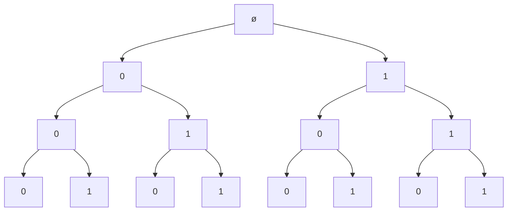

# Chuỗi nhị phân

## Yêu cầu

Sử dụng kỹ thuật quay lui, viết chương trình liệt kê tất cả số nhị phân có số chữ số cho trước.

## Input

Số nguyên dương n, là số chữ số.

## Output

Các số nhị phân có n chữ số.

## Bộ test

| STT | Input | Output |
| --- | --- | --- |
| 1 | n = 3 | 000 <br> 001 <br> 010 <br> 011 <br> 100 <br> 101 <br> 110 <br> 111 <br> |

## Cách giải đề xuất

1. **Khởi tạo**
    
    Đặt biến `binary` kiểu `list`, mỗi phần tử là một chữ số `0` hoặc `1`, thể hiện một số nhị phân hợp lệ.
    
    Khởi tạo `binary` là danh sách rỗng.

2. **Lựa chọn**

    Lần lượt chọn chữ số `0` và chữ số `1`.

    Ứng với mỗi chữ số `0` hoặc `1`, thực hiện:

    - Nạp chữ số này vào `binary` tại vị trí đang xét (do biến `current` nắm giữ).
    - Gọi hàm đệ quy để tiếp tục nạp chữ số `0` hoặc `1` cho vị trí tiếp theo (`current + 1`). Chỗ này không cần kiểm tra hợp lệ.
    - Thực hiện quay lui: Xóa bỏ chữ số đã nạp ra khỏi `binary`, nhằm chuẩn bị nạp chữ số khác ở cùng vị trí.

3. **Điều kiện dừng**

    Khi `binary` đã đủ số lượng chữ số theo yêu cầu, thì đây là một phương án hợp lệ, ta nạp vào mảng `solutions`, là mảng chứa tất cả đáp án. 

Hình 1 dưới đây thể hiện một cách tương đối kỹ thuật quay lui khi chọn các chữ số `0` và `1` cho số nhị phân gồm 3 chữ số.



*Hình 1. Cây mô tả cách tạo số nhị phân gồm 3 chữ số*

Như vậy, hàm phát sinh số nhị phân `generate_binary` được viết như sau:

Lưu ý: Do cách quản lý bộ nhớ của Python, trước khi nạp một đáp án vào mảng `solutions`, ta không nạp trực tiếp `binary` vào, mà phải nạp bản sao bằng cách dùng hàm `copy()`.

=== "C++"
    ```c++ linenums="1"
    void generateBinary(vector<int> binary, int length, int current)
    {
        // Nếu độ dài số nhị phân đã đủ theo yêu cầu,
        // thì nạp vào mảng solutions
        if (binary.size() == length)
        {
            solutions.push_back(binary);
            return;
        }

        // Lần lượt chọn chữ số 0 và 1
        for (int digit = 0; digit < 2; ++digit)
        {
            // Nạp chữ số 0 (hoặc 1) hoặc binary
            binary.push_back(digit);

            // Gọi hàm đệ quy để chọn chữ số ở vị trí tiếp theo
            generateBinary(binary, length, current + 1);

            // Quay lui: Xóa bỏ chữ số cuối cùng (để chuẩn bị nạp chữ số khác cho cùng vị trí đó)
            binary.pop_back();    
        }
    }
    ```
=== "Python"
    ```py linenums="1" hl_lines="5"
    def generate_binary(binary, length, current):
        # Nếu độ dài số nhị phân đã đủ theo yêu cầu,
        # thì nạp vào mảng solutions
        if len(binary) == length:
            solutions.append(binary.copy())
            return
        
        # Lần lượt chọn chữ số 0 và 1
        for digit in [0, 1]:
            # Nạp chữ số 0 (hoặc 1) hoặc binary
            binary.append(digit)

            # Gọi hàm đệ quy để chọn chữ số ở vị trí tiếp theo
            generate_binary(binary, length, current + 1)

            # Quay lui: Xóa bỏ chữ số đã nạp (để chuẩn bị nạp chữ số khác ở cùng vị trí)
            binary.pop()
    ```

## Mã nguồn

- Chương trình C++ hoàn chỉnh đặt tại [Gist của GitHub](https://gist.github.com/vtchitruong/a14d6686411b210f7623e66a5b66fa8a){:target="_blank"}

- Chương trình Python hoàn chỉnh đặt tại [Google Colab](https://colab.research.google.com/drive/1ertt7ZYcFs8GVdloIbY3VZgjTQEdBKLQ?usp=sharing){:target="_blank"}
