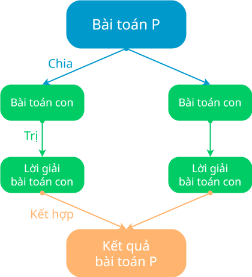

# Khái quát về chia để trị

## Khái niệm chia để trị

**Chia để trị** là kỹ thuật giải quyết bài toán bằng cách chia bài toán ban đầu thành các bài toán con nhỏ hơn, đơn giản hơn để có thể giải quyết một cách độc lập, và kết hợp các lời giải của chúng lại với nhau để có được lời giải của bài toán ban đầu.

## Các bước thực hiện

Chia để trị là một trong những kỹ thuật được áp dụng phổ biến trong thiết kế thuật toán và lập trình, được thực hiện qua ba bước sau:

**Bước 1: Chia**

Chia bài toán ban đầu thành các bài toán con đơn giản hơn.

Nếu những bài toán con chưa đủ đơn giản thì tiếp tục chia những bài toán con này thành những bài toán đơn giản hơn nữa. Lặp lại thao tác chia nhiều lần cho đến khi các bài toán con đủ đơn giản, theo nghĩa là có thể giải quyết một cách dễ dàng.

Có thể thấy, *“chia”* là bước quan trọng, đóng vai trò cơ sở cho các bước tiếp theo. Mục đích của thao tác chia là làm giảm đi sự phức tạp. Các bài toán con có được sau khi chia đều dễ giải quyết hơn bài toán ban đầu. Hơn nữa, mỗi bài toán con sẽ có cách giải độc lập, không phụ thuộc vào lời giải của bài toán con khác, mà nhờ đó, có thể giải từng bài toán con một cách riêng lẻ mà chưa cần quan tâm đến lời giải của bài toán con khác.

**Bước 2: Trị**

Giải quyết các bài toán con có được từ thao tác *“chia”* trong bước 1.

Trong bước này, các bài toán con đã đủ đơn giản để được *“trị”* một cách riêng lẻ, độc lập nhau.

*“Trị”* cũng có thể bao gồm cả việc tiếp tục chia nhỏ bài toán hơn nhằm đạt đến bài toán đủ đơn giản để giải quyết trực tiếp.

**Bước 3: Kết hợp**

Kết hợp các lời giải của các bài toán con để có được lời giải của bài toán ban đầu.

Tuỳ thuộc vào bài toán mà có thể thu thập các lời giải riêng lẻ hoặc tổng hợp các lời giải theo một cách nào đó phù hợp.

{ loading=lazy width=400 }

*Sơ đồ minh hoạ kỹ thuật chia để trị*

## Cấu trúc chung của hàm chia để trị

Thông thường, cách giải quyết bài toán theo hướng chia để trị là áp dụng **kỹ thuật đệ quy** hoặc **kỹ thuật lặp**. Đệ quy có thể giúp viết mã lệnh đơn giản và dễ hiểu hơn, trong khi lặp thường hiệu quả về mặt bộ nhớ và thời gian thực thi.

Mặt khác, kỹ thuật đệ quy là một giải pháp trực quan và phù hợp, có thể được áp dụng nhiều hơn bởi sự tương đồng trong cách thức tiếp cận vấn đề giữa chia để trị và đệ quy. Bên cạnh đó, các bài toán con nhỏ hơn thường là các trường hợp của cùng một bài toán nhưng ở quy mô nhỏ hơn.

Như vậy, thuật toán chia để trị xây dựng theo kỹ thuật đệ quy được viết tổng quát bằng mã giả như hàm divide_and_conquer() sau:

```py
def divide_and_conquer(P):
    # Trị
    if bài toán P là đủ đơn giản:
        Giải bài toán P
    
    # Chia
    sub_problems = divide(P) # (1)
    
    # Trị
    solutions = [] # (2)
    for sub_problem in sub_problems:
        # Gọi đệ quy
        solution = divide_and_conquer(sub_problem) # (3)

        # Nạp lời giải của bài toán con vào danh sách lời giải
        solutions.append(solution)
    
    # Kết hợp
    combined_solution = combine(solutions) # (4) 
    return combined_solution
```
{ .annotate }

1.  Biến `sub_problems` biểu thị danh sách các bài toán con.

    Hàm `divide()` dùng để chia `P` thành các bài toán con.

2.  Biến `solutions` biểu thị danh sách lời giải của các bài toán con.

3.  Biến `solution` biểu thị lời giải của một bài toán con cụ thể.

4.  Hàm `combine()` dùng để kết hợp các lời giải của các bài toán con.

    Biến `combined_solution` biểu thị lời giải của bài toán ban đầu.

## Some English words

| Vietnamese | Tiếng Anh | 
| --- | --- |
| chia | divide |
| kết hợp | combine |
| trị | conquer |
