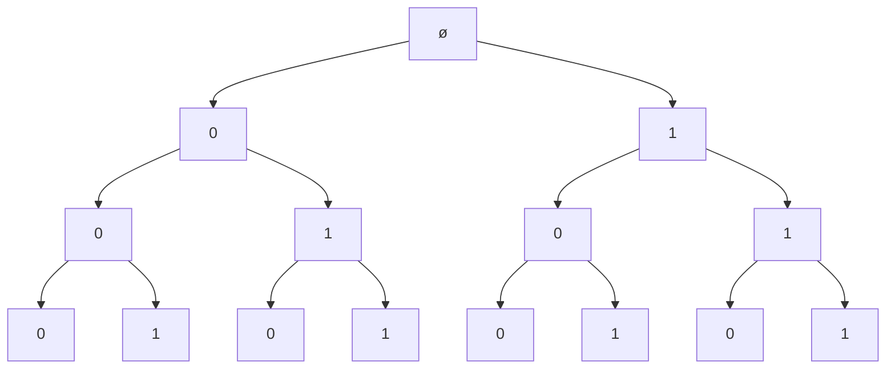

# Chuỗi nhị phân

!!! abstract "Tóm lược nội dung"

    Bài này trình bày cách giải bài toán liệt kê chuỗi nhị phân bằng phương pháp quay lui.

## Bài toán

**Yêu cầu:**

Viết chương trình liệt kê tất cả các chuỗi nhị phân có số lượng ký tự cho trước.

**Đầu vào:**

Số nguyên dương $n$ biểu thị số ký tự của chuỗi nhị phân cần phát sinh.

**Đầu ra:**

Các chuỗi nhị phân có $n$ ký tự.

**Bộ kiểm thử:**

| Đầu vào | Đầu ra |
| --- | --- |
| n = 3 | 000 <br> 001 <br> 010 <br> 011 <br> 100 <br> 101 <br> 110 <br> 111 <br> |

---

## Cách giải đề xuất

### Ý tưởng chính

1. **Khởi tạo**
    
    Khởi tạo danh sách `binary` rỗng, dùng để chứa các ký tự `0` hoặc `1`. 

2. **Xây dựng chuỗi nhị phân**

    Tại mỗi bước thứ `i`, ta thực hiện:

    - Chọn thử một ký tự khả thi: chọn `0`, rồi chọn `1`.
    - Nạp ký tự vừa chọn vào `binary`.
        - Nếu `binary` đã hoàn chỉnh (tức đầy đủ `n` ký tự) thì lưu nó vào `binary_list`.
        - Ngược lại, chưa hoàn chỉnh, thì gọi đệ quy để tiếp tục chọn ký tự cho vị trí tiếp theo `i + 1`.

3. **Quay lui**

    Khi chọn xong một ký tự, dù `binary` hoàn chỉnh hay đã thử xong các ký tự khả thi, ta đều phải thực hiện quay lui: đó là gỡ bỏ ký tự vừa nạp ở vị trí cuối ra khỏi `binary`.

    Việc này giúp trả `binary` về trạng thái trước khi lựa chọn ký tự cho vị trí `i` để chuẩn bị lựa chọn ký tự tiếp theo cho vị trí `i` này.

    Hoặc nếu đã thử hết các ký tự cho vị trí `i` thì trả `binary` về trạng thái chuẩn bị lựa chọn ký tự cho vị trí `i - 1`.

Hình dưới đây minh hoạ phương pháp quay lui khi chọn `0` và `1` cho chuỗi nhị phân gồm 3 ký tự.



### Viết chương trình

1\. Viết hàm `generate_binary_string()` dùng để phát sinh chuỗi nhị phân.

Hàm gồm có hai tham số:

- Danh sách `binary` biểu thị một chuỗi nhị phân hoàn chỉnh.
- Độ dài của chuỗi nhị phân hoàn chỉnh `length`.

Hàm không có giá trị trả về.

```py linenums="1"
# Hàm quay lui dùng để phát sinh chuỗi nhị phân
def generate_binary_string(binary, length):
    # Kiểm tra chuỗi nhị phân hoàn chỉnh
    if len(binary) == length:
        # Lưu chuỗi hoàn chỉnh vào binary_list
        binary_list.append(binary.copy()) # (1)!
        return

    # Duyệt các lựa chọn khả thi: chữ số 0 và 1
    for digit in [0, 1]:
        # Bước 1 - Thử: nạp chữ số được chọn vào chuỗi
        binary.append(digit)

        # Bước 2 - Tiến: gọi đệ quy để chọn chữ số ở vị trí tiếp theo
        generate_binary_string(binary, length)

        # Bước 3 - Quay lui: gỡ bỏ chữ số vừa nạp (nằm ở cuối)
        binary.pop()
```
{ .annotate }

1.  Đối với Python, ta không thể để nạp `binary` vào `binary_list` một cách trực tiếp, mà phải nạp bản sao bằng cách dùng hàm `copy()`.

2\. Viết chương trình chính:

- Cho người dùng nhập số lượng ký tự của chuỗi nhị phần cần phát sinh.
- Khởi tạo `binary_list` là rỗng.
- Khởi tạo `b` là chuỗi nhị phân rỗng.
- Gọi hàm `generate_binary_string()` ra thực hiện.
- Dùng vòng lặp để in ra các chuỗi nhị phân hoàn chỉnh có trong `binary_list`.

```py linenums="22"
if __name__ == '__main__':
    # Số lượng ký tự của chuỗi nhị phân
    n = int(input('Nhập số ký tự: '))

    # Khởi tạo binary_list chứa các chuỗi nhị phân hoàn chỉnh
    binary_list = []

    # Khởi tạo một chuỗi nhị phân
    b = []

    # Gọi hàm generate()
    generate_binary_string(b, n)

    # In ra tất cả chuỗi nhị phân
    for binary in binary_list:
        s = ''.join(map(str, binary))
        print(s)
```

---

## Mã nguồn

Code đầy đủ được đặt tại:

- [Google Colab](https://colab.research.google.com/drive/1ertt7ZYcFs8GVdloIbY3VZgjTQEdBKLQ?usp=sharing){target="_blank"}