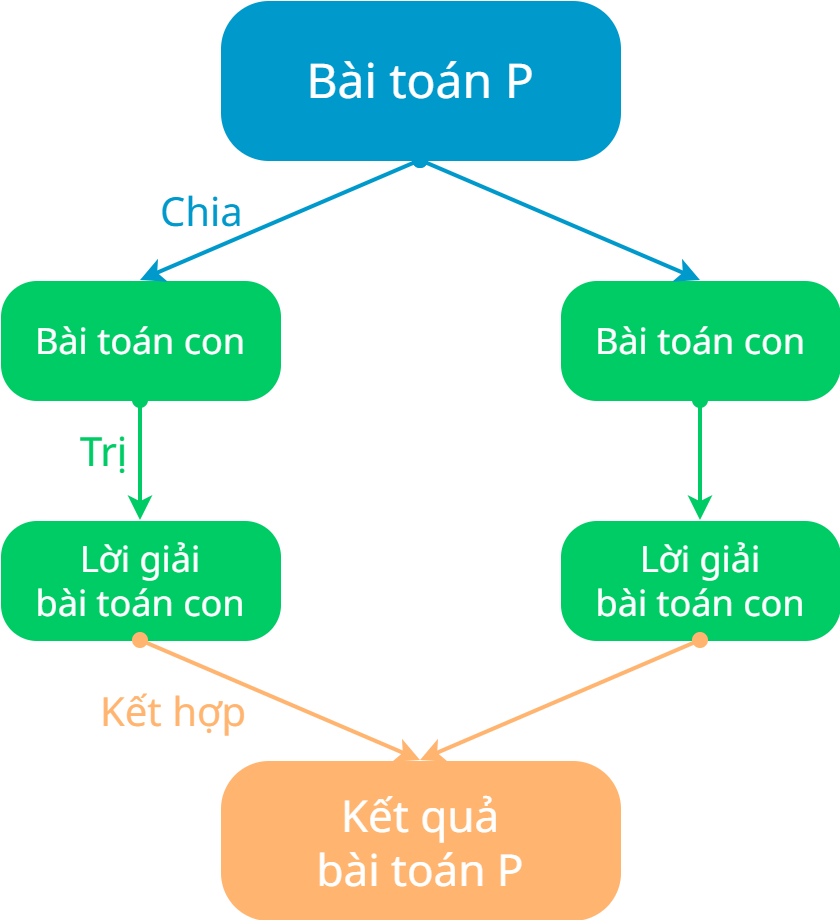

# Khái quát về chia để trị

!!! abstract "Tóm lược nội dung"

    Bài này trình bày khái quát về phương pháp chia để trị.

## Khái niệm

!!! note "Chia để trị"

    Là phương pháp thiết kế thuật toán dựa trên việc **chia một bài toán lớn thành các bài toán con** cùng loại, có kích thước nhỏ hơn cho đến khi chúng đủ đơn giản để giải quyết trực tiếp
    
    Sau đó, các lời giải của bài toán con được kết hợp lại để hình thành lời giải cho bài toán ban đầu.

---

## Ý tưởng chính

**Bước 1: Chia**

**Chia** nghĩa là phân tách bài toán gốc thành các bài toán con cùng loại nhưng có kích thước nhỏ hơn.

Tiến trình này được thực hiện lặp lại cho đến khi các bài toán con đạt đến kích thước tối thiểu, tìm được lời giải trực tiếp mà không cần phân tách thêm nữa.

Việc chia nhỏ giúp giảm độ phức tạp không gian và thời gian của bài toán.

!!! info "Đặc điểm của các bài toán con"

    Các bài toán con thường mang tính độc lập, cho phép xử lý riêng mà không phụ thuộc vào kết quả của các nhánh khác trong cùng một tầng phân tách.

**Bước 2: Trị**

**Tri** nghĩa là giải quyết các bài toán con:

- **Trị bằng đệ quy:**

    Nếu bài toán con còn phức tạp thì tiếp tục áp dụng quy trình chia để trị lên nó.

- **Trị trực tiếp:**

    Nếu bài toán con đã đủ đơn giản, tức đạt đến trường hợp cơ sở, thì giải quyết trực tiếp.

!!! note "Trị"

    **Trị** cũng có thể hiểu là giải các bài toán con một cách đệ quy. Trong đó, trường hợp cơ sở là điểm dừng của bước Trị.

**Bước 3: Kết hợp**

**Kết hợp** nghĩa là tổng hợp lời giải của các bài toán con để xây dựng nên lời giải cho bài toán ban đầu.

Tùy theo bài toán, thao tác kết hợp có thể đơn giản là thu thập lời giải hoặc phức tạp hơn là hòa trộn theo một cách nào đó.

Sơ đồ sau minh họa phương pháp chia để trị ở mức đơn giản.

{ loading=lazy width=360 }

---

## Mã giả

Phương pháp chia để trị có thể được triển khai thông qua **kỹ thuật đệ quy** hoặc **kỹ thuật lặp**. Đệ quy mang đến sự trực quan, phản ánh sự *"tự tương đồng"* (1) của các bài toán con, còn kỹ thuật lặp thường hiệu quả về mặt bộ nhớ và thời gian thực thi.
{ .annotate }

1.  Giống hệt bài toán gốc nhưng nhỏ hơn về quy mô.

Hàm `divide_and_conquer()` sau mô tả tổng quát thuật toán chia để trị theo kỹ thuật đệ quy.

Gọi:

- `P` là một thể hiện của bài toán có kích thước cụ thể.
- `sub_problems` là danh sách các bài toán con.
- `sub_solutions` là danh sách các lời giải của các bài toán con.
- Hàm `solve_directly()` dùng để giải quyết bài toán khi đạt trường hợp cơ sở.
- Hàm `divide()` dùng để chia `P` thành các bài toán con.
- Hàm `combine()` dùng để kết hợp các lời giải của các bài toán con.

```py
def divide_and_conquer(P):
    # Trị
    if P là đủ đơn giản:
        return solve_directly(P)
    
    # Bước 1 - Chia: chia problem thành các sub_problem
    sub_problems = divide(P)
    
    # Bước 2 - Trị: giải các sub_problem bằng cách gọi đệ quy
    sub_solutions = []
    for sub_problem in sub_problems:
        sub_solutions.append(divide_and_conquer(sub_problem))
    
    # Bước 3 - Kết hợp: tổng hợp các lời giải thành lời giải cuối cùng
    return combine(sub_solutions)
```

---

## Some English words

| Vietnamese | Tiếng Anh | 
| --- | --- |
| chia | divide |
| chia để trị | divide and conquer |
| kết hợp | combine |
| trị | conquer |
