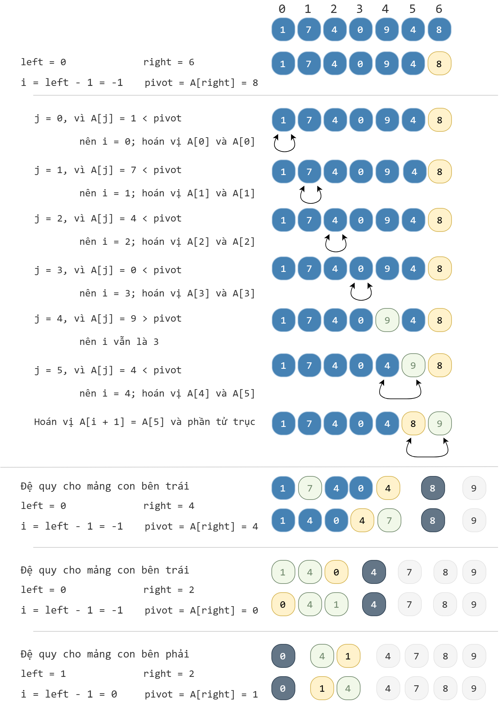

# Sắp xếp nhanh

!!! abstract "Tóm lược nội dung"

    Bài này trình bày thuật toán sắp xếp nhanh nhằm minh họa phương pháp chia để trị.

## Bài toán

**Yêu cầu:**

Sắp xếp một mảng số nguyên theo thứ tự tăng dần bằng thuật toán sắp xếp nhanh.

**Đầu vào:**

Mảng A gồm n số nguyên.

**Đầu ra:**

Mảng A có thứ tự tăng dần.

**Bộ kiểm thử:**

| Đầu vào | Đầu ra |
| --- | --- |
| 1 7 4 0 9 4 8 | 0 1 4 4 7 8 9 |

---

## Thuật toán

Tương tự sắp xếp trộn, thuật toán sắp xếp nhanh cũng chia mảng thành hai mảng con trái và phải.

Nếu như sắp xếp trộn chia mảng dựa vào vị trí của phần tử giữa thì sắp xếp nhanh chia mảng dựa vào tiến trình **phân hoạch** (partition).

Phân hoạch là tiến trình chọn một **phần tử trục** (pivot) để phân chia mảng thành hai mảng con:

- Một mảng con chứa các phần tử **nhỏ hơn hoặc bằng phần tử trục**.
- Một mảng con chứa các phần tử **lớn hơn phần tử trục**.

Tiến trình phân hoạch được lặp lại cho đến khi mỗi mảng con chỉ còn một phần tử, đồng nghĩa không thể chia đôi được nữa.

!!! note "Thuật toán sắp xếp nhanh"

    **Bước 1: Chia**
    
    Chia mảng ban đầu thành hai mảng con trái và phải.

    Cụ thể, chia bằng cách xác định vị trí của phần tử trục và đặt các phần tử còn lại vào mảng con trái hoặc phải.

    Phần tử trục có thể được chọn bằng nhiều cách:

    - Chọn phần tử ở giữa mảng.
    - Chọn phần tử ở cuối mảng.
    - Chọn phần tử ở đầu mảng.

    **Bước 2: Trị**

    Bước này bao gồm hai trạng thái:

    - Trị trực tiếp đối với trường hợp cơ sở:

        Mảng chỉ còn một phần tử hoặc rỗng, không thể chia đôi được nữa.

    - Trị bằng đệ quy:

        Gọi đệ quy hàm sắp xếp nhanh cho mảng con trái và mảng con phải.

    **Bước 3: Kết hợp**
    
    Thao tác kết hợp không cần thiết vì các phần tử trong mỗi mảng con đã được sắp xếp, và các phần tử trục cũng đã nằm đúng vị trí.

Hình sau minh họa thuật toán sắp xếp nhanh đối với mảng `A = [1, 7, 4, 0, 9, 4, 8]`.

{loading=lazy}

---

## Viết chương trình

1\. Viết hàm `quick_sort()` dùng để thực hiện thuật toán sắp xếp nhanh.

Hàm gồm có ba tham số đầu vào:

- `A` là mảng ban đầu cần sắp xếp.
- `left` và `right` là chỉ số dùng để xác định phạm vi của phần mảng cần xử lý trong mảng `A`.

```py linenums="23"
# Hàm dùng để thực hiện thuật toán sắp xếp nhanh
def quick_sort(A, left, right):
    # Trị đối với trường hợp cơ sở
    # Nếu chỉ còn một phần tử hoặc không còn phần tử nào thì kết thúc hàm
    if left >= right:
        return

    # Bước 1 - Chia: phân hoạch mảng A trong đoạn [left..right]
    pivot_index = partition(A, left, right)

    # Bước 2 - Trị: giải quyết đệ quy cho mảng con trái và phải
    quick_sort(A, left, pivot_index - 1)
    quick_sort(A, pivot_index + 1, right)
```

2\. Viết hàm `partition()` dùng để phân hoạch mảng `A` thành hai mảng con trái và phải.

Hàm này gồm có:

- Tham số `A` là mảng ban đầu
- Tham số `left` và `right` là phạm vi của mảng cần phân hoạch
- Giá trị trả về là chỉ số mới (vị trí mới) của phần tử trục.

Hàm hoạt động như sau:

**Bước 0:**

- Chọn phần tử cuối cùng của mảng làm phần tử trục: `pivot = A[right]`.
- Gọi `i` là biến đóng vai trò đánh dấu vị trí cuối cùng của nhóm các phần tử nhỏ hơn hoặc bằng phần tử trục.

    Khởi tạo biến `i` là vị trí nằm ngay trước phần tử đầu tiên của đoạn cần phân hoạch: `i = left - 1`.

    Việc khởi tạo này có ý nghĩa: nhóm các phần tử nhỏ hơn hoặc bằng phần tử trục chưa có phần tử nào.

**Bước 1:**

Duyệt từng phần tử `A[j]` từ `left` đến `right - 1`:

- Nếu `A[j]` nhỏ hơn hoặc bằng phần tử trục thì:

    - Tăng `i` thêm 1 đơn vị để mở rộng mảng con trái.
    - Hoán vị `A[i]` và `A[j]`.

Sau vòng lặp này, các `A[j]` nhỏ hơn hoặc bằng phần tử trục sẽ nằm trong đoạn `[left..i]` và các `A[j]` lớn hơn phần tử trục sẽ nằm trong đoạn `[i + 1..right - 1]`.

**Bước 2:**

- Hoán vị `A[i + 1]` và phần tử trục, tức `A[right]`.

    Thao tác này bảo đảm mảng được chia thành ba phần rõ rệt theo đúng ý nghĩa của phương pháp chia để trị:

    - Mảng con trái từ `left` đến `i`: gồm các phần tử nhỏ hơn hoặc bằng phần tử trục.
    - Phần tử trục nằm ở vị trí `i + 1`.
    - Mảng con phải từ `i +  1` đến `right - 1`: gồm các phần tử lớn hơn phần tử trục.

- Trả về chỉ số `i + 1`, là vị trí mới của phần tử trục.

```py linenums="2"
def partition(A, left, right):
    # Chọn phần tử cuối cùng làm phần tử trục
    pivot = A[right]

    # Khởi tạo i để theo dõi vị trí cuối cùng nhỏ hơn hoặc bằng phần tử trục
    i = left - 1

    # Duyệt từng phần tử A[j] trong đoạn [left..right - 1]
    for j in range(left, right):
        if A[j] <= pivot:
            i = i + 1
            A[i], A[j] = A[j], A[i]

    # Hoán vị phần tử trục, tức A[right], với phần tử ở vị trí i + 1
    A[i + 1], A[right] = A[right], A[i + 1]

    # Trả về chỉ số mới của phần tử trục
    return i + 1
```

3\. Viết chương trình chính.

Trong chương trình chính, ta tạm thời bỏ qua việc cho người dùng nhập mảng. Thay vào đó, ta khởi tạo mảng cố định, rồi gọi hàm `quick_sort()` để sắp xếp mảng `Array`.

```py linenums="38"
if __name__ == '__main__':
    # Khởi tạo mảng array
    array = [1, 7, 4, 0, 9, 4, 8]
    print(f'Mảng ban đầu chưa sắp xếp: {array}')

    # Gọi hàm quick_sort()
    quick_sort(array, 0, len(array) - 1)

    # In mảng mới
    print(f'Mảng mới sau khi sắp xếp: {array}')
```

4\. Chạy chương trình trên, kết quả như sau:

```pycon
Mảng ban đầu chưa sắp xếp: [1, 7, 4, 0, 9, 4, 8]
Mảng mới sau khi sắp xếp: [0, 1, 4, 4, 7, 8, 9]
```

---

## Mã nguồn

Code đầy đủ được đặt tại:

- [Google Colab](https://colab.research.google.com/drive/1wuMvmYzgzIOAIs9LO_2bqr7mSOQTRmz_?usp=sharing){target="_blank"}

## Some English words

| Vietnamese | Tiếng Anh | 
| --- | --- |
| phân hoạch, phân vùng | partition |
| sắp xếp nhanh | quick sort |

