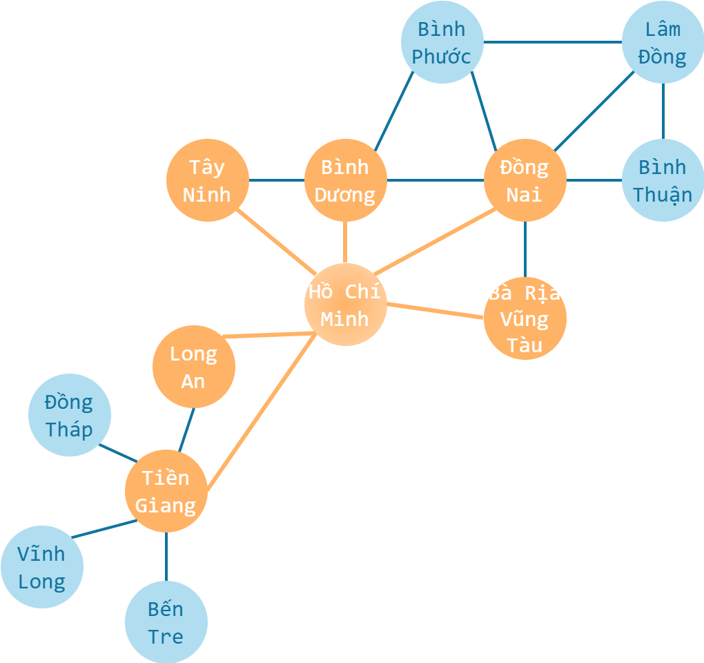

# Duyệt theo chiều rộng

!!! abstract "Tóm lược nội dung"

    Bài này trình bày thuật toán BFS - duyệt đồ thị theo chiều rộng.

## Khái quát

!!! note "BFS - Breadth First Search"

    "Duyệt theo chiều rộng** là thuật toán duyệt đồ thị bao gồm các đặc điểm sau:

    - **Bắt đầu:** Xuất phát từ một đỉnh, tạm gọi là đỉnh `start`.
    - **Lan tỏa theo lớp:** Ghé thăm các đỉnh `u` kề với đỉnh `start`, sau đó chuyển sang ghé thăm các đỉnh `v` kề với các đỉnh `u` vừa ghé thăm.
    - **Thứ tự ưu tiên:** BFS bảo đảm duyệt các đỉnh theo thứ tự khoảng cách tăng dần từ đỉnh `start`. Những đỉnh ở gần sẽ được ghé thăm trước những đỉnh ở xa.
    - **Kết thúc:** Quá trình dừng lại khi đã ghé thăm toàn bộ các đỉnh trong cùng một thành phần liên thông với đỉnh `start`, hoặc khi đã tìm thấy đỉnh mục tiêu.

## Ý tưởng chính

Ta dùng một **hàng đợi** để lưu trữ các đỉnh cần duyệt.

Các bước thực hiện BFS được phác thảo như sau:

**Bước 1:**

- Nạp đỉnh `start` vào hàng đợi.
- Đánh dấu đỉnh `start` đã ghé thăm.

**Bước 2:**

Lặp lại các thác tác sau cho đến khi hàng đợi không còn phần tử:

- Lấy đỉnh đầu tiên ra khỏi hàng đợi, đặt là đỉnh `current`.
- Duyệt các đỉnh `v` kề với đỉnh `current`:

    Nếu đỉnh `v` chưa được ghé thăm thì:
    
    - Đánh dấu đỉnh `v` đã ghé thăm.
    - Nạp đỉnh `v` vào hàng đợi.
    - Thực hiện các công việc cần thiết với đỉnh `v`, chẳng hạn như: lưu lại đường đi, kiểm tra điều kiện tìm kiếm.

Ví dụ:

{loading=lazy width=50%}

Gọi Thành phố Hồ Chí Minh là đỉnh `start`.

Theo BFS, sau khi duyệt đỉnh `start`, ta sẽ duyệt đến các đỉnh kề với đỉnh `start`, gồm: `'Long An'`, `'Tiền Giang'`, `'Tây Ninh'`, `'Bình Dương'`, `'Đồng Nai'` và `'Bà Rịa - Vũng Tàu'`.

Ứng với đỉnh `'Đồng Nai'`, ta sẽ duyệt các đỉnh kề với `Đồng Nai`, gồm: `'Bình Dương'`, `'Bình Phước'`, `'Lâm Đồng'`, `'Bình Thuận'`, `'Bà Rịa - Vũng Tàu'` và `'Hồ Chí Minh'`.

Ngoài ra, vì đây là đồ thị vô hướng nên để tránh lặp vô hạn giữa hai đỉnh kề nhau, ta cần đánh dấu đã ghé thăm cho các đỉnh.

## Ứng dụng

Các ứng dụng tiêu biểu của BFS bao gồm:

1. **Tìm đường đi ngắn nhất**

    Trong đồ thị không trọng số, BFS bảo đảm tìm được đường đi có ít cạnh nhất từ đỉnh nguồn đến đỉnh đích.

2. **Giải quyết bài toán mê cung**

    Tìm lối thoát nhanh nhất bằng cách xem mỗi ô trong mê cung là một đỉnh của đồ thị.

3. **Mạng xã hội**

    Xác định "độ phân tách" giữa hai người dùng, chẳng hạn như: tìm bạn chung, gợi ý kết bạn dựa trên khoảng cách gần nhất.

4. **Cơ chế web crawling**

    Các bộ máy tìm kiếm sử dụng BFS để thu thập dữ liệu các trang web theo từng cấp độ liên kết để tránh việc lún quá sâu vào một nhánh duy nhất.

5. **Kiểm tra tính liên thông**

    Xác định xem các đỉnh trong đồ thị có thể đi tới nhau được hay không.

## Some English words

| Vietnamese | Tiếng Anh | 
| --- | --- |
| duyệt đồ thị | graph traversal |
| duyệt theo chiều rộng | breadth first search (BFS) |
| tìm đường ngắn nhất | finding shortest path |
