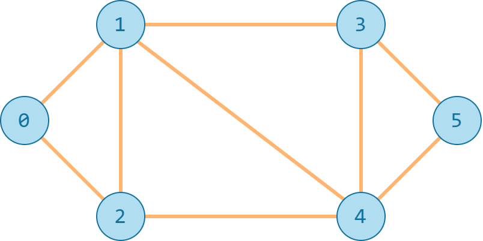

# Tìm đường đi bằng BFS

!!! abstract "Tóm lược nội dung"

    Bài này trình bày bài toán tìm đường đi bằng thuật toán BFS.

## Bài toán

**Yêu cầu:**

Tìm đường đi có khoảng cách ngắn nhất giữa hai đỉnh trong đồ thị bằng cách áp dụng thuật toán BFS. Giả sử tất cả các cạnh đều có độ dài bằng 1.

**Đầu vào:**

- Dòng đầu tiên gồm các đỉnh của đồ thị.
- Các dòng tiếp theo mô tả các cạnh của đồ thị.
- Hai dòng cuối cùng là hai đỉnh cần tìm khoảng cách ngắn nhất.

**Đầu ra:**

Khoảng cách ngắn nhất giữa hai đỉnh theo yêu cầu.

**Bộ kiểm thử:**

| Đầu vào | Đầu ra | Giải thích |
| --- | --- | --- |
| 0 1 2 3 4 5<br>0 1<br>0 2<br>1 2<br>1 3<br>1 4<br>2 4<br>3 4<br>3 5<br>4 5<br>0<br>5 | 3 | Đồ thị gồm 6 đỉnh, đánh số từ 0 đến 5.<br>Có 9 cạnh.<br>Hai đỉnh cần tìm khoảng cách ngắn nhất là 0 và 5. |

Đồ thị có thể được phác họa như sau:

{loading=lazy width=40%}

---

## Cách giải đề xuất

??? tip "Ý tưởng chính"

    1\. Ta dùng danh sách kề để biểu diễn đồ thị G.

    2\. Đối với đồ thị không có trọng số như bài này, BFS bảo đảm tìm được khoảng cách ngắn nhất, vì BFS duyệt các đỉnh theo từng lớp, mà các cạnh đều được coi là có cùng độ dài bằng 1.

    3\. Để đánh dấu các đỉnh đã ghé thăm, ta dùng danh sách `visited`. Ví dụ: đánh dấu đỉnh `v` đã ghé thăm bằng dòng lệnh `visited.append(v)`.

    4\. Để lưu khoảng cách từ đỉnh `start` đến các đỉnh khác, ta dùng biến `distance` có kiểu `dictionary`, trong đó:

    - `key`: là tên đỉnh.
    - `value`: là khoảng cách từ đỉnh `start` đến đỉnh `key`.

    Ví dụ:  
    `distance[0] = 0`: khoảng cách từ đỉnh `start` (là đỉnh `0`) đến chính nó là `0`.

    5\. Cách cập nhật khoảng cách:

    Khi duyệt một đỉnh `v` kề với đỉnh `current`, khoảng cách được tính là: `distance[v] = distance[current] + 1`.

    Ví dụ:  
    Khi đi từ `0` đến `1`: `distance[1] = distance[0] + 1 = 1`.  
    Khi đi từ `1` đến `3`: `distance[3] = distance[1] + 1 = 2`.  
    Khi đi từ `3` đến `5`: `distance[5] = distance[3] + 1 = 3`.

??? tip "Viết chương trình"

    0\. Khai báo biến `data` chứa dữ liệu đầu vào.

    ```py linenums="4"
    data = '''
    0 1 2 3 4 5
    0 1
    0 2
    1 2
    1 3
    1 4
    2 4
    3 4
    3 5
    4 5
    0
    5
    '''
    ```

    1\. Viết chương trình chính:

    - Khởi tạo các biến liên quan.
    - Gọi hàm `input()` để đọc dữ liệu đầu vào.
    - Gọi hàm `bfs()` để tìm khoảng cách ngắn nhất theo theo thuật toán BFS, gán kết quá cho biến `result`.
    - In ra biến `result`.

    ```py linenums="80"
    if __name__ == '__main__':
        # Khởi tạo biến adj_list lưu danh sách kề
        adj_list = defaultdict(list) # (1)!

        # Khởi tạo đỉnh bắt đầu và đỉnh kết thúc
        start = None
        finish = None

        # Gọi hàm input()
        input()

        # Gọi hàm bfs()
        result = bfs()

        # In ra kết quả
        print(f'Khoảng cách ngắn nhất từ đỉnh [{start}] đến đỉnh [{finish}] là {result}')
    ```
    { .annotate }

    1.  `defaultdict` là cấu trúc tương tự `dict`, giúp ta không cần quan tâm khóa đã tồn tại hay chưa.

        Ví dụ:  
        Xét dòng lệnh `adj_list[u].append(v)`.

        Với `dict` thông thường, chương trình sẽ báo lỗi nếu đỉnh `u` chưa tồn tại. Muốn tránh lỗi, ta phải viết lệnh kiểm tra như: `if u not in adj_list: adj_list[u] = []`, rồi mới được `append(v)`.
        
        Ngược lại, `defaultdict` không cần kiểm tra tồn tại, nó sẽ tự tạo danh sách rỗng `[]` và chạy tiếp.

    2\. Viết hàm `input()` dùng để đọc dữ liệu đầu vào `data`.

    ```py linenums="20"
    def input():
        global start, finish # (1)!

        # Chuyển đổi data thành danh sách các dòng riêng lẻ
        lines = data.strip().split('\n')

        # Duyệt các dòng tiếp theo và nạp phần tử vào các danh sách kề
        for l in lines[1:len(lines) - 2]:
            u, v = map(int, l.split())
            adj_list[u].append(v)
            adj_list[v].append(u)

        # Đọc đỉnh bắt đầu và đỉnh kết thúc
        start = int(lines[-2])
        finish = int(lines[-1])
    ```
    { .annotate }

    1.  Dòng lệnh này sẽ yêu cầu chương trình không tạo biến mới, mà dùng hai biến toàn cục đã có.

        Ta không cần dùng `global` cho biến `adj_list` vì nó là `list`. 

    Lưu ý:  
    Trong bài toán này, ta ngầm định mọi đỉnh đều có ít nhất một cạnh nối vào. Do đó, ta bỏ qua dòng lệnh đọc danh sách các đỉnh: `vertices = list(map(int, lines[0].split()))`.

    3\. Viết hàm `bfs()` dùng để tính khoảng cách từ đỉnh `start` đến đỉnh `finish` bằng BFS.
    
    Hàm không có tham số vì ta dùng các biến toàn cục: `adj_list`, `start` và `finish`.

    Giá trị trả về là một số nguyên biểu thị khoảng cách ngắn nhất giữa hai đỉnh.

    Hàm hoạt động như sau:

    - Khởi tạo các biến:

        - `q`: đóng vai trò hàng đợi, lưu các đỉnh trong khi duyệt BFS.
        - `visited`: lưu các đỉnh đã ghé thăm.
        - `distance`: lưu khoảng cách từ đỉnh `start` đến các đỉnh khác.
    
    - **Bước 1:**
        - Nạp đỉnh `start` vào hàng đợi.
        - Đánh dấu đỉnh `start` đã ghé thăm.

    - **Bước 2:**

        Duyệt từng phần tử trong hàng đợi cho đến khi không còn phần tử nào nữa:

        - Lấy đỉnh đầu tiên ra khỏi hàng đợi, đặt là đỉnh `current`.
        - Nếu đỉnh `current` là đỉnh `finish` thì trả về khoảng cách, kết thúc thuật toán.
        - Ngược lại, nếu không phải `finish` thì duyệt từng đỉnh `v` kề với đỉnh `current`:

            Nếu đỉnh v chưa được ghé thăm thì:

            - Đánh dấu đỉnh `v` đã ghé thăm.
            - Nạp đỉnh `v` vào hàng đợi.
            - Cập nhật khoảng cách từ `start` đến `v`.

    ```py linenums="38"
    def bfs():
        # Khởi tạo hàng đợi
        q = queue.Queue()

        # Khởi tạo biến lưu các đỉnh đã ghé thăm
        visited = set() # (1)!

        # Khởi tạo biến lưu khoảng cách
        distance = {start: 0}

        # Thêm đỉnh start vào hàng đợi
        q.put(start)

        # Đánh dấu đỉnh s đã ghé thăm
        visited.add(start)

        # Trong khi hàng đợi vẫn còn phần tử
        while not q.empty():
            # Lấy ra đỉnh ở đầu hàng đợi, đặt là đỉnh current
            current = q.get()

            # Nếu đỉnh current là đỉnh finish thì trả về khoảng cách
            if current == finish:
                return distance[current]

            # Duyệt các đỉnh v kề với đỉnh current
            for v in adj_list[current]:            
                if v not in visited:
                    # Nếu đỉnh v chưa ghé thăm thì đánh dấu đã ghé thăm
                    visited.add(v)

                    # Thêm đỉnh v vào hàng đợi
                    q.put(v)

                    # Cập nhật khoảng cách từ đỉnh start đến đỉnh v
                    distance[v] = distance[current] + 1

        # Nếu không tìm thấy đường đi thì trả về -1
        return -1
    ```
    { .annotate }

    1.  Thay vì khai báo `list` cho `visited`, ta khai báo `set` nhằm cải thiện hiệu suất.

        Trong Python, việc tìm kiếm như `if v not in visited:` khi dùng `list` có độ phức tạp $O(n)$, trong khi dùng `set` thì có độ phức tạp $O(1)$.


    4\. Nạp module `queue` và nạp đối tượng `defaultdict` của module `collections`.

    ```py linenums="1"
    import queue
    from collections import defaultdict
    ```

---

## Mã nguồn

Code đầy đủ được đặt tại:

- [Google Colab](https://colab.research.google.com/drive/1nwZ16XzLuUzUZm8aiG4TDhel_XsW1Jbk?usp=sharing){target="_blank"}