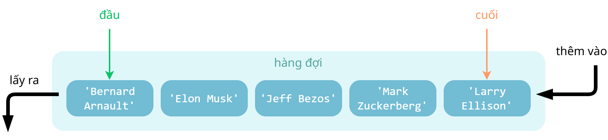

# Tổng quan về hàng đợi

!!! abstract "Tóm lược nội dung"

    Bài này trình bày về cấu trúc dữ liệu hàng đợi (queue).

## Khái niệm

!!! note "Hàng đợi"

    Là cấu trúc dữ liệu hoạt động theo nguyên tắc **vào trước, ra trước** (**FIFO - First In, First Out**).

Nghĩa là, phần tử thêm vô đầu tiên sẽ được lấy ra đầu tiên, phần tử thêm vô sau cùng sẽ được lấy ra sau cùng.

Vi dụ:  
Một số hình ảnh minh họa cho hàng đợi:

- Xếp hàng trước quầy thanh toán trong siêu thị.
- Xếp hàng chờ đến lượt phục vụ trong các cơ quan hành chính hoặc cơ sở dịch vụ.

Hình dưới đây minh họa hàng đợi gồm năm phần tử. Mỗi phần tử là một chuỗi.

{loading=lazy width=75%}  

!!! note "Các thao tác cơ bản"

    Các thao tác cơ bản trên hàng đợi bao gồm:

    - **Thêm** phần tử **vô cuối** hàng đợi.
    - **Lấy** phần tử **ở đầu** ra khỏi hàng đợi.

---

## Cài đặt

Hàng đợi có thể được biểu diễn bằng các cấu trúc dữ liệu khác nhau như mảng, danh sách liên kết hoặc các cấu trúc dữ liệu phức tạp hơn tùy thuộc vào yêu cầu cụ thể.

Trong Python, ta có thể cài đặt hàng đợi bằng nhiều cách, bao gồm:

- Cấu trúc `list`, với các hàm như `append()` và `pop()` (1).
    { .annotate }

    1.  `append()`: thêm phần tử vô cuối danh sách.

        `pop(0)`: xóa phần tử đầu tiên khỏi danh sách.

- Lớp `queue.PriorityQueue`: hàng đợi mà trong đó các phần tử được truy xuất dựa trên độ ưu tiên, phần tử có độ ưu tiên cao hơn sẽ được ra trước.
- Lớp `queue.Queue`: hàng đợi hoạt động theo nguyên tắc FIFO.

Bài học này dùng lớp `Queue` của module `queue` để cài đặt hàng đợi.

---

## Ứng dụng

Một số ứng dụng của hàng đợi là:

- Xử lý hàng đợi công việc: phổ biến trong hệ thống đa nhiệm, lập lịch công việc như in ấn, xử lý tác vụ nền, v.v..
- Quản lý tài nguyên: bộ nhớ đệm (buffer), lập lịch cho CPU, quản lý kết nối mạng, v.v..
- Xử lý sự kiện trong các hệ thống phần mềm.

---

## Some English words

| Vietnamese | Tiếng Anh |
| --- | --- |
| hàng đợi | queue |
| phần tử đầu | front element |
| phần tử cuối | rear element |
| vào trước, ra trước | FIFO - First In, First Out |