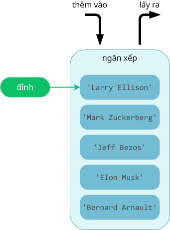

# Khái quát về ngăn xếp

!!! abstract "Tóm lược nội dung"

    Bài này trình bày về cấu trúc dữ liệu ngăn xếp (stack).

## Khái niệm

!!! note "Ngăn xếp"

    Là cấu trúc dữ liệu hoạt động theo nguyên tắc **vào sau, ra trước**" (**LIFO - Last In, First Out**).

Nghĩa là, trong ngăn xếp, phần tử thêm vào sau cùng sẽ được lấy ra trước tiên. 

Vi dụ:  
Một số hình ảnh minh hoạ cho ngăn xếp:

- Chồng dĩa: ta phải lấy những dĩa ở trên ra trước thì mới lấy được một dĩa nào đó ở dưới.
- Lọ thuốc: viên nằm ở nắp lọ sẽ được lấy ra đầu tiên.
- Băng đạn của súng tiểu liên: viên đạn nạp vào sau cùng sẽ được bắn ra đầu tiên, còn viên đạn nạp vào đầu tiên sẽ được bắn ra sau cùng.

Hình dưới đây minh hoạ ngăn xếp gồm năm phần tử. Mỗi phần tử là một chuỗi.

{loading=lazy }  

*Minh hoạ ngăn xếp*

Các thao tác cơ bản trên ngăn xếp bao gồm:

- Thêm phần tử vào đỉnh của ngăn xếp.
- Lấy phần tử đỉnh ra khỏi ngăn xếp.

---

## Triển khai ngăn xếp

Ngăn xếp có thể được biểu diễn bằng các cấu trúc dữ liệu khác nhau như mảng, danh sách liên kết hoặc các cấu trúc dữ liệu phức tạp hơn tùy thuộc vào yêu cầu cụ thể.

Trong Python, ta có thể triển khai ngăn xếp bằng nhiều cách, bao gồm:

- Cấu trúc `list`, với các hàm như `append()` và `pop()` (1).
    { .annotate }

    1.  `append()`: thêm phần tử vào cuối danh sách.
        `pop()`: xoá phần tử khỏi danh sách nếu không chỉ định tham số.

- Lớp `collections.deque`, còn gọi là hàng đợi hai đầu.
- Lớp `queue.LifoQueue`

Bài học này dùng lớp `LifoQueue` (1) của module `queue` để triển khai ngăn xếp.
{ .annotate }

1.  Python đặt tên là `LifoQueue` thay vì `stack` là để bảo đảm sự nhất quán trong việc đặt tên.

    Python xem mọi thứ trong module `queue` đều là biến thể của hàng đợi, chỉ khác nhau về thứ tự truy xuất: `Queue` (FIFO), lớp `LifoQueue` (LIFO), `PriorityQueue`.

---

## Chương trình minh hoạ

Chương trình sau đây minh hoạ một số thao tác cơ bản trên ngăn xếp.

### Nạp module

Dòng lệnh 1 nạp lớp `LifoQueue` của module `queue`.    

```py linenums="1"
from queue import LifoQueue
```

### Khởi tạo

Dòng lệnh 5 khởi tạo ngăn xếp `s`.

```py linenums="1" hl_lines="3-5"
from queue import LifoQueue

if __name__ == '__main__':
    # Khởi tạo ngăn xếp
    s = LifoQueue()
```

### Thêm phần tử

Để thêm phần tử vào ngăn xếp, ta dùng phương thức `put()`.

Các dòng lệnh từ 8 đến 12 lần lượt nạp từng phần tử, là chuỗi, vào ngăn xếp.

Sau khi thực hiện xong, phần tử đỉnh là chuỗi `'Larry Ellison'`.

```py linenums="1" hl_lines="7-12"
from queue import LifoQueue

if __name__ == '__main__':
    # Khởi tạo ngăn xếp
    s = LifoQueue()

    # Thêm phần tử vào ngăn xếp
    s.put('Bernard Arnault')
    s.put('Elon Musk')
    s.put('Jeff Bezos')
    s.put('Mark Zuckerberg')
    s.put('Larry Ellison')
```

### In ngăn xếp

Module `queue` không có hàm in tất cả phần tử của ngăn xếp. Thay vào đó, ta có thể chuyển đổi ngăn xếp thành cấu trúc `list` trước khi in.

Dòng lệnh 16 chuyển đổi ngăn xếp `s` thành `list`, rồi gọi hàm `print()` để in ra danh sách. Việc chuyển đổi này được thực hiện trên bản sao của ngăn xếp, nên không làm ảnh hưởng đến ngăn xếp.

```py linenums="1" hl_lines="14-16"
from queue import LifoQueue

if __name__ == '__main__':
    # Khởi tạo ngăn xếp
    s = LifoQueue()

    # Thêm phần tử vào ngăn xếp
    s.put('Bernard Arnault')
    s.put('Elon Musk')
    s.put('Jeff Bezos')
    s.put('Mark Zuckerberg')
    s.put('Larry Ellison')

    # In ngăn xếp bằng cách chuyển đổi sang list
    print('Ngăn xếp theo thứ tự của list:', end=' ')
    print(*list(s.queue)) # (1)!
```
{ .annotate }

1.  Toán tử `*` dùng để *"mở gói"* hoặc *"giải nén"* danh sách.

Chạy chương trình trên, kết quả như sau:

```pycon
Ngăn xếp theo thứ tự của list: Bernard Arnault Elon Musk Jeff Bezos Mark Zuckerberg Larry Ellison
```

!!! warning "Lưu ý"

    Việc chuyển đổi sang `list` chỉ là đặc trưng của Python, chứ không phổ quát cho mọi ngôn ngữ.

    Cách truy xuất phổ quát phải là dùng vòng lặp để lấy ra từng phần tử nằm ở đỉnh của ngăn xếp theo nguyên tắc LIFO.

### Truy xuất phần tử

Như đã đề cập ở phần Lưu ý, các dòng lệnh từ 21 đến 23 truy xuất từng phần tử trong ngăn xếp bằng vòng lặp while. Trong đó:

- Phương thức `empty()` trả về `True` nếu ngăn xếp rỗng, không còn phần tử nào.
- Phương thức `get()` có tác dụng vừa lấy giá trị của phần tử đỉnh, vừa xoá phần tử này khỏi ngăn xếp.

```py linenums="1" hl_lines="18-23"
from queue import LifoQueue

if __name__ == '__main__':
    # Khởi tạo ngăn xếp
    s = LifoQueue()

    # Thêm phần tử vào ngăn xếp
    s.put('Bernard Arnault')
    s.put('Elon Musk')
    s.put('Jeff Bezos')
    s.put('Mark Zuckerberg')
    s.put('Larry Ellison')

    # In ngăn xếp bằng cách chuyển đổi sang list
    print('Ngăn xếp theo thứ tự của list:', end=' ')
    print(*list(s.queue))

    # In ngăn xếp theo LIFO bằng vòng lặp
    print('Ngăn xếp được truy xuất theo LIFO:', end=' ')

    while not s.empty():
        item = s.get()
        print(item, end=' ')
```

Chạy chương trình trên, kết quả như sau:

```pycon hl_lines="2"
Ngăn xếp theo thứ tự của list: Bernard Arnault Elon Musk Jeff Bezos Mark Zuckerberg Larry Ellison
Ngăn xếp được truy xuất theo LIFO: Larry Ellison Mark Zuckerberg Jeff Bezos Elon Musk Bernard Arnault 
```

!!! warning "Lưu ý"

    Sau khi thực hiện xong vòng lặp while, ngăn xếp không còn phần tử nào nữa.

---

## Ứng dụng

Một số ứng dụng của ngăn xếp là:

- Call stack:
    - Call stack quản lý việc gọi và trả về hàm thông qua các khung ngăn xếp (stack frame). Với mỗi lần gọi hàm, một khung chứa biến cục bộ, tham số, địa chỉ trả về được đẩy vào ngăn xếp; khi hàm kết thúc, khung này được lấy ra, giải phóng bộ nhớ.
    - Hỗ trợ đệ quy: ngăn xếp lưu trữ trạng thái của mỗi lần gọi hàm, bảo đảm có thể quay lại đúng trạng thái trước đó sau mỗi lần hàm đệ quy trả về.
- Trợ giúp tính năng khôi phục undo hoặc redo (Ctrl+Z hoặc Ctrl+Y trong chương trình soạn thảo văn bản) bằng cách lưu các thao tác vào ngăn xếp.
- Thuật toán duyệt đồ thị theo chiều sâu có thể được triển khai bằng đệ quy hoặc ngăn xếp tường minh.
- Kỹ thuật back tracking cũng có thể được triển khai bằng đệ quy hoặc ngăn xếp tường minh.
- Trợ giúp xử lý các bài toán có cấu trúc lồng nhau như: so khớp cặp ngoặc trong biểu thức toán học, kiểm tra tính hợp lệ của các thẻ HTML.

---

## Mã nguồn

Code đầy đủ được đặt tại:

- [Google Colab](https://colab.research.google.com/drive/1tteH1AwNIc3w2YX2xn71Sj875gXGF2SG?usp=sharing){target="_blank"}

---

## Some English words

| Vietnamese | Tiếng Anh |
| --- | --- |
| ngăn xếp | stack |
| phần tử đỉnh | top, peak (element) |
| vào sau, ra trước | LIFO - Last In, First Out |