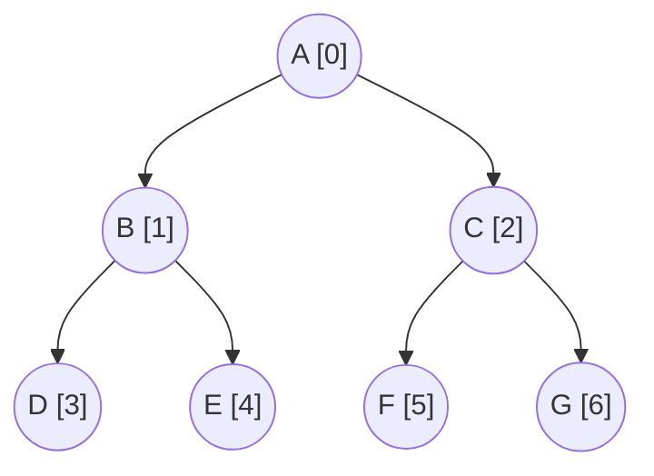

# Duyệt cây nhị phân

!!! abstract "Tóm lược nội dung"

    Bài này trình bày cách biểu diễn cây nhị ph6an bằng mảng một chiều.

## Khái quát

!!! note "Duyệt cây"

    Là quá trình truy xuất và xử lý giá trị của mỗi nút trong cây đúng một lần duy nhất theo một thứ tự xác định.

Đối với cây nhị phân, ta thường sử dụng kỹ thuật đệ quy để thực hiện các phép duyệt này dựa trên quan hệ cha-con.

---

## Các cách thức duyệt

Cho cây nhị phân như sau:



Lấy nút gốc làm mốc, ta có ba cách thức duyệt cơ bản: trước, giữa và sau.

!!! note "Duyệt trước"

    Còn gọi là **duyệt tiền thứ tự**.

    Trình tự duyệt: **Gốc → Cây con trái → Cây con phải**.

Ví dụ:  
Duyệt trước: A → B → D → E → C → F → G 

Ứng dụng:

- Tạo một bản sao của cây
- Biểu diễn cấu trúc phân cấp (như mục lục sách).

!!! note "Duyệt giữa"

    Còn gọi là **duyệt trung thứ tự**.

    Trình tự duyệt: **Cây con trái → Gốc → Cây con phải**.

Ví dụ:  
Duyệt giữa: D → B → E → A → F → C → G 

Ứng dụng:

Đối với cây nhị phân tìm kiếm, phép duyệt này sẽ trả về các giá trị theo thứ tự tăng dần.

!!! note "Duyệt sau"

    Còn gọi là **duyệt Hậu thứ tự**.

    Trình tự duyệt: **Cây con trái → Cây con phải → Gốc**.

Ví dụ:  
Duyệt sau: D → E → B → F → G → C → A 

Ứng dụng:

- Xoá cây: xoá các nút con trước khi xoá nút cha.
- Tính toán các biểu thức toán học.

---

## Chương trình minh hoạ

Chương trình sau đây minh hoạ các cách duyệt cây nhị phân nêu trên.

Trong chương trình, ta sử dụng lại lớp `BinaryTree` và các phương thức của nó ở [bài trước](./tree-implementing-binary-tree-with-1d-array.md){target="_blank"}.

### Định nghĩa các phương thức

1\. Viết hàm `traverse_pre_order()` (1) dùng để duyệt trước (duyệt tiền thứ tự).
{ .annotate }

1.  Khi hàm được định nghĩa bên trong một lớp thì nó được gọi là **phương thức**.

Hàm gồm có hai tham số:

- `self`
- `index`: biểu thị chỉ số của nút đang xét, đóng vai trò là nút gốc của cây con trong mỗi bước đệ quy.

Hàm không có giá trị trả về vì mục đích chỉ là in ra giá trị của các nút.

```py linenums="1" hl_lines="41-51"
# Định nghĩa lớp BinaryTree
class BinaryTree:
    def __init__ (self, data_array):
        self.tree = data_array
        self.size = len(data_array)

    # Hàm dùng để lấy chỉ số của node con bên trái
    def get_left_child(self, index):
        left_index = 2 * index + 1

        if left_index < self.size:
            return left_index

        return None

    # Hàm dùng để lấy chỉ số của node con bên phải
    def get_right_child(self, index):
        right_index = 2 * index + 2

        if right_index < self.size:
            return right_index

        return None

    # Hàm dùng để lấy chỉ số của node cha
    def get_parent(self, index):
        # Nếu chỉ số trong mảng bằng 0 thì không có nút cha
        if index == 0:
            return None

        parent_index = (index - 1) // 2
        return parent_index

    # Hàm dùng để lấy giá trị của node
    def get_node_value(self, index):
        if index is not None and 0 <= index < self.size:
            return self.tree[index]

        return None

    # Hàm dùng để duyệt trước
    def traverse_pre_order(self, index):
        if index is not None and index < self.size and self.tree[index] is not None:
            # Duyệt nút gốc
            print(self.tree[index], end=' -> ')

            # Duyệt cây con trái
            self.traverse_pre_order(self.get_left_child(index))

            # Duyệt cây con phải
            self.traverse_pre_order(self.get_right_child(index))
```

2\. Viết hàm `traverse_in_order()` dùng để duyệt giữa (duyệt trung thứ tự).

Hàm cũng có hai tham số `self` và `index`, không có giá trị trả về.

```py linenums="53"
    # Hàm dùng để duyệt giữa
    def traverse_in_order(self, index):
        if index is not None and index < self.size and self.tree[index] is not None:
            # Duyệt cây con trái
            self.traverse_in_order(self.get_left_child(index))

            # Duyệt nút gốc
            print(self.tree[index], end=' -> ')

            # Duyệt cây con phải
            self.traverse_in_order(self.get_right_child(index))
```

3\. Viết hàm `traverse_post_order()` dùng để duyệt sau (duyệt hậu thứ tự).

Hàm cũng có hai tham số `self` và `index`, không có giá trị trả về.

```py linenums="65"
    # Hàm dùng để duyệt sau
    def traverse_post_order(self, index):
        if index is not None and index < self.size and self.tree[index] is not None:
            # Duyệt cây con trái
            self.traverse_post_order(self.get_left_child(index))

            # Duyệt cây con phải
            self.traverse_post_order(self.get_right_child(index))

            # Duyệt nút gốc
            print(self.tree[index], end=' -> ')
```

### Viết chương trình chính

1\. Khởi tạo mảng `nodes` gồm 7 phần tử, mỗi phần tử chứa một ký tự.

Khởi tạo cây nhị phân `bt` (1) có các nút lấy từ mảng `nodes` (2).
{ .annotate }

1.  `bt` là một thực thể (instance) của lớp `BinaryTree`.

2.  Với dòng lệnh `self.tree = data_array`, hệ thống không tạo ra một bản sao mới của mảng, mà tạo ra một tham chiếu. Do đó, về mặt bản chất, `nodes` và `self.tree` chỉ là hai cái *"nhãn tên"* trỏ về cùng một danh sách trên bộ nhớ RAM.

```py linenums="78"
# Chương trình chính
if __name__ == '__main__':
    # Khởi tạo cây nhị phân bt
    nodes = ['A', 'B', 'C', 'D', 'E', 'F', 'G']
    bt = BinaryTree(nodes)
```

2\. Gọi các phương thức duyệt cây đã viết trên ra thực hiện. Truyền vào tham số là `0`, tức nút gốc, đồng nghĩa với duyệt toàn bộ cây.

```py linenums="84"
    # In ra các nút theo thứ tự duyệt trước
    print('Duyệt trước:', end=' ')
    bt.traverse_pre_order(0)

    print()

    # In ra các nút theo thứ tự duyệt giữa
    print('Duyệt giữa:', end=' ')
    bt.traverse_in_order(0)

    print()

    # In ra các nút theo thứ tự duyệt sau
    print('Duyệt sau:', end=' ')
    bt.traverse_post_order(0)
```

3\. Chạy chương trình trên, kết quả như sau:

```pycon
Duyệt trước: A -> B -> D -> E -> C -> F -> G -> 
Duyệt giữa: D -> B -> E -> A -> F -> C -> G -> 
Duyệt sau: D -> E -> B -> F -> G -> C -> A -> 
```

---

## Mã nguồn

Code đầy đủ được đặt tại:

- [Google Colab](https://colab.research.google.com/drive/1HX6ZABvxytFzjQOd9xssIqb_07LGAzfc?usp=sharing){target="_blank"}

---

## Some English words

| Vietnamese | Tiếng Anh | 
| --- | --- |
| duyệt giữa (trung thứ tự) | in-order traversal |
| duyệt sau (hậu thứ tự) | post-order traversal |
| duyệt trước (tiền thứ tự) | pre-order traversal |