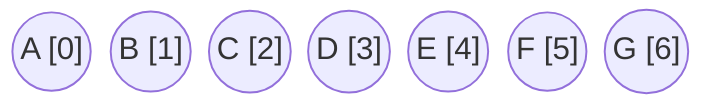
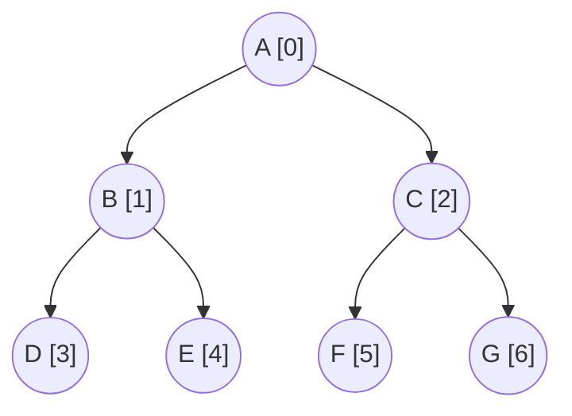

# Biểu diễn cây nhị phân bằng mảng một chiều

!!! abstract "Tóm lược nội dung"

    Bài này trình bày cách biểu diễn cây nhị phân bằng mảng một chiều.

## Khái quát

Có nhiều cách để biểu diễn cây nhị phân:

- Danh sách kề
- Ma trận kề
- Tập hợp lồng nhau
- Chuỗi biểu thức
- Danh sách liên kết
- Mảng một chiều

Bài này chỉ đề cập cách biểu diễn bằng mảng một chiều.

---

## Mô tả cách biểu diễn

!!! note "Nguyên lý lưu trữ"

    Mỗi nút của cây nhị phân được ánh xạ tương ứng với một phần tử trong mảng một chiều, trong đó:
    
    - Nút gốc luôn được lưu trữ tại chỉ số `0`.
    - Các nút tiếp theo được đánh chỉ số liên tục, bắt đầu từ `1`, theo cấp độ từ cao xuống thấp, trong cùng cấp độ thì từ trái sang phải.

Như vậy, đối với một nút nằm tại vị trí $i$ (chỉ số $i$) trong mảng, ta có các công thức xác định mối quan hệ như sau:

- Chỉ số của nút con trái: $2i + 1$
- Chỉ số của nút con phải: $2i + 2$
- Chỉ số của nút cha: $\lfloor (i - 1) / 2 \rfloor$, với $i \gt 0$ (1)
    { .annotate }

    1.  $\lfloor \text{ } \rfloor$ là ký hiệu lấy phần nguyên của phép chia.

Ví dụ:  
Cho mảng một chiều như sau:



Mảng một chiều trên có thể được dùng để biểu diễn cây nhị phân dưới đây:



Cây nhị phân trên có:

- Nút `A` là nút gốc, được lưu trữ tại chỉ số `0` trong mảng.
- Nút `B` được lưu tại chỉ số `1`.
- Nút con trái của nút `B` là nút `D`, có chỉ số là `3` (do $2 \times 1 + 1 = 3$)
- Nút con phải của nút `B` là nút `A`, có chỉ số là `4` (do $2 \times 1 + 2 = 4$)
- Nút cha của nút `B` là nút `A`, có chỉ số là `0` (do $\lfloor (2 - 1) / 2 \rfloor = 0$)

---

## Ưu điểm và hạn chế

Ưu điểm:

- Cho phép truy xuất ngẫu nhiên với độ phức tạp $O(1)$. Ta có thể tìm ra ngay vị trí của nút con hoặc nút cha bằng cách tính chỉ số mà không cần phải duyệt qua các nút trung gian.
- Ta không cần lưu trữ các biến liên kết, tức con trỏ. Điều này giúp giảm dung lượng bộ nhớ.

Hạn chế:

- Nếu cây bị lệch hoặc phân bố không đều, mảng sẽ phải duy trì nhiều vị trí trống nhằm bảo toàn logic của các công thức tính chỉ số. Điều này làm ảnh hưởng đến hiệu suất về mặt không gian lưu trữ.

Do đó, mảng một chiều là cách thức hiệu quả khi áp dụng cho cây nhị phân hoàn toàn và cây nhị phân hoàn mỹ.

??? info "Phân biệt các kiểu cây nhị phân"

    Ba khái niệm sau về cây nhị phân có thể gây nhầm lẫn.

    | | Cây nhị phân đầy đủ | Cây nhị phân hoàn toàn | Cây nhị phân hoàn mỹ |
    | --- | --- | --- | --- |
    | Thuật ngữ tiếng Anh | full binary tree | complete binary tree | perfect binary tree |
    | Định nghĩa | Mỗi nút trong cây có đúng 0 hoặc 2 nút con. Không có nút nào chỉ có một nút con. | - Mọi cấp độ của cây đều được lấp đầy, ngoại trừ cấp độ cuối cùng có thể không.<br>- Ở cấp độ cuối cùng, các nút phải được điền từ trái sang phải một cách liên tục. | - Tất cả các nút trong đều có 2 nút con.<br>- Tất cả các nút lá đều ở cùng một mức. |

---

## Chương trình minh hoạ

Chương trình sau đây minh hoạ cách biểu diễn cây nhị phân bằng mảng một chiều.

### Định nghĩa lớp cây nhị phân

Định nghĩa lớp `BinaryTree` gồm hai thuộc tính:

- Thuộc tính `tree`: là một `list` của Python, đóng vai trò là mảng một chiều lưu trữ các nút của cây nhị phân.
- Thuộc tính `size`: lưu kích thước thực tế của mảng, tức số lượng nút của cây nhị phân.

```py linenums="1"
# Định nghĩa lớp BinaryTree
class BinaryTree:
    def __init__ (self, data_array):
        self.tree = data_array
        self.size = len(data_array)
```

### Định nghĩa các phương thức của lớp

1\. Viết hàm `get_left_child()` (1) dùng để lấy chỉ số của nút con trái.
{ .annotate }

1.  Khi hàm được định nghĩa bên trong một lớp thì nó được gọi là **phương thức**.

Hàm gồm có:

- Tham số `self`: là tham số bắt buộc của bất kỳ phương thức nào trong Python, dùng để tham chiếu đến chính đối tượng đang vận hành, cho phép truy xuất các thuộc tính của lớp.
- Tham số `index`: biểu thị chỉ số của nút cha đang xét, tức vị trí hiện tại trong mảng.
- Giá trị trả về là chỉ số của nút con bên trái.

*Lưu ý:*  
*Khi đề cập đến "chỉ số" là đang nói đến chỉ số hoặc vị trí (của một nút) trong mảng một chiều. Còn cây nhị phân thì không có khái niệm "chỉ số".*

```py linenums="1" hl_lines="7-14"
# Định nghĩa lớp BinaryTree
class BinaryTree:
    def __init__ (self, data_array):
        self.tree = data_array
        self.size = len(data_array)

    # Hàm dùng để lấy chỉ số của node con bên trái
    def get_left_child(self, index):
        left_index = 2 * index + 1

        if left_index < self.size:
            return left_index

        return None
```

2\. Viết hàm `get_right_child()` dùng để lấy chỉ số của nút con phải.

Hàm gồm có:

- Tham số `self`
- Tham số `index`: biểu thị chỉ số của nút cha đang xét.
- Giá trị trả về là chỉ số của nút con bên phải.

```py linenums="1" hl_lines="16-23"
# Định nghĩa lớp BinaryTree
class BinaryTree:
    def __init__ (self, data_array):
        self.tree = data_array
        self.size = len(data_array)

    # Hàm dùng để lấy chỉ số của node con bên trái
    def get_left_child(self, index):
        left_index = 2 * index + 1

        if left_index < self.size:
            return left_index

        return None

    # Hàm dùng để lấy chỉ số của node con bên phải
    def get_right_child(self, index):
        right_index = 2 * index + 2

        if right_index < self.size:
            return right_index

        return None
```

3\. Viết hàm `get_parent()` dùng để lấy chỉ số của nút cha.

Hàm gồm có:

- Tham số `self`
- Tham số `index`: biểu thị chỉ số của nút con đang xét.
- Giá trị trả về là chỉ số của nút cha.

```py linenums="1" hl_lines="25-32"
# Định nghĩa lớp BinaryTree
class BinaryTree:
    def __init__ (self, data_array):
        self.tree = data_array
        self.size = len(data_array)

    # Hàm dùng để lấy chỉ số của node con bên trái
    def get_left_child(self, index):
        left_index = 2 * index + 1

        if left_index < self.size:
            return left_index

        return None

    # Hàm dùng để lấy chỉ số của node con bên phải
    def get_right_child(self, index):
        right_index = 2 * index + 2

        if right_index < self.size:
            return right_index

        return None

    # Hàm dùng để lấy chỉ số của node cha
    def get_parent(self, index):
        # Nếu chỉ số trong mảng bằng 0 thì không có nút cha
        if index == 0:
            return None

        parent_index = (index - 1) // 2
        return parent_index
```

4\. Viết hàm `get_node_value()` dùng để lấy dữ liệu của nút (tức giá trị của phần tử) dựa trên chỉ số của nút trong mảng.

```py linenums="1" hl_lines="34-39"
# Định nghĩa lớp BinaryTree
class BinaryTree:
    def __init__ (self, data_array):
        self.tree = data_array
        self.size = len(data_array)

    # Hàm dùng để lấy chỉ số của node con bên trái
    def get_left_child(self, index):
        left_index = 2 * index + 1

        if left_index < self.size:
            return left_index

        return None

    # Hàm dùng để lấy chỉ số của node con bên phải
    def get_right_child(self, index):
        right_index = 2 * index + 2

        if right_index < self.size:
            return right_index

        return None

    # Hàm dùng để lấy chỉ số của node cha
    def get_parent(self, index):
        # Nếu chỉ số trong mảng bằng 0 thì không có nút cha
        if index == 0:
            return None

        parent_index = (index - 1) // 2
        return parent_index

    # Hàm dùng để lấy giá trị của node
    def get_node_value(self, index):
        if index is not None and 0 <= index < self.size:
            return self.tree[index]

        return None
```

### Viết chương trình chính

1\. Khởi tạo mảng `nodes` gồm 7 phần tử, mỗi phần tử chứa một ký tự.

Khởi tạo cây nhị phân `bt` (1) có các nút lấy từ mảng `nodes` (2).
{ .annotate }

1.  `bt` là một thực thể (instance) của lớp `BinaryTree`.

2.  Với dòng lệnh `self.tree = data_array`, hệ thống không tạo ra một bản sao mới của mảng, mà tạo ra một tham chiếu. Do đó, về mặt bản chất, `nodes` và `self.tree` chỉ là hai cái *"nhãn tên"* trỏ về cùng một danh sách trên bộ nhớ RAM.

```py linenums="42"
# Chương trình chính
if __name__ == '__main__':
    # Khởi tạo cây nhị phân bt
    nodes = ['A', 'B', 'C', 'D', 'E', 'F', 'G']
    bt = BinaryTree(nodes)
```

2\. Cho người dùng nhập chỉ số của nút cần xét, lưu vào biến `i`.

```py linenums="42" hl_lines="7 8"
# Chương trình chính
if __name__ == '__main__':
    # Khởi tạo cây nhị phân bt
    nodes = ['A', 'B', 'C', 'D', 'E', 'F', 'G']
    bt = BinaryTree(nodes)

    # Nhập chỉ số của nút cần kiểm tra
    i = int(input('Nhập chỉ số của một nút: '))
```

3\. Đối với nút con trái:

- Gọi phương thức `get_left_child()` ra để lấy chỉ số của nút con trái, lưu vào biến `li`.
- Gọi phương thức `get_node_value()` ra để lấy giá trị của nút con trái, lưu vào biến `lv`.
- In ra chỉ số và giá trị của nút con trái.

```py linenums="42" hl_lines="10-13"
# Chương trình chính
if __name__ == '__main__':
    # Khởi tạo cây nhị phân bt
    nodes = ['A', 'B', 'C', 'D', 'E', 'F', 'G']
    bt = BinaryTree(nodes)

    # Nhập chỉ số của nút cần kiểm tra
    i = int(input('Nhập chỉ số của một nút: '))

    # In ra nút con trái
    li = bt.get_left_child(i)
    lv = bt.get_node_value(li)
    print(f'Nút con trái của nút {nodes[i]} là {lv}')
```

4\. Thực hiện tương tự đối nút con phải và nút cha.

```py linenums="56"
    # In ra nút con phải
    ri = bt.get_right_child(i)
    rv = bt.get_node_value(ri)
    print(f'Nút con phải của nút {nodes[i]} là {rv}')

    # In ra nút cha
    pi = bt.get_parent(i)
    pv = bt.get_node_value(pi)
    print(f'Nút cha của nút {nodes[i]} là {pv}')
```

5\. Chạy chương trình trên, nhập vào 1, tức nút B, kết quả như sau:

```pycon
Nhập chỉ số của một nút: 1
Nút con trái của nút B là D
Nút con phải của nút B là E
Nút cha của nút B là A
```

---

## Mã nguồn

Code đầy đủ được đặt tại:

- [Google Colab](https://colab.research.google.com/drive/13OhsDgUBo77EcDtc-14_ls_Hg70TTC12?usp=sharing){target="_blank"}
