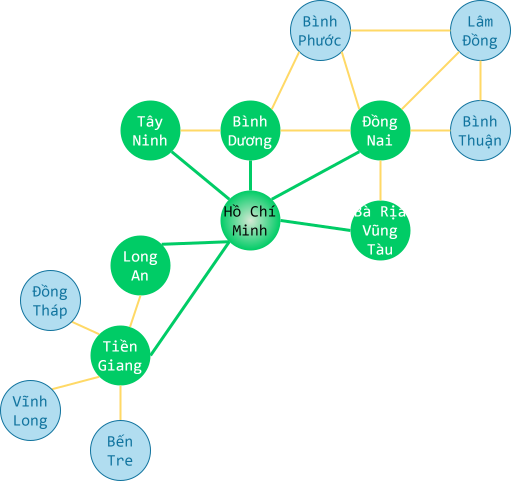

# Duyệt đồ thị theo chiều rộng

!!! abstract "Tóm lược nội dung"

    Bài này trình bày thuật toán duyệt đồ thị theo chiều rộng (BFS) và cách cài đặt bằng ngôn ngữ Python.

## Khái quát

**Duyệt đồ thị theo chiều rộng**, gọi tắt là **BFS**, là thuật toán duyệt đồ thị:

- Bắt đầu từ một đỉnh bất kỳ, tạm gọi là đỉnh `start`.
- Lan sang các đỉnh `u` kề với đỉnh `start`
- Tiếp theo, duyệt các đỉnh `v` kề với các đỉnh `u` vừa duyệt.
- Tiếp tục như vậy cho đến khi duyệt hết tất cả đỉnh của đồ thị hoặc đến được đỉnh cần tìm.

Nói cách khác, BFS ưu tiên duyệt các đỉnh ở gần đỉnh `start` trước, sau đó mới đến các đỉnh ở xa hơn.

## Đặc điểm

Thuật toán BFS khá dễ hiểu và cài đặt.

BFS được áp dụng phổ biến cho các bài toán như:

- Tìm đường đi ngắn nhất trong đồ thị không trọng số.
- Tìm kiếm đường đi trong mê cung.
- Tìm kiếm bạn bè trên mạng xã hội.
- Phân tích mạng lưới giao thông.

## Các bước thực hiện

Để thực hiện thuật toán BFS, ta dùng một hàng đợi để lưu trữ các đỉnh cần duyệt.

Các bước thực hiện như sau:

Bước 1: Đưa đỉnh `start` vào hàng đợi.

Bước 2: Lặp lại các thác tác sau cho đến khi hàng đợi không còn phần tử:

- Lấy đỉnh đầu tiên ra khỏi hàng đợi, đặt là đỉnh `current`.
- Duyệt các đỉnh `v` kề với đỉnh `current` vừa lấy ra:

    Nếu `v` chưa được ghé thăm thì:
    - Đánh dấu đỉnh `v` đã ghé thăm.
    - Đưa đỉnh `v` vào hàng đợi.
    - Thực hiện các công việc cần thiết với đỉnh `v`.

Ví dụ:

{loading=lazy}

Gọi Thành phố Hồ Chí Minh là đỉnh `start`.

Theo BFS, sau khi duyệt đỉnh `start`, ta sẽ duyệt đến các đỉnh kề với đỉnh `start`, gồm: `'Long An'`, `'Tiền Giang'`, `'Tây Ninh'`, `'Bình Dương'`, `'Đồng Nai'` và `'Bà Rịa - Vũng Tàu'`.

Ứng với đỉnh `'Đồng Nai'`, ta sẽ duyệt các đỉnh kề với `Đồng Nai`, gồm: `'Bình Dương'`, `'Bình Phước'`, `'Lâm Đồng'`, `'Bình Thuận'`, `'Bà Rịa - Vũng Tàu'` và `'Hồ Chí Minh'`.

Ngoài ra, để tránh lặp lại, ta cần đánh dấu các đỉnh đã ghé thăm, chẳng hạn như `'Bà Rịa - Vũng Tàu'` và `'Hồ Chí Minh'`.

## Bài toán minh hoạ

### Yêu cầu

Tìm khoảng cách ngắn nhất giữa hai đỉnh trong đồ thị bằng cách áp dụng BFS. Giả sử độ dài tất cả cạnh đều bằng 1.

### Input

```pycon
0 1 2 3 4 5
0 1
0 2
1 2
1 3
1 4
2 4
3 4
3 5
4 5
0
5
```

### Output

```pycon
3
```

### Giải thích

**Input:** 

- Dòng đầu tiên gồm các đỉnh của đồ thị.
- Các dòng tiếp theo mô tả các cạnh của đồ thị.
- Hai dòng cuối cùng là hai đỉnh cần tìm khoảng cách ngắn nhất.

Đồ thị có thể được phác hoạ như sau:

{ loading=lazy width=360 }

**Output:**

Khoảng cách ngắn nhất giữa hai đỉnh trong đồ thị.

Cụ thể, theo input trên, khoảng cách từ đỉnh `0` đến đỉnh `5` là `3`.

Cần lưu ý, bài toán này chỉ tính khoảng cách, chứ không tìm đường đi cụ thể.

## Cách giải đề xuất

### Khai báo module

Do cần sử dụng hàng đợi, ta khai báo module `queue`.

```py linenums="1"
import queue
```

### Khai báo biến chứa input

Khai báo biến `data` chứa dữ liệu đầu vào như bài trước.

```py linenums="3"
data = '''
0 1 2 3 4 5
0 1
0 2
1 2
1 3
1 4
2 4
3 4
3 5
4 5
0
5
'''
```

### Khởi tạo danh sách kề

Viết hàm `init_adjacency_list()` để khởi tạo danh sách kề từ input như bài trước.

```py linenums="19"
# Hàm khởi tạo danh sách kề
def init_adjacency_list(input_data):
    # Chuyển đổi input thành danh sách các dòng riêng lẻ
    lines = input_data.strip().split('\n')

    # Tách rời các số của dòng đầu tiên, lưu vào biến V là danh sách các đỉnh
    V = list(map(int, lines[0].split()))

    # Khởi tạo danh sách kề L rỗng (dùng kiểu dictionary)
    L = {v: [] for v in V}

    # Duyệt các dòng tiếp theo và nạp phần tử vào các danh sách đỉnh kề
    for line in lines[1:len(lines) - 2]:
        u, v = map(int, line.split())
        L[u].append(v)
        L[v].append(u)

    return L
```

### Khởi tạo cho hàm BFS

Hàm `bfs()` dùng để tính khoảng cách từ đỉnh `start` đến đỉnh `finish` bằng BFS, gồm ba tham số:

- `adj_list`: danh sách kề của đồ thị.
- `start`: đỉnh bắt đầu.
- `finish`: đỉnh kết thúc.

Hàm này trả về một số nguyên khoảng cách ngắn nhất giữa hai đỉnh.

Trước khi thực hiện duyệt BFS, ta cần khởi tạo các biến sau:

- `q`: hàng đợi dùng để lưu các đỉnh trong khi duyệt BFS.
- `visited`: danh sách lưu các số nguyên dùng để đánh dấu các đỉnh đã ghé thăm.
- `distance`: dùng để lưu khoảng cách từ đỉnh `start` đến các đỉnh khác.
    
    Biến `distance` có thể là kiểu `list` hoặc `dictionary`. Trong bài này, ta sử dụng kiểu `dictionary` để tiện cho việc lưu trữ và truy xuất. Trong đó:

    - Key: là đỉnh của đồ thị.
    - Value: là khoảng cách từ đỉnh `start` đến đỉnh tương ứng.

    `distance[u] = d` nghĩa là khoảng cách từ đỉnh `start` đến đỉnh `u` là `d`.

    Ví dụ:
    
    `distance[0] = 0` nghĩa là khoảng cách từ đỉnh `start` đến đỉnh `0` là `0`.

    `distance[1] = 1` nghĩa là khoảng cách từ đỉnh `start` đến đỉnh `1` là `1`.
    
    `distance[3] = 2` nghĩa là khoảng cách từ đỉnh `start` đến đỉnh `3` là `2`.

```py linenums="39"
# Hàm tính khoảng cách từ đỉnh start đến đỉnh finish bằng BFS
def bfs(adj_list, start, finish):
    # Khởi tạo hàng đợi q để áp dụng thuật toán BFS
    q = queue.Queue()

    # Khởi tạo danh sách visited để lưu các đỉnh đã ghé thăm
    visited = []

    # Khởi tạo dictionary distance để lưu khoảng cách từ start đến các đỉnh khác
    distance = {start: 0}
```

### Thực hiện BFS

**Bước 1:** Đưa đỉnh `start` vào hàng đợi.

```py linenums="50"
    # Thêm đỉnh start vào hàng đợi
    q.put(start)

    # Đánh dấu đỉnh u đã ghé thăm
    visited.append(start)
```

**Bước 2:**

Duyệt hàng đợi cho đến khi hàng đợi không còn phần tử nào nữa:

- Lấy đỉnh ở đầu ra khỏi hàng đợi, đặt là đỉnh `current`.
- Nếu `current` là đỉnh `finish` thì đã đến đích, trả về khoảng cách.
- Ngược lại, nếu không phải `finish`, thì duyệt từng đỉnh `v` kề với `current`:

    - Nếu `v` chưa được ghé thăm thì:
        - Thêm `v` vào hàng đợi.
        - Đánh dấu `v` đã ghé thăm.
        - Cập nhật khoảng cách từ `start` đến `v`.

```py linenums="56"
    # Trong khi hàng đợi vẫn còn phần tử
    while not q.empty():
        # Lấy ra đỉnh ở đầu hàng đợi, đặt là đỉnh current
        current = q.get()

        # Nếu đỉnh u là đỉnh finish thì trả về khoảng cách
        if current == finish:
            return distance[current]

        # Duyệt các đỉnh kề của đỉnh current
        for v in adj_list[current]:
            # Nếu đỉnh v chưa ghé thăm
            if v not in visited:
                # thêm đỉnh v vào hàng đợi
                q.put(v)

                # Đánh dấu đỉnh v đã ghé thăm
                visited.append(v)

                # Cập nhật khoảng cách từ start đến v
                distance[v] = distance[current] + 1

```py linenums="56"
    # Trong khi hàng đợi vẫn còn phần tử
    while not q.empty():
        # Lấy ra đỉnh ở đầu hàng đợi, đặt là đỉnh current
        current = q.get()

        # Nếu đỉnh u là đỉnh finish thì trả về khoảng cách
        if current == finish:
            return distance[current]

        # Duyệt các đỉnh kề của đỉnh current
        for v in adj_list[current]:
            # Nếu đỉnh v chưa ghé thăm
            if v not in visited:
                # thì thêm đỉnh v vào hàng đợi
                q.put(v)

                # Đánh dấu đỉnh v đã ghé thăm
                visited.append(v)

                # Cập nhật khoảng cách từ start đến v
                distance[v] = distance[current] + 1
    
    # Nếu không tìm thấy đường đi từ start đến finish thì trả về -1
    return -1
```

### In kết quả

Trong chương trình chính, ta gọi các hàm vừa viết và in kết quả ra màn hình.

```py linenums="82"
# Chương trình chính
if __name__ == '__main__':
    # Đọc dữ liệu input và đưa vào biến al
    al = init_adjacency_list(data)

    # Lấy đỉnh bắt đầu và đỉnh kết thúc
    lines = data.strip().split('\n')
    s = int(lines[-2])
    f = int(lines[-1])

    # Gọi hàm tính bfs() để khoảng cách từ đỉnh s đến đỉnh f
    d = bfs(al, s, f)

    # In kết quả
    print(f'Khoảng cách từ đỉnh {s} đến đỉnh {f} là {d}')
```

## Mã nguồn

Code đầy đủ được đặt tại:

1. [GitHub](https://github.com/vtchitruong/gdpt-2018/blob/main/special-topics/graph/bfs.py){:target="_blank"}

2. [Google Colab](https://colab.research.google.com/drive/1nwZ16XzLuUzUZm8aiG4TDhel_XsW1Jbk?usp=sharing){:target="_blank"}
