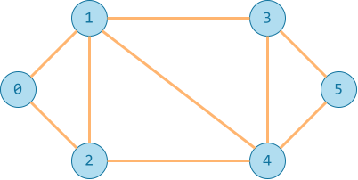

# Duyệt theo chiều sâu

!!! abstract "Tóm lược nội dung"

    Bài này trình bày thuật toán duyệt đồ thị theo chiều sâu (DFS) và cách cài đặt bằng ngôn ngữ Python.

## Khái quát

**Duyệt đồ thị theo chiều sâu**, gọi tắt là **DFS**, là thuật toán duyệt đồ thị:

Hoạt động theo nguyên tắc đi sâu nhất có thể theo mỗi nhánh trước khi quay lui.

- Bắt đầu từ một đỉnh bất kỳ, tạm gọi là đỉnh `start`.
- Sau đó ghé thăm một trong các đỉnh kề của `start`, tạm gọi là đỉnh `u`.
- Tiếp tục ghé thăm một trong các đỉnh kề của `u`, tạm gọi là đỉnh `v`.
- Lặp lại quá trình trên cho đến khi không còn đỉnh kề nào chưa ghé thăm.
- Quay lui để ghé thăm các đỉnh kề khác.

Nói cách khác, DFS ưu tiên duyệt các đỉnh ở xa nhất trước, sau đó mới đến các đỉnh ở gần hơn.

## Ứng dụng

DFS được áp dụng phổ biến cho các bài toán như:

- Tìm kiếm đường đi trong mê cung.
- Kiểm tra tính liên thông của đồ thị.
- Tìm kiếm bạn bè trên mạng xã hội.
- Tô màu đồ thị.

## Các bước thực hiện

Để thực hiện thuật toán DFS, ta có thể sử dụng kỹ thuật đệ quy hoặc cấu trúc ngăn xếp.

Bài học này chỉ đề cập cách sử dụng ngăn xếp.

Các bước thực hiện như sau:

Buớc 1: Đưa đỉnh `start` vào ngăn xếp.

Bước 2: Lặp lại các thác tác sau cho đến khi ngăn xếp không còn phần tử:

- Lấy đỉnh trên cùng ra khỏi ngăn xếp, đặt là đỉnh `current`.
- Duyệt các đỉnh `v` kề với đỉnh `current` vừa lấy ra:

    Nếu `v` chưa được ghé thăm thì:
    - Đánh dấu đỉnh `v` đã ghé thăm.
    - Đưa đỉnh `v` vào ngăn xếp.
    - Thực hiện các công việc cần thiết với đỉnh `v`.

Ví dụ:

{loading=lazy}

Gọi Thành phố Hồ Chí Minh là đỉnh `start`.

Theo DFS, sau khi duyệt đỉnh `start`, ta sẽ duyệt đỉnh đầu tiên kề với đỉnh `start`, giả sử là `'Đồng Nai'`.

Ứng với đỉnh `'Đồng Nai'`, ta sẽ duyệt đỉnh đầu tiên kề với `Đồng Nai`, giả sử là `'Bình Phước'`.

Ứng với đỉnh `'Bình Phước'`, ta sẽ duyệt đỉnh đầu tiên kề với `Bình Phước`, giả sử là `'Lâm Đồng'`.

Cứ như thế cho đến khi đến được đỉnh cuối cùng hoặc không còn đỉnh kề nào chưa ghé thăm.

Ngoài ra, để tránh lặp lại, ta cần đánh dấu các đỉnh đã ghé thăm.

## Bài toán minh hoạ

### Yêu cầu

Tìm đường đi giữa hai đỉnh trong đồ thị bằng cách áp dụng DFS.

### Input

```pycon
0 1 2 3 4 5
0 1
0 2
1 2
1 3
1 4
2 4
3 4
3 5
4 5
0
5
```

### Output

```pycon
0 -> 2 -> 4 -> 5
```

### Giải thích

Input:

- Dòng đầu tiên gồm các đỉnh của đồ thị.
- Các dòng tiếp theo mô tả các cạnh của đồ thị.
- Hai dòng cuối cùng là hai đỉnh cần tìm đường đi.

Đồ thị có thể được phác hoạ như sau:

{ loading=lazy width=360 }

Output:

Đường đi từ đỉnh `0` đến đỉnh `5` là: 0 -> 2 -> 4 -> 5

## Cách giải đề xuất

### Khai báo biến chứa input

Khai báo biến `data` chứa dữ liệu đầu vào như bài trước.

```py linenums="1"
data = '''
0 1 2 3 4 5
0 1
0 2
1 2
1 3
1 4
2 4
3 4
3 5
4 5
0
5
'''
```

### Khởi tạo danh sách kề

Viết hàm `init_adjacency_list()` để khởi tạo danh sách kề từ input như bài trước.

```py linenums="17"
# Hàm khởi tạo danh sách kề
def init_adjacency_list(input_data):
    # Chuyển đổi input thành danh sách các dòng riêng lẻ
    lines = input_data.strip().split('\n')

    # Tách rời các số của dòng đầu tiên, lưu vào biến V là danh sách các đỉnh
    V = list(map(int, lines[0].split()))

    # Khởi tạo danh sách kề L rỗng (dùng kiểu dictionary)
    L = {v: [] for v in V}

    # Duyệt các dòng tiếp theo và nạp phần tử vào các danh sách đỉnh kề
    for line in lines[1:len(lines) - 2]:
        u, v = map(int, line.split())
        L[u].append(v)
        L[v].append(u)

    return L
```

### Khởi tạo cho hàm DFS

Hàm `dfs()` dùng để tìm đường đi giữa hai đỉnh trong đồ thị bằng DFS, gồm ba tham số:

- `adj_list`: danh sách kề của đồ thị.
- `start`: đỉnh bắt đầu.
- `finish`: đỉnh kết thúc.

Hàm này trả về mảng `trace` dùng để truy vết đường đi. Nếu không có đường đi, hàm trả về mảng rỗng hoặc `None`.

Trước khi thực hiện duyệt DFS, ta cần khởi tạo các biến sau:

- `stack`: ngăn xếp dùng để lưu các đỉnh trong khi duyệt DFS.

    Ban đầu, ngăn xếp chứa đỉnh `start`.

- Thay vì dùng biến `visited`, ta dùng biến `trace` để vừa đánh dấu các đỉnh đã ghé thăm, vừa lưu vết nhằm truy ngược đường đi sau này.

    Cụ thể, `trace[v] = u` nghĩa là trước đỉnh `v` là đỉnh `u`.

    Ví dụ:

    `trace[start] = None` nghĩa là đỉnh `start` không có đỉnh nào nằm trước nó.
    
    `trace[5] = 3` nghĩa là trước đỉnh `5` là đỉnh `3`.

    Biến `trace` vừa dùng để đánh dấu các đỉnh đã ghé thăm, vừa dùng để truy vết đường đi.

    Biến `trace` có thể là kiểu `list` hoặc `dictionary`. Trong bài này, ta sử dụng kiểu `dictionary` để tiện cho việc lưu trữ và truy xuất.

```py linenums="37"
# Hàm tìm đường đi từ đỉnh start đến đỉnh finish bằng DFS
def dfs(adj_list, start, finish):
    # Khởi tạo ngăn xếp stack để áp dụng thuật toán DFS
    stack = [start]

    # Khởi tạo dictionary trace để lưu vết đường đi
    trace = {start: None}
```

### Thực hiện DFS

**Buớc 1:** Đưa đỉnh `start` vào ngăn xếp.

Đã thực hiện ở bước khởi tạo.

**Bước 2:**

Duyệt ngăn xếp cho đến khi ngăn xếp không còn phần tử nào nữa:

- Lấy đỉnh trên cùng ra khỏi ngăn xếp, đặt là đỉnh `current`.
- Duyệt các đỉnh `v` kề với đỉnh `current` vừa lấy ra:

    Nếu `v` chưa được ghé thăm thì:
    - Đánh dấu đỉnh `v` bằng mảng `trace`: `trace[v] = current`.
    - Đưa đỉnh `v` vào ngăn xếp.

```py linenums="45"
    # Trong khi stack vẫn còn phần tử
    while stack:
        # Lấy đỉnh trên cùng ra khỏi ngăn xếp, đặt là đỉnh current
        current = stack.pop()

        # Nếu đỉnh u là đỉnh finish thì trả về True
        if current == finish:
            return trace

        # Duyệt các đỉnh kề của đỉnh current
        for v in adj_list[current]:
            # Nếu đỉnh kề chưa được ghé thăm
            if v not in trace:
                # Đánh dấu đỉnh kề đã được ghé thăm bằng cách lưu vết đường đi
                trace[v] = current

                # Thêm đỉnh kề vào ngăn xếp
                stack.append(v)
        
    # Nếu không tìm thấy đường đi từ start đến finish thì trả về None
    return None
```

### Truy vết đường đi

Hàm `get_path()` dùng để truy vết đường đi dựa trên mảng `trace`.

Cụ thể, hàm này dùng biến tạm `node` để di chuyển ngược từ đỉnh `finish` về đỉnh trước đó, dựa trên `trace[finish]`, và dần dần về đỉnh `start`.

Hàm này trả về mảng `path` chứa đường đi.

```py linenums="68"
# Hàm truy vết đường đi từ đỉnh start đến đỉnh finish
def get_path(trace, start, finish):
    # Nếu không tìm thấy đường đi
    if trace is None:
        # thì trả về mảng rỗng
        return []
        
    # Khởi tạo mảng path để lưu đường đi từ đỉnh start đến đỉnh finish
    path = []

    # Biến tạm node dùng để di chuyển ngược từ đỉnh finish về đỉnh start
    node = finish

    # Trong khi node chưa về đến đỉnh start
    while node != start:
        # Thêm node vào mảng path
        path.append(node)

        # Di chuyển ngược về đỉnh trước đó
        node = trace[node]

    # Thêm đỉnh start vào mảng path
    path.append(start)

    # Đảo ngược mảng path để in ra đúng thứ tự
    path.reverse()

    return path
```

### In kết quả

Trong chương trình chính, ta gọi các hàm vừa viết và in kết quả ra màn hình.

```py linenums="98"
# Chương trình chính
if __name__ == '__main__':
    # Đọc dữ liệu input và đưa vào biến al
    al = init_adjacency_list(data)

    # Lấy đỉnh bắt đầu và đỉnh kết thúc
    lines = data.strip().split('\n')
    s = int(lines[-2])
    f = int(lines[-1])

    # Gọi hàm tính dfs() và lưu kết quả vào biến path
    trace_result = dfs(al, s, f)

    # Gọi hàm truy vết để lấy đường đi từ đỉnh s đến đỉnh f
    path_result = get_path(trace_result, s, f)

    # In đường đi
    if trace_result:
        print(f'Đường đi từ đỉnh {s} đến đỉnh {f} là:', end=' ')
        print(' -> '.join(map(str, path_result)))
    else:
        print(f'Không tìm thấy đường đi từ đỉnh {s} đến đỉnh {f}')
```

## Nhận xét

- DFS không tìm ra đường đi ngắn nhất, mà chỉ tìm đường liên thông, nghĩa là có đường đi hoặc không có đường đi từ đỉnh này sang đỉnh khác.

- Có thể có nhiều đường đi, nhưng DFS luôn trả về đường đi có thứ tự từ điển nhỏ nhất.

## Mã nguồn

Code đầy đủ được đặt tại:

1. [GitHub](https://github.com/vtchitruong/gdpt-2018/blob/main/special-topics/graph/dfs.py){:target="_blank"}

2. [Google Colab](https://colab.research.google.com/drive/1qPQpJj5yyK0ynmOyDPKycDdmQUM1hzwZ?usp=sharing){:target="_blank"}

## Some English words

| Vietnamese | Tiếng Anh | 
| --- | --- |
| duyệt theo chiều sâu | depth first search (DFS) |
