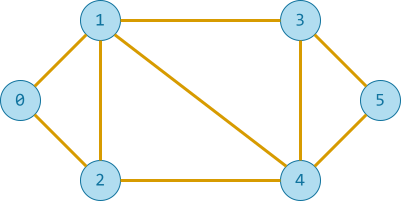

# Biểu diễn đồ thị

## Khái quát

**Biểu diễn đồ thị** là cách lưu trữ và mô hình hóa một đồ thị trong máy tính sao cho phù hợp với việc xử lý.

Có nhiều cách biểu diễn đồ thị tùy vào mục đích và loại đồ thị, chẳng hạn như:

- Sử dụng ma trận kề
- Sử dụng danh sách kề
- Sử dụng danh sách cạnh
- Sử dụng ma trận sự cố

Bài này chỉ trình bày ma trận kề và danh sách kề.

## Ma trận kề

### Khái niệm

**Ma trận kề** là ma trận vuông kích thước n x n, với n là số đỉnh của đồ thị. Trong đó, mỗi phần tử tại hàng u và cột v biểu diễn sự tồn tại hoặc không tồn tại của một cạnh giữa hai đỉnh u và v.

Cụ thể, gọi `M` là ma trận kề.

- Nếu có cạnh giữa đỉnh `u` và đỉnh `v`:

    - Với đồ thị không có trọng số, thì `M[u][v] = 1`.
    - Với đồ thị có trọng số, `M[u][v] = trọng số`.

- Nếu không có cạnh, `M[u][v] = 0`.

Ví dụ:

Cho đồ thị vô hướng G(V, E), trong đó:

- V = {0, 1, 2, 3, 4, 5}
- E = { (0, 1), (0, 2), (1, 2), (1, 3), (1, 4), (2, 4), (3, 4), (3, 5) }

{ loading=lazy width=360 }

Đồ thị G được biểu diễn bằng ma trận kề `M` như sau:

|  | 0 | 1 | 2 | 3 | 4 | 5 |
| --- | --- | --- | --- | --- | --- | --- |
| <strong>0</strong> | 0 | 1 | 1 | 0 | 0 | 0 |
| <strong>1</strong> | 1 | 0 | 1 | 1 | 1 | 0 |
| <strong>2</strong> | 1 | 1 | 0 | 0 | 1 | 0 |
| <strong>3</strong> | 0 | 1 | 0 | 0 | 1 | 1 |
| <strong>4</strong> | 0 | 1 | 1 | 1 | 0 | 1 |
| <strong>5</strong> | 0 | 0 | 0 | 1 | 1 | 0 |

### Viết chương trình

**Bước 0**: Khai báo biến `data` chứa dữ liệu đầu vào.

- Hàng đầu tiên là các đỉnh.
- Các hàng còn lại là các cạnh.

```py linenums="1"
data = '''
0 1 2 3 4 5
0 1
0 2
1 2
1 3
1 4
2 4
3 4
3 5
4 5
'''
```

**Bước 1**: Tách dữ liệu đầu vào thành các dòng riêng lẻ và lưu trong biến `lines`.

```py linenums="16"
def init_adjacent_matrix(d):
    # Chuyển đổi input thành danh sách các dòng riêng lẻ
    lines = d.strip().split('\n')
```

**Bước 2**: Dựa vào dòng đầu tiên của `lines` gồm các đỉnh, khởi tạo ma trận kề `M`, đồng thời gán giá trị `0` cho toàn bộ phần tử của nó.

```py linenums="20"
    # Tách rời các số của dòng đầu tiên, lưu vào biến V là danh sách các đỉnh
    V = list(map(int, lines[0].split()))

    # n là số đỉnh
    n = len(V)

    # Khởi tạo ma trận kề A gồm các phần tử 0
    M = [[0] * n for _ in range(n)]
```

**Bước 3**: Với các dòng còn lại, do mỗi cặp `(u, v)` là một cạnh, ta gán `1` cho cả phần tử `M[u][v]` và phần tử `M[v][u]`.

```py linenums="29"
    # Tách hai số của các dòng còn lại và gán giá trị 1 vào phần tử tương ứng
    for line in lines[1:]:
        u, v = map(int, line.split())
        M[u][v] = 1
        M[v][u] = 1

    return M
```

### Đánh giá chung

1. Đặc điểm:

    Đối với đồ thị vô hướng, ma trận kề là ma trận đối xứng (1).
    { .annotate }

    1.  **Ma trận đối xứng** là ma trận vuông mà các phần tử đối xứng qua đường chéo chính, tức `M[u][v] = M[v][u]`.

    Đối với đồ thị có hướng, ma trận kề không phải là ma trận đối xứng nếu chỉ có cạnh từ u đến v.

2. Ưu điểm:

    Truy xuất cạnh giữa hai đỉnh rất nhanh, độ phức tạp là $O(1)$.
  
3. Hạn chế:

    Tốn nhiều bộ nhớ, do phải lưu tất cả phần tử dù có cạnh hay không, nhất là với đồ thị thưa (1).
    { .annotate }

    1.  **Đồ thị thưa** là đồ thị có số cạnh nhỏ hơn rất nhiều so với tổng số cạnh tối đa có thể có giữa các đỉnh.

## Danh sách kề

### Khái niệm

**Danh sách kề** là danh sách mà mỗi phần tử tương ứng với một đỉnh và mỗi phần tử cũng là một danh sách chứa các đỉnh kề với đỉnh đó.

Cụ thể, gọi `L` là danh sách kề. Phần tử `L[v]` chứa danh sách các đỉnh kề với đỉnh `v`.

Ví dụ:

Cho đồ thị vô hướng G(V, E), trong đó:

- V = {0, 1, 2, 3, 4, 5}
- E = { (0, 1), (0, 2), (1, 2), (1, 3), (1, 4), (2, 4), (3, 4), (3, 5) }

{ loading=lazy width=360 }

Đồ thị G được biểu diễn bằng danh sách kề `L` như sau:

```pycon
0: [1, 2]
1: [0, 2, 3, 4]
2: [0, 1, 4]
3: [1, 3, 5]
4: [1, 2, 3, 5]
5: [3, 4]
```

### Viết chương trình

**Bước 0**: Khai báo biến `data` chứa dữ liệu đầu vào.

- Hàng đầu tiên là các đỉnh.
- Các hàng còn lại là các cạnh.

```py linenums="1"
data = '''
0 1 2 3 4 5
0 1
0 2
1 2
1 3
1 4
2 4
3 4
3 5
4 5
'''
```

**Bước 1**: Tách dữ liệu đầu vào thành các dòng riêng lẻ và lưu trong biến `lines`.

```py linenums="16"
def init_adjacent_list(d):
    # Chuyển đổi input thành danh sách các dòng riêng lẻ
    lines = d.strip().split('\n')
```

**Bước 2**: Dựa vào dòng đầu tiên của `lines` gồm các đỉnh, khởi tạo danh sách kề `L`, ban đầu gồm các danh sách rỗng.

```py linenums="20"
    # Tách rời các số của dòng đầu tiên, lưu vào biến V là danh sách các đỉnh
    V = list(map(int, lines[0].split()))

    # Khởi tạo danh sách kề L rỗng (dùng kiểu dictionary)
    L = {v: [] for v in V} # (1)!
```
{ .annotate }

1.  Để thuận tiện khi truy xuất về sau, ta sử dụng kiểu `dictionary`. Trong đó, mỗi khoá là một đỉnh, giá trị của khoá là danh sách đỉnh kề. Ví dụ: `{0: [1, 2]}` nghĩa là, đỉnh `0` có hai đỉnh kề là `1` và `2`.

**Bước 3**: Với các dòng còn lại, do mỗi cặp `(u, v)` là một cạnh, ta nạp `v` vào danh sách đỉnh kề của `u` và nạp `u` và danh sách đỉnh kề của `v`.

```py linenums="26"
    # Duyệt các dòng còn lại và nạp phần tử vào các danh sách đỉnh kề
    for line in lines[1:]:
        u, v = map(int, line.split())
        L[u].append(v)
        L[v].append(u)

    return L
```

### Đánh giá chung

1. Ưu điểm:
  
    - Tiết kiệm bộ nhớ hơn ma trận kề, đặc biệt đối với đồ thị thưa.
    - Hiệu quả khi cần duyệt các đỉnh kề của một đỉnh.

2. Hạn chế:
  
    - Truy xuất cạnh giữa hai đỉnh chậm hơn, do cần duyệt danh sách kề, độ phức tạp $O(k)$ với $k$ là số đỉnh kề của đỉnh đang xét.

## Mã nguồn

- Chương trình Python hoàn chỉnh đặt tại [Google Colab](https://colab.research.google.com/drive/1uRt2payWQrP0rEExZgy-uijdK1PHA2uf?usp=sharing){:target="_blank"}.

## Some English words

| Vietnamese | Tiếng Anh | 
| --- | --- |
| danh sách kề | adjacent list |
| ma trận kề | adjacent matrix |
