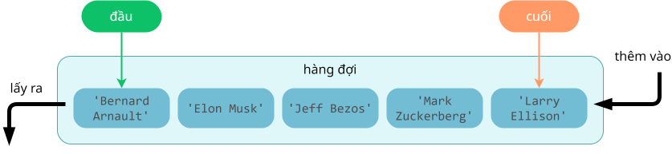

# Khái quát về hàng đợi

## Khái niệm

**Hàng đợi** là cấu trúc dữ liệu phổ biến trong lập trình, được sử dụng để quản lý các phần tử theo thứ tự "*vào trước, ra trước*" (**FIFO - First In, First Out**).

Nói cách khác, trong hàng đợi, phần tử đầu tiên được thêm vào sẽ là phần tử đầu tiên được xóa khỏi hàng đợi.

Hình dưới đây minh hoạ hàng đợi gồm 5 phần tử. Mỗi phần tử chứa dữ liệu là một chuỗi.

{loading=lazy }  

*Minh hoạ hàng đợi*

## Ứng dụng

Một số ứng dụng của hàng đợi là:

- Xử lý hàng đợi công việc
- Quản lý tài nguyên
- Xử lý sự kiện trong các hệ thống phần mềm

## Những thao tác trên hàng đợi

Các thao tác cơ bản trên hàng đợi bao gồm:

- Thêm phần tử vào cuối hàng đợi: enqueue, put.
- Lấy ra phần tử ở đầu hàng đợi: dequeue, get.

## Biểu diễn hàng đợi

Hàng đợi có thể được biểu diễn bằng các cấu trúc dữ liệu khác nhau như mảng, danh sách liên kết hoặc các cấu trúc dữ liệu phức tạp hơn tùy thuộc vào yêu cầu cụ thể.

Trong Python, hàng đợi có thể được triển khai bằng kiểu dữ liệu `list` hoặc module có sẵn là `queue`. Module `queue` gồm có các lớp:

- `Queue`: hàng đợi vào trước, ra trước (FIFO).
- `LifoQueue`: hàng đợi vào sau, ra trước (LIFO), hoạt động giống như một ngăn xếp.
- `PriorityQueue`: hàng đợi mà trong đó các phần tử được truy xuất dựa trên độ ưu tiên, phần tử có độ ưu tiên thấp hơn sẽ được ra trước.

Bài học này chỉ đề cập đến `Queue`.

### Khai báo module

Khai báo module `queue`, là module có sẵn của Python, không cần cài đặt gì thêm.

```py linenums="1"
import queue
```

### Khởi tạo hàng đợi

```py linenums="3"
if __name__ == '__main__':
    # Khởi tạo một hàng đợi
    q = queue.Queue()
```

### In hàng đợi

Mặc dù module `queue` không có hàm nào in tất cả phần tử của hàng đợi, ta có thể chuyển đổi hàng đợi thành danh sách, rồi dùng hàm `print()` để in danh sách.

```py linenums="7"
    # In hàng đợi
    print(f'Hàng đợi khi mới khởi tạo: {list(q.queue)}')
```

Output:

```pycon
Hàng đợi khi mới khởi tạo: []
```

### Thêm phần tử vào

Để thêm phần tử vào cuối hàng đợi, ta dùng hàm `put()`.

```py linenums="10"
    # Lần lượt thêm phần tử vào hàng đợi
    q.put('Bernard Arnault')
    q.put('Elon Musk')
    q.put('Jeff Bezos')
    q.put('Mark Zuckerberg')
    q.put('Larry Ellison')

    # In hàng đợi
    print(f'Hàng đợi sau khi thêm phần tử: {list(q.queue)}')
```

Output:

```pycon
Hàng đợi sau khi thêm phần tử: ['Bernard Arnault', 'Elon Musk', 'Jeff Bezos', 'Mark Zuckerberg', 'Larry Ellison']
```

### Lấy phần tử ra

Để lấy ra phần tử nằm ở đầu hàng đợi, ta dùng hàm `get()`.

Hàm `get()` vừa lấy giá trị của phần tử đầu, vừa xoá phần tử này khỏi hàng đợi.

```py linenums="20"
    # Lần lượt lấy ra các phần tử ở đầu hàng đợi
    print(f'Lấy ra phần tử đầu: {q.get()}')
    print(f'Lấy ra phần tử đầu: {q.get()}')
    print(f'Lấy ra phần tử đầu: {q.get()}')

    # In hàng đợi
    print(f'Hàng đợi còn lại: {list(q.queue)}')
```

Output:

```pycon
Lấy ra phần tử đầu: Bernard Arnault
Lấy ra phần tử đầu: Elon Musk
Lấy ra phần tử đầu: Jeff Bezos
Hàng đợi còn lại: ['Mark Zuckerberg', 'Larry Ellison']
```

## Mã nguồn

- Chương trình Python hoàn chỉnh đặt tại [Google Colab](https://colab.research.google.com/drive/12Eg3jEkV-hXZlfkX2-JX1o562CBgxrPX?usp=sharing){:target="_blank"}.

## Some English words

| Vietnamese | Tiếng Anh |
| ----------- | ----- |
| hàng đợi | queue |
| phần tử đầu | front (element) |
| phần tử cuối | rear (element) |
| thêm phần tử vào cuối hàng đợi | enqueue |
| vào trước, ra trước | FIFO - First In, First Out |
| xóa phần tử ở đầu hàng đợi | dequeue |