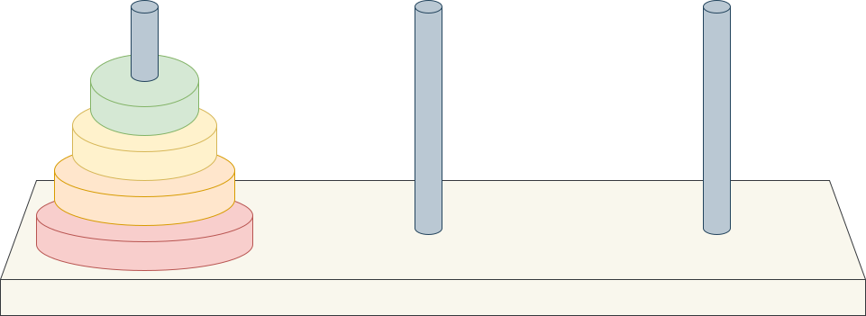

# Tháp Hà Nội

## Khái quát về bài toán

Bài toán tháp Hà Nội (còn có tên khác là bài toán Benares Temple, Tower of Brahma, Lucas' Tower hoặc bài toán Kim Tự Tháp) là một trò chơi gồm ba cột và số lượng đĩa với đường kính khác nhau được đặt vào các cột.

Trò chơi xuất phát từ trạng thái các đĩa nằm chồng lên nhau trên cùng một cột, đĩa nhỏ nằm trên đĩa lớn, cả chồng đĩa tạo thành hình nón.

Mục tiêu của trò chơi là di chuyển toàn bộ đĩa đến cột đích, tuân theo quy định sau đây:

- Mỗi lần chỉ di chuyển một đĩa.
- Mỗi lần chỉ di chuyển đĩa nằm trên cùng của một cột và đặt đĩa này lên trên cùng của một cột khác.
- Đĩa nhỏ phải luôn nằm trên đĩa lớn.

{width="75%" loading=lazy}

*Minh họa trò chơi có 4 đĩa*

## Yêu cầu

In ra màn hình chỉ dẫn từng bước di chuyển đĩa để đáp ứng thể lệ của trò chơi nêu trên.

## Input

```pycon
4 1 3
```

## Ouput

```pycon
Move disc 1 from rod 1 to rod 2  
Move disc 2 from rod 1 to rod 3  
Move disc 1 from rod 2 to rod 3  
Move disc 3 from rod 1 to rod 2  
Move disc 1 from rod 3 to rod 1  
Move disc 2 from rod 3 to rod 2  
Move disc 1 from rod 1 to rod 2  
Move disc 4 from rod 1 to rod 3  
Move disc 1 from rod 2 to rod 3  
Move disc 2 from rod 2 to rod 1  
Move disc 1 from rod 3 to rod 1  
Move disc 3 from rod 2 to rod 3  
Move disc 1 from rod 1 to rod 2  
Move disc 2 from rod 1 to rod 3  
Move disc 1 from rod 2 to rod 3  
```

## Giải thích

Input gồm ba số, lần lượt là số lượng đĩa, cột bắt đầu và cột đích.

## Cách giải đề xuất

### Ý tưởng chính

Gọi **đĩa thứ 1** là đĩa nhỏ nhất (nằm trên cùng) và **đĩa thứ n** là đĩa lớn nhất (nằm dưới cùng). 

Ta "*giả vờ*" xem chồng đĩa chỉ gồm hai nhóm, là $n - 1$ đĩa nằm trên và đĩa thứ n nằm dưới.

Như vậy, ta thực hiện di chuyển hai nhóm đĩa này theo trình tự sau:

- Thao tác 1: Chuyển $n - 1$ đĩa từ **cột bắt đầu** sang **cột trung gian**.
- Thao tác 2: Chuyển đĩa thứ n từ **cột bắt đầu** sang **cột đích**.
- Thao tác 3: Chuyển $n - 1$ đĩa sang từ **cột trung gian** sang **cột đích**.

Dễ nhận thấy, tại thao tác 1 và thao tác 3, bài toán được lặp lại với kích thước nhỏ hơn. Đây là chỗ để gọi thực hiện đệ quy. 

### Các bước thực hiện

1. Tạo chỉ dẫn cho mỗi lần di chuyển đĩa:

    Trước hết, ta viết hàm gồm ba tham số: đĩa thứ `d`, cột bắt đầu `s` và cột đích `t`.
    
    Công dụng của hàm này là in ra một dòng thông báo chỉ dẫn di chuyển đĩa `d` từ cột `s` sang cột `t`.

    === "C++"
        ```c++ linenums="1"
        void guide(int d, int s, int t)
        {
            cout << "Move disk " << d << " from rod " << s << " to rod " << t << endl;
        }
        ```
    === "Python"
        ```py linenums="1"
        def guide(d, s, t):
            print(f'Move disc {d} from rod {s} to rod {t}')
        ```

2. Trường hợp cơ sở:

    Đây là trường hợp mà trong đó, ta chỉ di chuyển một đĩa từ cột bắt đầu đến cột đích.

    === "C++"
        ```c++ linenums="1"
        if (disk == 1)
        {
            guide(disk, source, target);
            return;
        }
        ```
    === "Python"
        ```py linenums="1"
        if disc == 1:
            guide(disc, source, target)
            return
        ```

3. Trường hợp đệ quy:

    Mỗi lần di chuyển đĩa, cột trung gian có thể không phải là cột 2. Chẳng hạn, khi chuyển một đĩa từ cột 2 sang cột 1, thì lúc này cột trung gian là cột 3.

    Nhận thấy, tổng số thứ tự của ba cột là $1 + 2 + 3 = 6$.

    Do đó, để xác định cột trung gian, ta lấy tổng (là 6) trừ đi cột bắt đầu và cột đích.

    Ví dụ: Nếu cột bắt đầu là cột 2, cột đích là cột 1, thì cột trung gian là $6 - 2 - 1 = 3$.

    Như vậy, ta có thể viết lệnh gọi đệ quy như sau:

    === "C++"
        ```c++ linenums="1"
            spare = 6 - (source + target);
            
            // Di chuyển n - 1 đĩa nằm trên sang cột trung gian
            HaNoiTower(disk - 1, source, spare);

            // Di chuyển đĩa thứ n (nằm dưới cùng) sang cột đích
            guide(disk, source, target);

            // Di chuyển n - 1 đĩa còn lại từ cột trung gian sang cột đích
            HaNoiTower(disk - 1, spare, target);
        ```
    === "Python"
        ```py linenums="1"
            spare = 6 - (source + target)

            # Di chuyển n - 1 đĩa nằm trên sang cột trung gian
            hanoi_tower(disc - 1, source, spare)

            # Di chuyển đĩa thứ n (nằm dưới cùng) sang cột đích 
            guide(disc, source, target)

            # Di chuyển n - 1 đĩa còn lại từ cột trung gian sang cột đích
            hanoi_tower(disc - 1, spare, target)
        ```

## Mã nguồn

- Chương trình C++ hoàn chỉnh đặt tại [Gist của GitHub](https://gist.github.com/vtchitruong/d13701c239e3d31af412a8c3e2a4c009){:target="_blank"}

- Chương trình Python hoàn chỉnh đặt tại [Google Colab](https://colab.research.google.com/drive/1MDK_03352u5FH6YLMl37J3pHSFF7YWXe?usp=sharing){:target="_blank"}
