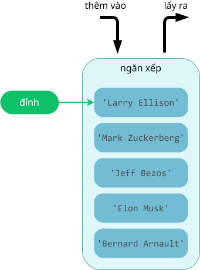

# Khái quát về ngăn xếp

## Khái niệm

**Ngăn xếp** là cấu trúc dữ liệu hoạt động theo nguyên tắc "*vào sau ra trước*" (**LIFO - Last In, First Out**).

Nói cách khác, trong ngăn xếp, phần tử thêm vào sau cùng sẽ được lấy ra trước tiên. 

Vi dụ:

- Chồng dĩa là hình ảnh minh hoạ cho ngăn xếp. Ta phải lấy dĩa ở trên cùng ra trước.
- Lọ thuốc chứa các viên thuốc sủi. Viên đầu tiên nằm ở đáy lọ. Viên cuối cùng nằm ở ngay nắp và được lấy ra trước tiên.
- Băng đạn của súng tiểu liên.

Hình dưới đây minh hoạ ngăn xếp gồm 5 phần tử. Mỗi phần tử chứa dữ liệu là một chuỗi.

{loading=lazy }  
<figcaption>Minh hoạ ngăn xếp</figcaption>  

## Ứng dụng

Một số ứng dụng của ngăn xếp là:

- Call stack:
    - Quản lý bộ nhớ trong quá trình gọi hàm và trả về giá trị. Mỗi lần một hàm được gọi, bộ nhớ dùng cho hàm đó được đẩy vào ngăn xếp và khi hàm kết thúc, bộ nhớ này được lấy ra.
    - Hỗ trợ đệ quy: ngăn xếp lưu trữ trạng thái của mỗi lần gọi hàm, bảo đảm có thể quay lại đúng trạng thái trước đó sau mỗi lần hàm đệ quy trả về.
- Cung cấp chức năng khôi phục undo.
- Duyệt đồ thị theo chiều sâu.
- Back tracking.
- Xử lý lồng nhau: trợ giúp xử lý các bài toán có tính chất lồng nhau như xác định cặp dấu ngoặc trong biểu thức toán học, xử lý cặp thẻ HTML.

## Những thao tác trên ngăn xếp

Các thao tác cơ bản trên ngăn xếp bao gồm:

- Thêm phần tử vào đỉnh của ngăn xếp: push.
- Lấy phần tử đỉnh ra khỏi ngăn xếp: pop.

## Biểu diễn ngăn xếp

Python không có kiểu dữ liệu ngăn xếp `stack` tích hợp sẵn như kiểu hàng đợi `queue`. Do đó, ta có thể sử dụng những kiểu dữ liệu khác để triển khai ngăn xếp, chẳng hạn như:

- Kiểu `list`: có thể sử dụng làm ngăn xếp nhờ các hàm như `append()` và `pop()` (1).
    { .annotate }

    1.  `append()`: thêm phần tử vào cuối danh sách.
        `pop()`: xoá bỏ phần tử ra khỏi danh sách. Nếu không có tham số thì mặc định là xoá bỏ phần tử cuối.

- Module `collections.deque`: `deque` (double-ended queue) là hàng đợi hai đầu, cũng có thể sử dụng làm ngăn xếp.

Bài học này dùng `list` để triển khai ngăn xếp.

### Khởi tạo ngăn xếp

```py linenums="30"
if __name__ == '__main__':
    # Khởi tạo một ngăn xếp
    S = []
```

### Thêm phần tử vào

Để thêm phần tử vào đỉnh của ngăn xếp, ta viết hàm `push()`.

```py linenums="1"
# Hàm thêm phần tử vào ngăn xếp
def push(stack, item): # (1)!
    # Thêm phần tử vào cuối
    stack.append(item) # (2)!
```
{ .annotate }

1.  Tham số `stack` chỉ ngăn xếp.
    
    Tham số `item` chỉ phần tử được thêm vào. 

2.  `append()` là hàm có sẵn của kiểu `list` dùng để thêm phần tử vào cuối danh sách. Ta tận dụng để thêm phần tử vào đỉnh của ngăn xếp.

Trong chương trình chính, gọi hàm `push()` để đẩy các phần tử vào ngăn xếp.

```py linenums="30"
if __name__ == '__main__':
    # Khởi tạo một ngăn xếp
    S = []

    # Lần lượt thêm phần tử vào ngăn xếp
    push(S, 'Bernard Arnault')
    push(S, 'Elon Musk')
    push(S, 'Jeff Bezos')
    push(S, 'Mark Zuckerberg')
    push(S, 'Larry Ellison')

    print(f'Ngăn xếp sau khi thêm phần tử: {S}')
```

Output:

```pycon
Ngăn xếp sau khi thêm phần tử: ['Bernard Arnault', 'Elon Musk', 'Jeff Bezos', 'Mark Zuckerberg', 'Larry Ellison']
```

### Lấy phần tử ra

Để lấy phần tử ra khỏi ngăn xếp, ta viết hàm `pop()`.

Hàm `pop()` vừa lấy ra phần tử nằm ở đỉnh của ngăn xếp, vừa trả về giá trị của phần tử này.

```py linenums="8"
def pop(stack):
    # Nếu ngăn xếp đang chứa phần tử
    if (len(stack) > 0):
        # thì lấy ra và loại bỏ phần tử cuối
        return stack.pop() #(1)!
    else:
        # Ngược lại, không có phần tử, thì trả về None
        return None
```
{ .annotate }

1.  Có hai hàm `pop()` trùng tên nhau:
    
    - `def pop(stack):` là do ta tự định nghĩa cho ngăn xếp của mình.
    - `stack.pop()` là phương thức có sẵn của kiểu `list`, ta tận dụng để thực hiện thao tác lấy ra này.

Trong chương trình chính, gọi hàm `pop()` để lấy ra phần tử ở đỉnh.

```py linenums="43"
    # Lấy ra phần tử ở đỉnh ngăn xếp
    print(f'Phần tử ở đỉnh sẽ bị lấy ra: {pop(S)}')

    # In ngăn xếp
    print(f'Ngăn xếp còn lại: {S}')
```

Output:

```pycon
Phần tử ở đỉnh sẽ bị lấy ra: Larry Ellison
Ngăn xếp còn lại: ['Bernard Arnault', 'Elon Musk', 'Jeff Bezos', 'Mark Zuckerberg']
```

### Truy xuất giá trị của phần tử đỉnh

Để truy xuất giá trị của phần tử nằm ở đỉnh của ngăn xếp mà không loại bỏ nó khỏi ngăn xếp, ta viết hàm `peek()`.

```py linenums="19"
def peek(stack):
    # Nếu ngăn xếp đang chứa phần tử
    if (len(stack) > 0):
        # thì truy xuất giá trị của phần tử đỉnh
        return stack[-1] # (1)!
    else:
        # Ngược lại, không có phần tử, thì trả về None
        return None
```
{ .annotate }

1.  `stack` có kiểu `list`, `stack[-1]` là phần tử cuối của danh sách. Ta tận dụng để truy xuất phần tử đỉnh của ngăn xếp.


Trong chương trình chính, gọi hàm `peek()` để lấy giá trị của phần tử đỉnh.

```py linenums="49"
    # In ra giá trị của phần tử đỉnh
    print(f'Phần tử đỉnh: {peek(S)}')
```

Output:

```pycon
Phần tử ở đỉnh: Mark Zuckerberg
```

## Mã nguồn

- Chương trình Python hoàn chỉnh đặt tại [Google Colab](https://colab.research.google.com/drive/1Jwr-AytQu7YDTyO3xIk8nY_DLmlSWsPv?usp=sharing){:target="_blank"}.

## Some English words

| Vietnamese | Tiếng Anh |
| ----------- | ----- |
| ngăn xếp | stack |
| phần tử đỉnh | top, peek (element) |
| lấy ra phần tử đỉnh | pop |
| thêm phần tử vào đỉnh của ngăn xếp | push |
| vào sau, ra trước | LIFO - Last In, First Out |
