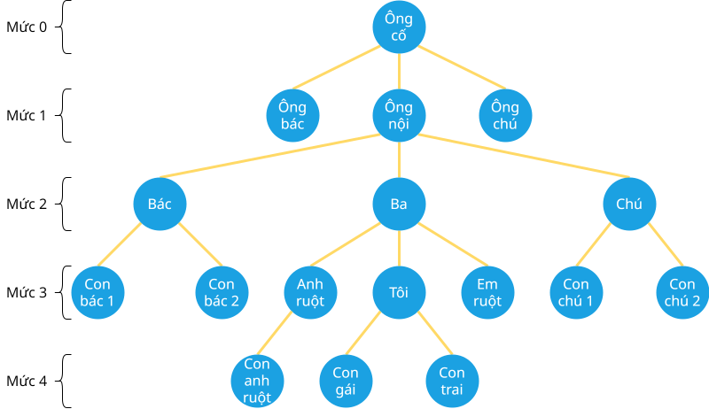

# Khái quát về cây

!!! abstract "Tóm lược nội dung"

    Bài này trình bày một vài khái niệm chung về cây.

## Khái niệm

**Cây** là một cấu trúc dữ liệu phi tuyến tính, biểu diễn các mối quan hệ phân cấp giữa các phần tử.

- Mỗi **nút** là một phần tử trong cây.
- Mỗi **nhánh** là một đường kết nối giữa hai nút trong cây.

    Nhánh đại diện cho mối quan hệ phân cấp giữa một nút cha và nút con. Mỗi nhánh xuất phát từ một nút cha và dẫn đến một nút con.

## Các thành phần cơ bản

1. **Nút gốc** là nút đầu tiên của cây.

    Nút gốc không có nút cha.

2. **Nút lá** là các nút không có nút con. Nghĩa là, nút lá nằm ở cuối các nhánh.

3. **Nút trong**, hay còn gọi là nút nhánh, là nút có ít nhất một nút con.

    Nói cách khác, nút trong không phải là nút lá.

Đường đi từ nút X đến nút Y trong cây là một dãy các nút nối tiếp nhau (1), bắt đầu tại X và kết thúc tại Y.
{ .annotate }

1.  Giữa hai nút liên tiếp có một cạnh nối chúng. 

4. **Mức** của một nút được xác định bằng khoảng cách từ nút gốc. Trong đó:

    - Mức của nút gốc bằng 0.
    - Mức của các nút con của nút gốc bằng 1.
    - Mức của một nút (khác gốc) bằng mức của nút cha cộng thêm 1.

5. **Chiều cao** của cây là số cạnh nằm trên đường đi dài nhất từ nút gốc đến nút lá.

    Nói cách khác, chiều cao của cây là mức lớn nhất của các nút lá.

    Chiều cao của một nút là số cạnh nằm trên đường đi dài nhất từ nút đó đến một nút lá.

6. **Độ sâu** của một nút là số cạnh từ gốc đến nút đó.

Bảng sau liệt kê một số điểm phân biệt chiều cao và độ sâu:

| | Chiều cao | Độ sâu|
| --- | --- | --- |
| Định nghĩa | Số cạnh trên đường đi dài nhất từ nút đang xét đến nút lá. | Số cạnh từ nút gốc đến nút đang xét. |
| Áp dụng | Nút đang xét hoặc toàn bộ cây | Nút đang xét |
| Hướng tính toán | Từ nút đang xét đi đến nút lá | Từ nút gốc đi đến đến nút đang xét |
| Nút gốc | height(cây) == height(nút gốc) | depth(nút gốc) == 0 |
| Nút lá | height(nút lá) == 0 | depth(nút lá) == Số cạnh từ nút gốc đến nút lá |

Ví dụ:

Cho cây T như hình sau:

{loading = lazy}

Cây T có:

- Nút gốc là `Ông cố`.
- Nút gốc có ba cây con: cây gốc `Ông bác`, cây gốc `Ông nội` và cây gốc `Ông chú`.
- Nút lá gồm: `Con anh ruột`, `Con gái` và `Con trai`
- `Tôi` là một trong số các nút trong.
- Chiều cao của cây là 4.
- Độ sâu của nút `Tôi` là 3.

## Một số loại cây phổ biến

1. **Cây nhị phân**

    Mỗi nút của cây nhị phân có tối đa hai nút con: nút con trái và nút con phải.

2. **Cây cân bằng**

    Là cây có chiều cao của các nhánh con khác nhau không vượt quá một ngưỡng nhất định. Ví dụ: cây AVL, cây đỏ đen.

3. **Cây biểu thức**

    Dùng để biểu diễn các biểu thức toán học, trong đó các toán tử là nút trong và các toán hạng là nút lá.

4. **Cây đa nhánh**
    
    Mỗi nút có thể có nhiều hơn hai nút con.

    Thường được sử dụng để biểu diễn cấu trúc thư mục hoặc tổ chức phân cấp.

## Những thao tác phổ biến

1. **Duyệt cây**

    Có bốn cách sau:

    - Duyệt tiền thứ tự: gốc → con trái → con phải.
    - Duyệt trung thứ tự: con trái → gốc → con phải.
    - Duyệt hậu thứ tự: con trái → con phải → gốc.
    - Duyệt theo chiều rộng: duyệt từng mức từ trên xuống dưới, từ trái sang phải.

2. Thao tác cơ bản

    - **Chèn** một nút mới vào cây.
    - **Xoá** một nút khỏi cây.
    - **Tìm kiếm** một nút có giá trị cụ thể trong cây.
    - **Tính chiều cao** của cây.

3. Thao tác nâng cao

    - Xây dựng cây từ dữ liệu như mảng, danh sách liên kết, chuỗi ký tự.
    - Kiểm tra cây cân bằng, cây hoàn chỉnh hoặc cây hoàn hảo.
    - Tìm tổ tiên chung gần nhất.
    - Ghép cây.
    - Tạo bản sao phản chiếu của cây.
    - Chuyển đối cây sang dạng khác.
    - Tìm đường đi ngắn nhất và đường đi dài nhất trong cây.
    - Tối ưu hoá cây.

## Ứng dụng

Cây có nhiều ứng dụng quan trọng, bao gồm:

- Biểu diễn cấu trúc phân cấp: cấu trúc thư mục, tổ chức công ty, cây gia phả, v.v...
- Tổ chức dữ liệu: cây được sử dụng để lưu trữ và tổ chức dữ liệu hiệu quả, chẳng hạn như: cây tìm kiếm nhị phân (BST), cây AVL, cây đỏ-đen.
- Xử lý cú pháp: cây cú pháp (parse tree) trong trình biên dịch giúp phân tích mã nguồn, cây biểu thức được sử dụng để phân tích và đánh giá các biểu thức toán học.
- Tìm kiếm và tối ưu hóa: cây trò chơi, cây minimax trong AI và trò chơi.
- Thuật toán đồ thị: cây bao trùm (spanning tree) được sử dụng trong các bài toán liên quan đến mạng lưới và tối ưu hóa.
- Trí tuệ nhân tạo: cây quyết định (decision tree).
- Nén dữ liệu: cây Huffmann.
- Lập lịch và quản lý quy trình: hệ điều hành sử dụng cây để tổ chức tiến trình.

## Some English words

| Vietnamese | Tiếng Anh | 
| --- | --- |
| cây | tree |
| cây nhị phân | binary tree |
| chiều cao | height |
| duyệt hậu thứ tự | post-order traversal |
| duyệt tiền thứ tự | pre-order traversal |
| duyệt trung thứ tự | in-order traversal |
| độ sâu | depth |
| mức | level |
| nhánh | branch |
| nút | node |
| nút cha | parent node |
| nút con | child node |
| nút gốc | root node |
| nút là | leaf node |
| nút trong | internal node |
