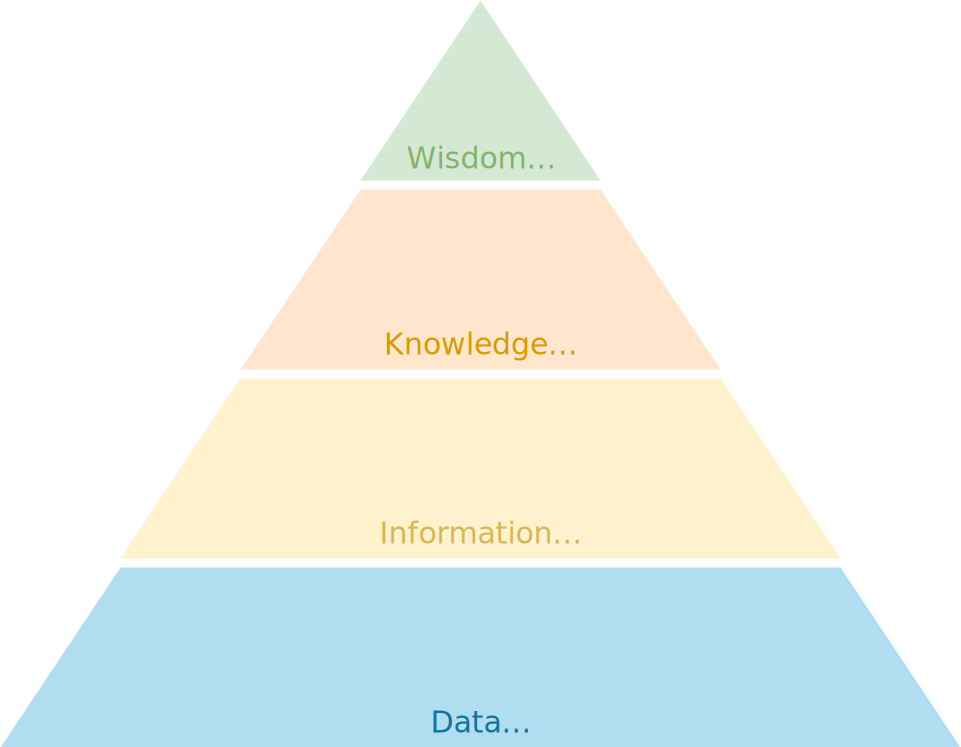

# Tháp DIKW

!!! abstract "Tóm lược nội dung"

    Bài viết này trình bày sơ lược khái niệm về tháp DIKW.

## Khái quát

Tháp DIKW là mô hình phân cấp thể hiện mối quan hệ giữa dữ liệu, thông tin, tri thức và trí tuệ. 

Tháp DIKW giúp ta hiểu cách mà dữ liệu và thông tin được chuyển hoá, từ cấp độ đơn giản đến sâu sắc.

## Mô hình tháp DIKW

{ loading=lazy width=480 }

Tháp DIKW gồm bốn tầng:

1.  **Data** (dữ liệu):

	Là các sự kiện và con số thô, chưa qua xử lý, không có ngữ cảnh.

2.  **Information** (thông tin):

	Là dữ liệu đã qua xử lý, có ngữ cảnh và ý nghĩa. Thông tin giúp trả lời các câu hỏi: Ai? Cái gì? Ở đâu? Khi nào?

3.  **Knowledge** (tri thức):

	Là thông tin đã được phân tích và hiểu. Tri thức giúp trả lời câu hỏi: Như thế nào?

4.  **Wisdom** (trí tuệ):

	Là cấp độ cao nhất, thể hiện khả năng áp dụng tri thức. Trí tuệ giúp trả lời câu hỏi: Tại sao?

Ví dụ:

1. Dữ liệu: môn học, điểm số các bài kiểm tra, thời gian làm bài. 

2. Thông tin: sau khi dữ liệu được xử lý, thông tin có được bao gồm:
	- Ai được bao nhiêu điểm, hạng mấy, học lực ra sao.
	- Điểm trung bình của cả lớp thế nào.
	- Bao nhiêu người hoàn thành 70% yêu cầu bài học.

3. Tri thức: sau khi thông tin được phân tích, kết hợp tri thức và kinh nghiệm trước đó, giáo viên có thể rút ra những tri thức bao gồm:
	- Một học sinh đạt kết quả cao hay thấp là do đâu.
	- Yếu tố nào đã ảnh hưởng đến điểm trung bình của cả lớp.
	- Phương pháp giảng dạy vừa qua là tốt hoặc chưa tốt.

4. Trí tuệ: dựa trên tri thức trên, giáo viên đưa ra các quyết định "chiến lược":

	- Mở lớp phụ đạo.
	- Thay đổi phương pháp giảng dạy.
	- Tìm cách giải quyết các yếu tố đã gây ra kết quả không như ý.

## Ứng dụng thực tiễn

-   **Hiểu người dùng**:

	Tháp DIKW giúp hiểu rõ hành vi, nhu cầu và động cơ của người dùng.

	Ví dụ: dựa trên dữ liệu đã được thu thập và xử lý, nhà trường có thể hiểu được nguyên nhân, khó khăn hoặc mong muốn của học sinh.
	
-   **Đánh giá các phương án**: 

	Tháp DIKW giúp đánh giá các phương án một cách có căn cứ.
	
	Ví dụ: dựa trên dữ liệu đã được thu thập và xử lý, giáo viên có thể đánh giá hiệu quả của các phương pháp hoặc hoạt động dạy học khác nhau.

-   **Giải thích cho lựa chọn**:

	Tháp DIKW giúp giải thích, biện minh và thuyết phục và phương án đã lựa chọn.

	Ví dụ: dựa trên dữ liệu đã được thu thập và xử lý, nhà trường có thể giải thích với cha mẹ và học sinh về những giải pháp của mình.

-   **Ưu tiên các tính năng**:

	Tháp DIKW giúp xác định những yếu tố có giá trị nhất nhằm ưu tiên và tối ưu hoá các nguồn lực.

	Ví dụ: dựa trên dữ liệu đã được thu thập và xử lý, nhà trường có thể xác định yếu tố nào cần đầu tư: công cụ trợ giảng, chương trình học, hoạt động trong và ngoài lớp.

## Hạn chế

- Tháp DIKW là mô hình đơn giản, có thể không phản ánh đầy đủ sự phức tạp của các tình huống thực tế.

- Tháp DIKW là một tiến trình tuyến tính, trong khi tiến trình ra quyết định thực tế thường lặp lại và không tuyến tính.

-  Tháp DIKW có vẻ xem nhẹ giá trị của dữ liệu thô hoặc tạo cảm giác  tự thân dữ liệu thô thì chưa đủ hữu ích.

- Tháp DIKW giả định rằng ngữ cảnh chỉ được thêm vào tầng thông tin. Tuy nhiên, trong thực tế, ngữ cảnh đóng vai trò quan trọng ở mọi tầng. Dù ở tầng nào, việc thiếu ngữ cảnh có thể sẽ dẫn đến những quyết định sai lầm.

## Tóm tắt

Hiểu rõ Tháp DIKW giúp cá nhân, tổ chức đưa ra quyết định sáng suốt hơn nhằm thúc đẩy hiệu quả, thành công trong công việc.

Với giáo viên và học sinh, tháp DIKW giúp ta hiểu rằng việc học không chỉ là ghi nhớ số liệu hay sự kiện, mà còn là hiểu và vận dụng chúng một cách thông minh. Do đó, khi học kiến thức mới, hãy thử nghĩ xem: “Mình có thể dùng kiến thức này để làm gì?”.